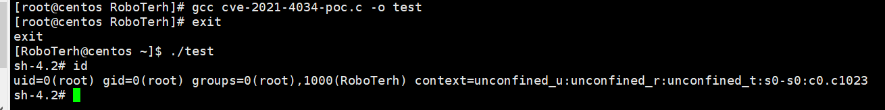

## 影响版本

Debain stretch policykit-1 < 0.105-18+deb9u2
Debain buster policykit-1 < 0.105-25+deb10u1
Debain bookworm, bullseye policykit-1 < 0.105-31.1
Ubuntu 21.10 (Impish Indri) policykit-1 < 0.105-31ubuntu0.1
Ubuntu 21.04 (Hirsute Hippo) policykit-1 Ignored (reached end-of-life)
Ubuntu 20.04 LTS (Focal Fossa) policykit-1 < 0.105-26ubuntu1.2)
Ubuntu 18.04 LTS (Bionic Beaver) policykit-1 <0.105-20ubuntu0.18.04.6)
Ubuntu 16.04 ESM (Xenial Xerus) policykit-1 <0.105-14.1ubuntu0.5+esm1)
Ubuntu 14.04 ESM (Trusty Tahr) policykit-1 <0.105-4ubuntu3.14.04.6+esm1)
CentOS 6 polkit < polkit-0.96-11.el6_10.2
CentOS 7 polkit < polkit-0.112-26.el7_9.1
CentOS 8.0 polkit < polkit-0.115-13.el8_5.1
CentOS 8.2 polkit < polkit-0.115-11.el8_2.2
CentOS 8.4 polkit < polkit-0.115-11.el8_4.2
（2021即以前发行版都可以测试下）

[arthepsy/CVE-2021-4034: PoC for PwnKit: Local Privilege Escalation Vulnerability in polkit’s pkexec (CVE-2021-4034) (github.com)](https://github.com/arthepsy/CVE-2021-4034)

