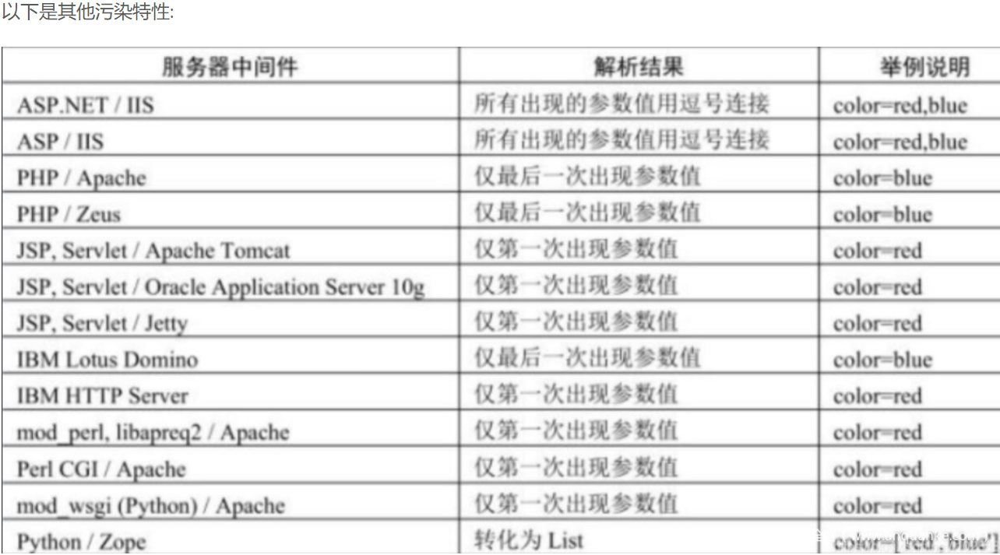
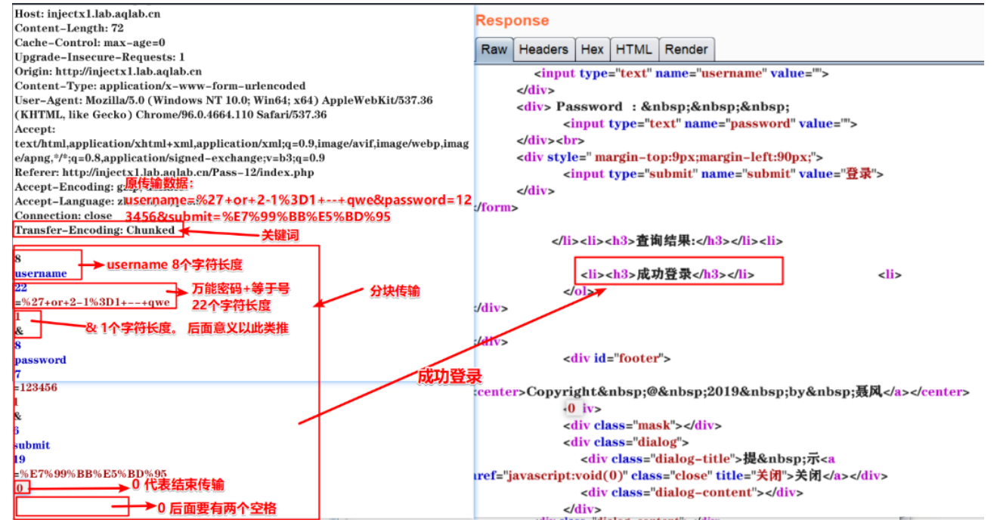

### 1.双写绕过

有些waf会对关键词进行过滤，若只过滤1次，则可以双写绕过。

### 2.等号like绕过

有的waf会对等于号进行拦截和过滤。

### 3.order by 绕过

当 order by 被过滤时，可以使用 into 变量名进行代替。

### 4.and/or绕过

主流的 waf 都会对and 、or、xor进行拦截。替代字符：and 等于&&、or 等于 ||、not 等于 !、xor 等于|

### 5.union select 绕过

```mysql
uNIoN sel<>ect # 程序过滤<>为空 脚本处理
uNi//on sele//ct # 程序过滤//为空
uNIoN /!%53eLEct/ # url 编码与内联注释
uNIoN se%0blect # 使用空格绕过
uNIoN sele%ct # 使用百分号绕过
uNIoN %53eLEct # 编码绕过
uNIoN sELecT 1,2 #大小写绕过
uNIoN all select 1,2 # ALL绕过
uNIoN DISTINCT select 1,2 # 去重复DISTINCT 绕过
null+UNION+SELECT+1,2 # 加号代替空格绕过
/!union//!select/1,2 # 内联注释绕过
/!50000union//!50000select/1,2 # 内联注释绕过
uNIoN//select/**/1,2 # 注释代替空格绕过
```

### 6.大小写绕过
对关键词设置为大小写即可

### 7.逗号绕过

有些防注入脚本都会逗号进行拦截。变换函数的形式，比如 substr(database(),1,1)—> substr(database() from 1 for 1) ；limit 0,1 —> limit 1 offset 0

### 8.等函数替换

当常用函数被waf拦截时，可以使用偏僻函数或者功能相同的其他函数,比如substr()函数被拦截，就可以使用mid函数；报错注入的updatexml()用polygon()函数替换。

### 9.浮点数绕过

通过浮点数的形式从而绕过。id=1 union select —> id=1.0union select —> id=1E0union select

### 10.添加库名绕过

有些 waf 的拦截规则 并不会拦截[库名].[表名]这种模式。

### 11.ascii编码绕过

waf有的时候会对截取的字符拦截，可以使用ascii编码对比进行绕过。

```mysql
1+and+substr(database(), 1, 1)%3d'q'+%23
1+and+ascii(database(), 1, 1)%3d113+%23
```

### 12.base64编码绕过

waf有的时候会对截取的字符拦截，可以将注入的语句进行base64编码进行绕过

### 13.空格字符绕过

空格字符可以混淆WAF的检测机制。%20=%a0=%09=%0a=0b=%0c=%0d=+

### 14.引号字符绕过

若单引号被拦截，则使用双引号，若都被拦截，就尝试使用hex六进制编码，也可以考虑宽字节注入绕过

### 15.参数污染

在 php 语言中 id=1&id=2 后面的值会自动覆盖前面的值，不同的语言有不同的特性。可以利用这点绕过一 些 waf 的拦截。以下是其他污染特性



### 16.注释绕过

内联注释：是Mysql为了保持与其他数据的兼容，将Mysql中特有的语句放在/!/中这些语句在不兼容的数据库中不执行，而在Mysql自身却能识别执行。例如：/!50001/表示数据库版本>=5.00.01时，/!50001 中间的语句才能被执行 /

### 17.脏数据溢出绕过

数据太多超过waf检测范围，然后造成绕过,前面填垃圾数据后面填要注入的SQL语句，如果是GET传参，参数值超过GET所能运行的长度可能无法利用，所以最好是POST传参(前提是对方支持POST传参)

### 18.pipline绕过

http协议是由tcp 协议封装而来，当浏览器发起一个 http 请求时，浏览器先和服务器建立起连接tcp连接，然后发http 数据包，其中包含了一个Connection字段，一般值为close，apache等容器根据这个字段决定是保持该tcp连接或断开。

当发送的内容太大，超过一个http包容量，需要分多次发送时，值会变成keep-alive，即本次发起的http请求所建立的tcp连接不断开，直到所发送内容结束Connection为close为止。

用burpsuite抓包提交复制整个包信息放在第一个包最后，有些waf会匹配第二个包的正属于正常参，不会对第一个包的参数进行检测，这样就可以绕过一些waf拦截。

### 19.分块传输绕过

分块传输编码是只在HTTP协议1.1版本中提供的一种数据传送机制。

以往HTTP的应答中数据是整个一起发送的，并在应答头里Content-Length字段标识了数据的长度，以便客户端知道应答消息的结束。分块传输编码允许服务器在最后发送消息头字段。

例如在头中添加散列签名。对于压缩传输传输而言，可以一边压缩一边传输，将本该一次性传输的完整数据分块传输，从而绕过waf的检测。



### 21.GET/POST转换绕过

waf 在对危险字符进行检测的时候，分别为 post 请求和 get 请求设定了不同的匹配规则，请求被拦截，变 换请求方式有几率能绕过检测。

### 22.白名单绕过

有些 WAF 会自带一些文件白名单，对于白名单 waf 不会拦截任何操作，比如白名单目录，白名单文件等等，所以可以利用这个特点，可以进行突破。

```mysql
xxx/index.php/1.jpg?id=1 and 1 = 2 union select
```

### 23.花括号绕过

花括号，左边是注释的内容，这样的话可以过一些waf的拦截。

```mysql
select * from user where id = 1 and 1 = 2 union select {xxx 1},{aa, 2}
```

### 24.反引号绕过

特殊符号反引号也能绕过waf

```mysql
id = 1 = 2 and `sleep(2)`
```


[sql注入绕WAF的N种姿势 - 安全客，安全资讯平台 (anquanke.com)](https://www.anquanke.com/post/id/268428#h3-14)
