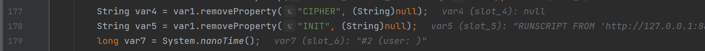

## 分析

### RunScript

在poc中的`TRACE_LEVEL_SYSTEM_OUT=3`是定义了输出级别为`DEBUG`级别

我们在`org.h2.engine.Engine#openSession`打下断点，在前面就会分离出`INIT`属性值，得到`RUNSCRIPT FROM 'xxx'`



之后会调用`var6.prepareCommand`方法传入参数`var5`，初始化数据库连接


跟进`prepareCommand`方法，调用了prepareLocal方法，继续跟进，之后会得到一个`CommandContainer`类，之后会调用他的`executeUpdate`方法，之后跟进到了`update`方法中


在`update`方法中


首先会在断点处接收远程来的poc.sql

之后在调用`ScriptReader`中得到sql脚本，之后在之后执行`execute`执行命令

为什么要使用 RUNSCRIPT捏？

因为其中的`prepareCommand`只能够支持一条sql语句的执行，所以我们使用命令直接从远程获取执行sql语句脚本

## 不出网分析

所以我们需要找到一个能够只执行一条sql语句就能达到目的的途径

来自HTB中的议题分享，Litch1查看了语句CREATE ALIAS的创建者的源代码，发现语句中JAVA METHOD的定义交给了源编译类。支持的编译器有Java/Javascript/Groovy三种，从源代码编译器着手开始

### Groovy

在`org.h2.util.SourceCompiler#getClass`方法中他会通过`isGroovySource`判断是否是Groovy的源代码，如果是，就会调用`SourceCompiler.GroovyCompiler.parseClass`对源代码进行解析


进而调用了`groovy.lang.GroovyCodeSource#parseClass`进行解析


在poc中我们使用@AST注解进行断言执行任意代码

```java
String groovy = "@groovy.transform.ASTTest(value={" +
        " assert java.lang.Runtime.getRuntime().exec(\"calc\")" +
        "})" +
        "def x";
String url = "jdbc:h2:mem:dbtest;MODE=MSSQLServer;init=CREATE ALIAS T5 AS '" + groovy + "'";
```

在环境中需要存在groovy依赖

```xml
<dependency>
    <groupId>org.codehaus.groovy</groupId>
    <artifactId>groovy-sql</artifactId>
    <version>3.0.9</version>
</dependency>
```


### JavaScript执行

采用JavaScript + CREATE TRIGGER的方式不仅可以编译代码，还可以调用eval方法

同样在`CommandContainer#update`方法中调用了`this.prepared.update()`这里的`prepared`是`CreateTrigger`类


跟进，在其中获得了对应的table属性，和TriggerObject，之后调用`var4.setTriggerSource`设置源代码


跟进，跟着调用了`setTriggerAction` 和 `load`方法


在load方法中，会判断是否有`triggerClassName`，如果有，就直接加载对应的类并实例化，这里我们选择进入loadFromSource方法，直接从源代码中加载，跟进


在其中，他会判断source是否是javaScript源代码，如果是，就会进行编译，特别的，在编译完成之后他会执行`eval`操作，自然的就达到了命令执行的目的

```java
String javaScript = "//javascript\njava.lang.Runtime.getRuntime().exec(\"calc\")";
String url = "jdbc:h2:mem:test;MODE=MSSQLServer;init=CREATE TRIGGER hhhh BEFORE SELECT ON INFORMATION_SCHEMA.CATALOGS AS '"+ javaScript +"'";
```