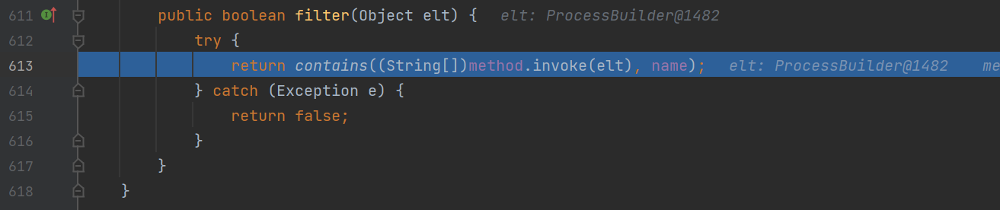

## 前奏

实例：

```java
package pers.xstream;

import com.thoughtworks.xstream.XStream;

import java.util.HashMap;
import java.util.Map;

class person{
    String name;
    int age;
    public person(String name,int age){
        this.name = name;
        this.age = age;
    }
}

public class MapTest {
    public static void main(String[] args) throws Exception{
        Map map = new HashMap();
        map.put(new person("RoboTerh", 19), "test");

        XStream xStream = new XStream();
        String xml = xStream.toXML(map);
        System.out.println(xml);
    }
}
```

结果：

```xml
<map>
  <entry>
    <pers.xstream.person>
      <name>RoboTerh</name>
      <age>19</age>
    </pers.xstream.person>
    <string>test</string>
  </entry>
</map>
```

在Xstream将Map生成xml格式数据时，会为s每个Entry对象生成一个`<entry>…</entry>`元素，并将该Entry中的key与value作为其子元素顺次放置于其中第一个和第二个元素处

这里我们生程xml数据的时候，是用的一个map类型，然后map的key，value分别是一个实例化和一个字符串

最后得到了的数据可以看出来，Xstream生成xml时，其结构应遵循如下结构

```xml
<对象>
    <属性1>...</属性1>
    <属性2>...</属性2>
    ...
</对象>
```

## 漏洞分析

从poc进行剖析

就是一个map类型，entry的key是`jdk.nashorn.internal.objects.NativeString`，value是`test`

然后这个类里面的value属性是`com.sun.xml.internal.bind.v2.runtime.unmarshaller.Base64Data`这个类

在`ClassAliasingMapper#realClass`方法中根据`map`标签找到了`java.util.Map`类，在`TreeUnmarshaller#convertAnother`中找到他的实现类`java.util.HashMap`, 之后找到了对应的转换器`MapConverter`

之后一直到`MapConverter#putCurrentEntryIntoMap`中向target这个HashMap中写入了key和value, 其分别是poc中map标签下的第一个元素和第二个元素，`key`为`jdk.nashorn.internal.objects.NativeString`, 之后调用target.put方法，之后就会调用对应得hashCode方法


跟进`this.getStringValue`方法


这里判断了对应的value值是否为String类型得值，但是在POC中我们已经将其设置为了一个类对象


所以，这里会调用`this.value.toString`方法，即是`com.sun.xml.internal.bind.v2.runtime.unmarshaller.Base64Data#toString`方法，跟进，之后会调用`this.get`方法，跟进


之后通过`this.dataHandler.getDataSource().getInputStream()`获取输入流，这里的`dataHandler`属性中的`dataSource`早已经在POC中设置为了`com.sun.xml.internal.ws.encoding.xml.XMLMessage$XmlDataSource`, 所以这里调用的是其的`getInputStream`方法，跟进


得到对应的输入流为POC中设置的`java.io.SequenceInputStream`，之后调用`baos.readFrom`, 跟进


调用了`is.read`方法。跟进，继续调用了`nextStream`方法，跟进，这里的`e`属性为POC中设置的`javax.swing.MultiUIDefaults$MultiUIDefaultsEnumerator`类，值得一提的是，在这前面存在一个if判断语句，POC中也设置了`in`属性为`java.io.ByteArrayInputStream`, 使得其为空，得以绕过这个判断语句


之后调用了`javax.swing.MultiUIDefaults$MultiUIDefaultsEnumerator#hasMoreElements`方法，跟进，调用了`iterator`属性的`hasNext`方法，同样在POC中设置为了`javax.imageio.spi.FilterIterator`，返回了true，进而调用了`nextElement`方法，因为在POC中设置其`type`属性为`KEYS`，进而调用`iterator.next().getKey()`


跟进，之后在next方法中调用了`advance`方法，跟进，`iter`属性仍然是设置的`java.util.ArrayList$Itr`，调用其hashNext方法，之后调用了`iter.next()`方法


根据POC中的`out-class`标签返回了一个`ProcessBuilder`对象，之后会调用`filter.filter`方法，这里filter属性也在POC中设置了`javax.imageio.ImageIO$ContainsFilter`, 这里methed为`ProcessBuilder.start()`方法，name为`start`, 直接通过反射触发`invoke`执行命令



## 调用栈

```java
filter:613, ImageIO$ContainsFilter (javax.imageio)
advance:834, FilterIterator (javax.imageio.spi)
next:852, FilterIterator (javax.imageio.spi)
nextElement:153, MultiUIDefaults$MultiUIDefaultsEnumerator (javax.swing)
nextStream:110, SequenceInputStream (java.io)
read:211, SequenceInputStream (java.io)
readFrom:65, ByteArrayOutputStreamEx (com.sun.xml.internal.bind.v2.util)
get:182, Base64Data (com.sun.xml.internal.bind.v2.runtime.unmarshaller)
toString:286, Base64Data (com.sun.xml.internal.bind.v2.runtime.unmarshaller)
getStringValue:121, NativeString (jdk.nashorn.internal.objects)
hashCode:117, NativeString (jdk.nashorn.internal.objects)
hash:339, HashMap (java.util)
put:612, HashMap (java.util)
putCurrentEntryIntoMap:107, MapConverter (com.thoughtworks.xstream.converters.collections)
populateMap:98, MapConverter (com.thoughtworks.xstream.converters.collections)
populateMap:92, MapConverter (com.thoughtworks.xstream.converters.collections)
unmarshal:87, MapConverter (com.thoughtworks.xstream.converters.collections)
convert:72, TreeUnmarshaller (com.thoughtworks.xstream.core)
convert:72, AbstractReferenceUnmarshaller (com.thoughtworks.xstream.core)
convertAnother:66, TreeUnmarshaller (com.thoughtworks.xstream.core)
convertAnother:50, TreeUnmarshaller (com.thoughtworks.xstream.core)
start:134, TreeUnmarshaller (com.thoughtworks.xstream.core)
unmarshal:32, AbstractTreeMarshallingStrategy (com.thoughtworks.xstream.core)
unmarshal:1404, XStream (com.thoughtworks.xstream)
unmarshal:1383, XStream (com.thoughtworks.xstream)
fromXML:1268, XStream (com.thoughtworks.xstream)
fromXML:1259, XStream (com.thoughtworks.xstream)
main:60, XStreamRCE (pers.xstream)
```