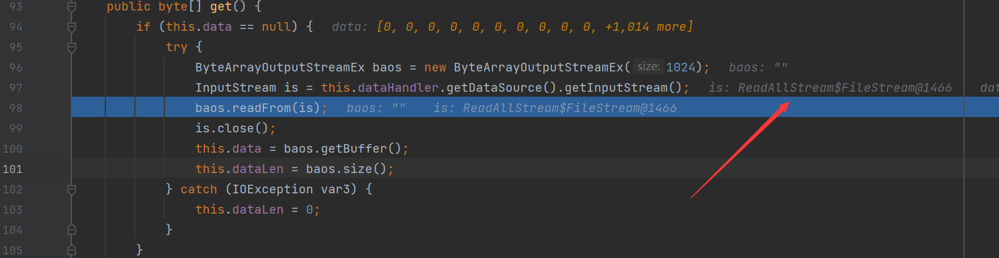
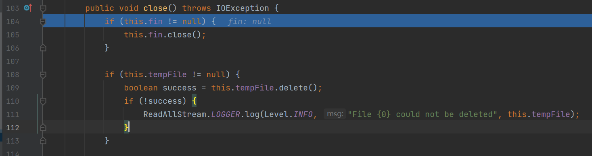

## 漏洞分析

和[之前](CVE-2020-26217分析.md)差距不大，只是其中的`com.sun.xml.internal.ws.encoding.xml.XMLMessage$XmlDataSource`类中is属性的设置不同，这里设置为了`com.sun.xml.internal.ws.util.ReadAllStream$FileStream`

我们在`com.sun.xml.internal.ws.encoding.xml.XMLMessage$XmlDataSource#getInputStream`处打下断点



可以得到`is`属性的值为`com.sun.xml.internal.ws.util.ReadAllStream$FileStream`类，跟进`readFrom`方法中，调用了`is.read`方法，继续跟进，之后又调用了`is.close`方法，在POC中只对`tempFile`属性进行了赋值操作，所以，其中的`fin`属性为空，绕过if语句，在第二个`if`语句中，存在`tempFile`属性值为`E:/src.txt`，之后调用了`delete`方法进行删除



## 调用栈

```java
close:146, ReadAllStream$FileStream (com.sun.xml.internal.ws.util)
get:183, Base64Data (com.sun.xml.internal.bind.v2.runtime.unmarshaller)
toString:286, Base64Data (com.sun.xml.internal.bind.v2.runtime.unmarshaller)
getStringValue:121, NativeString (jdk.nashorn.internal.objects)
hashCode:117, NativeString (jdk.nashorn.internal.objects)
hash:339, HashMap (java.util)
put:612, HashMap (java.util)
putCurrentEntryIntoMap:107, MapConverter (com.thoughtworks.xstream.converters.collections)
populateMap:98, MapConverter (com.thoughtworks.xstream.converters.collections)
populateMap:92, MapConverter (com.thoughtworks.xstream.converters.collections)
unmarshal:87, MapConverter (com.thoughtworks.xstream.converters.collections)
convert:72, TreeUnmarshaller (com.thoughtworks.xstream.core)
convert:72, AbstractReferenceUnmarshaller (com.thoughtworks.xstream.core)
convertAnother:66, TreeUnmarshaller (com.thoughtworks.xstream.core)
convertAnother:50, TreeUnmarshaller (com.thoughtworks.xstream.core)
start:134, TreeUnmarshaller (com.thoughtworks.xstream.core)
unmarshal:32, AbstractTreeMarshallingStrategy (com.thoughtworks.xstream.core)
unmarshal:1404, XStream (com.thoughtworks.xstream)
unmarshal:1383, XStream (com.thoughtworks.xstream)
fromXML:1268, XStream (com.thoughtworks.xstream)
fromXML:1259, XStream (com.thoughtworks.xstream)
main:28, WriteFile (pers.xstream)
```