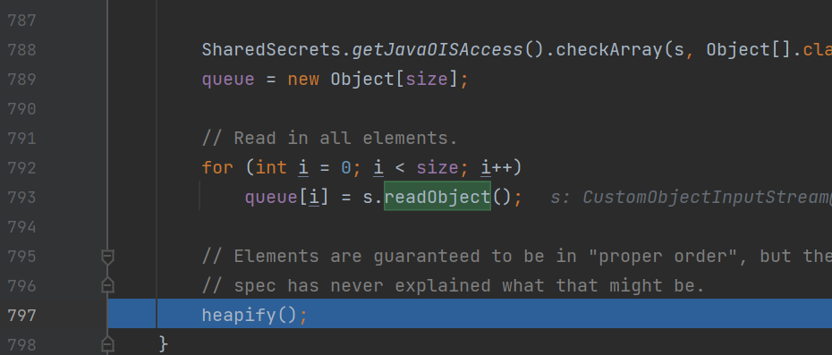
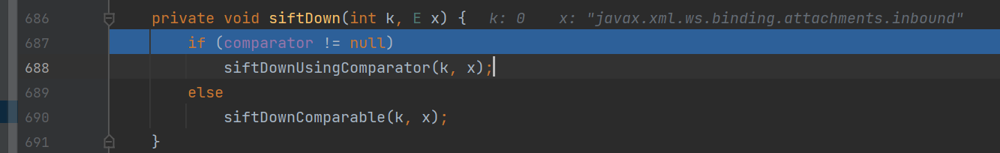
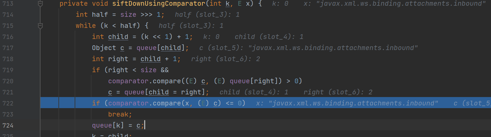
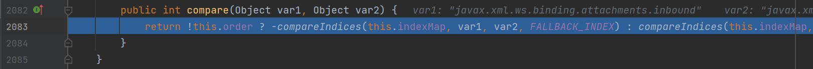
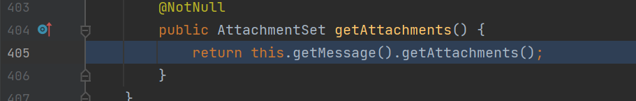
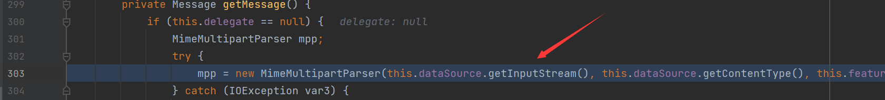
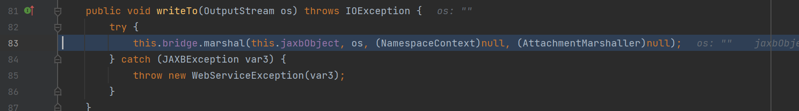
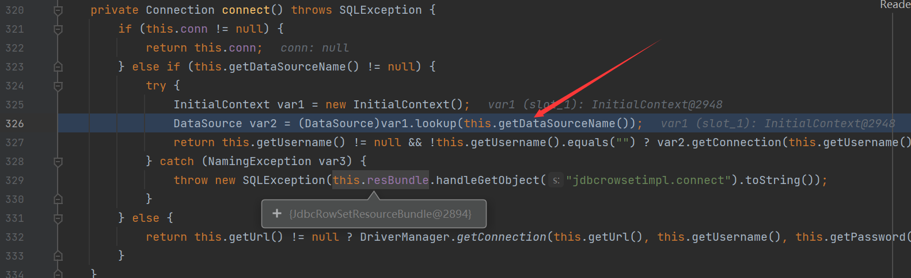

## 前奏

这次的POC主要是通过在反序列化中调用类的`readObject`方法，在[基本使用中有所提及](REAME.md)

## 漏洞分析

在`java.util.PriorityQueue`类的`readObject`方法中打下断点，我们可以发现他仍然在`TreeUnmarshaller#start`中获取到了标签对应的类`java.util.PriorityQueue`, 并且使用的转换器是`SerializableConverter`, 之后在`SerialiableConverter#doUnmarshal`中调用了

`serializationMembers.callReadObject`, 进行调用readObject方法

最后来到了其类的`readObject`方法，和分析CC2链类似，跟进`heapify`方法



接下来继续跟进调用的`siftDown`, 因为我们在POC中设置了`comparator`是`sun.awt.datatransfer.DataTransferer$IndexOrderComparator`, 所以进入if语句调用`siftDownUsingComparator`



跟进，之后调用的`comparator.compare`方法，跟进`IndexOrderComparator`中



跟进，这里的`indexMap`是在POC中设置的`com.sun.xml.internal.ws.client.ResponseContext`



之后调用了`compareIndices`, 在`ResponseContext`中取值中调用了get方法，跟进，之后调用了`this.packet.getMessage().getAttachments()`这里的`packet.message`也是POC中设置的`com.sun.xml.internal.ws.encoding.xml.XMLMessage$XMLMultiPart`, 所以我们直接跟进`getAttachments`方法



之后调用了这里的`getMessage`方法，紧接着调用了我们POC中设置的dataSource为`com.sun.xml.internal.ws.message.JAXBAttachment`，调用了他的`getInputStream`方法，跟进，再次调用`asInputStream`方法，调用`writeTo`方法，跟进



这里的`bridge`也是POC中的类`com.sun.xml.internal.ws.db.glassfish.BridgeWrapper` `jaxbObject`同样是`com.sun.rowset.JdbcRowSetImpl` 这个类有点熟悉，就是在Fastjson链中存在有`JdbcRowSetImpl`这条利用链，我们来看看是否是同一条利用链，调用其`marshal`方法，跟进，之后再次调用`marshal`方法，只不过换成了POC中的`bridge.bridge`的类`com.sun.xml.internal.bind.v2.runtime.BridgeImpl`, 跟进，再次调用`marshal`方法，



之后将会调用`MarshallerImpl#write`方法，跟进，之后会调用到`jdbcRowSetImpl#getDatabaseMetaData`方法中，调用其`connect`方法，之后在这里存在lookup方法的可控



在POC中也有对`dataSource`的赋值

## 调用栈

```
connect:624, JdbcRowSetImpl (com.sun.rowset)
getDatabaseMetaData:4004, JdbcRowSetImpl (com.sun.rowset)
invoke0:-1, NativeMethodAccessorImpl (sun.reflect)
invoke:62, NativeMethodAccessorImpl (sun.reflect)
invoke:43, DelegatingMethodAccessorImpl (sun.reflect)
invoke:498, Method (java.lang.reflect)
get:343, Accessor$GetterSetterReflection (com.sun.xml.internal.bind.v2.runtime.reflect)
serializeURIs:402, ClassBeanInfoImpl (com.sun.xml.internal.bind.v2.runtime)
childAsXsiType:662, XMLSerializer (com.sun.xml.internal.bind.v2.runtime)
write:256, MarshallerImpl (com.sun.xml.internal.bind.v2.runtime)
marshal:89, BridgeImpl (com.sun.xml.internal.bind.v2.runtime)
marshal:130, Bridge (com.sun.xml.internal.bind.api)
marshal:161, BridgeWrapper (com.sun.xml.internal.ws.db.glassfish)
writeTo:109, JAXBAttachment (com.sun.xml.internal.ws.message)
asInputStream:99, JAXBAttachment (com.sun.xml.internal.ws.message)
getInputStream:125, JAXBAttachment (com.sun.xml.internal.ws.message)
getMessage:366, XMLMessage$XMLMultiPart (com.sun.xml.internal.ws.encoding.xml)
getAttachments:465, XMLMessage$XMLMultiPart (com.sun.xml.internal.ws.encoding.xml)
getAttachments:103, MessageWrapper (com.sun.xml.internal.ws.api.message)
get:111, ResponseContext (com.sun.xml.internal.ws.client)
compareIndices:2492, DataTransferer$IndexedComparator (sun.awt.datatransfer)
compare:2971, DataTransferer$IndexOrderComparator (sun.awt.datatransfer)
siftDownUsingComparator:722, PriorityQueue (java.util)
siftDown:688, PriorityQueue (java.util)
heapify:737, PriorityQueue (java.util)
readObject:797, PriorityQueue (java.util)
invoke0:-1, NativeMethodAccessorImpl (sun.reflect)
invoke:62, NativeMethodAccessorImpl (sun.reflect)
invoke:43, DelegatingMethodAccessorImpl (sun.reflect)
invoke:498, Method (java.lang.reflect)
callReadObject:132, SerializationMembers (com.thoughtworks.xstream.core.util)
doUnmarshal:443, SerializableConverter (com.thoughtworks.xstream.converters.reflection)
unmarshal:277, AbstractReflectionConverter (com.thoughtworks.xstream.converters.reflection)
convert:72, TreeUnmarshaller (com.thoughtworks.xstream.core)
convert:72, AbstractReferenceUnmarshaller (com.thoughtworks.xstream.core)
convertAnother:66, TreeUnmarshaller (com.thoughtworks.xstream.core)
convertAnother:50, TreeUnmarshaller (com.thoughtworks.xstream.core)
start:134, TreeUnmarshaller (com.thoughtworks.xstream.core)
unmarshal:32, AbstractTreeMarshallingStrategy (com.thoughtworks.xstream.core)
unmarshal:1409, XStream (com.thoughtworks.xstream)
unmarshal:1388, XStream (com.thoughtworks.xstream)
fromXML:1273, XStream (com.thoughtworks.xstream)
fromXML:1264, XStream (com.thoughtworks.xstream)
main:111, LDAPRCE (pers.xstream)
```