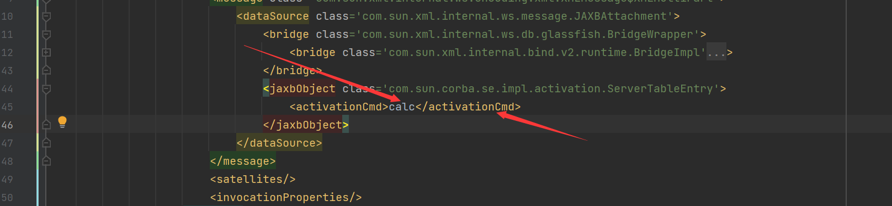

## 漏洞分析

这条链子和之前的相比来说，前面部分都是差不多的，只是他没有使用`JdbcRowSetImpl`链，使用的是`com.sun.corba.se.impl.activation.ServerTableEntry`类中的`verify`方法配合属性`activationCmd`直接执行命令

在`com.sun.corba.se.impl.activation.ServerTableEntry#verify`打下断点

根据前面CVE分析的铺垫，将会在`com.sun.xml.internal.bind.v2.runtime.reflect.Accessor$GetterSetterReflection#get`方法中，进行反射调用，成功进入到了`verify`方法中

而在POC中对其中的属性值也进行了定义



最后理所应当得执行了命令

## 调用栈

```java
verify:174, ServerTableEntry (com.sun.corba.se.impl.activation)
invoke0:-1, NativeMethodAccessorImpl (sun.reflect)
invoke:62, NativeMethodAccessorImpl (sun.reflect)
invoke:43, DelegatingMethodAccessorImpl (sun.reflect)
invoke:498, Method (java.lang.reflect)
get:343, Accessor$GetterSetterReflection (com.sun.xml.internal.bind.v2.runtime.reflect)
serializeURIs:402, ClassBeanInfoImpl (com.sun.xml.internal.bind.v2.runtime)
childAsXsiType:662, XMLSerializer (com.sun.xml.internal.bind.v2.runtime)
write:256, MarshallerImpl (com.sun.xml.internal.bind.v2.runtime)
marshal:89, BridgeImpl (com.sun.xml.internal.bind.v2.runtime)
marshal:130, Bridge (com.sun.xml.internal.bind.api)
marshal:161, BridgeWrapper (com.sun.xml.internal.ws.db.glassfish)
writeTo:109, JAXBAttachment (com.sun.xml.internal.ws.message)
asInputStream:99, JAXBAttachment (com.sun.xml.internal.ws.message)
getInputStream:125, JAXBAttachment (com.sun.xml.internal.ws.message)
getMessage:366, XMLMessage$XMLMultiPart (com.sun.xml.internal.ws.encoding.xml)
getAttachments:465, XMLMessage$XMLMultiPart (com.sun.xml.internal.ws.encoding.xml)
getAttachments:103, MessageWrapper (com.sun.xml.internal.ws.api.message)
get:111, ResponseContext (com.sun.xml.internal.ws.client)
compareIndices:2492, DataTransferer$IndexedComparator (sun.awt.datatransfer)
compare:2971, DataTransferer$IndexOrderComparator (sun.awt.datatransfer)
siftDownUsingComparator:722, PriorityQueue (java.util)
siftDown:688, PriorityQueue (java.util)
heapify:737, PriorityQueue (java.util)
readObject:797, PriorityQueue (java.util)
invoke0:-1, NativeMethodAccessorImpl (sun.reflect)
invoke:62, NativeMethodAccessorImpl (sun.reflect)
invoke:43, DelegatingMethodAccessorImpl (sun.reflect)
invoke:498, Method (java.lang.reflect)
callReadObject:132, SerializationMembers (com.thoughtworks.xstream.core.util)
doUnmarshal:443, SerializableConverter (com.thoughtworks.xstream.converters.reflection)
unmarshal:277, AbstractReflectionConverter (com.thoughtworks.xstream.converters.reflection)
convert:72, TreeUnmarshaller (com.thoughtworks.xstream.core)
convert:72, AbstractReferenceUnmarshaller (com.thoughtworks.xstream.core)
convertAnother:66, TreeUnmarshaller (com.thoughtworks.xstream.core)
convertAnother:50, TreeUnmarshaller (com.thoughtworks.xstream.core)
start:134, TreeUnmarshaller (com.thoughtworks.xstream.core)
unmarshal:32, AbstractTreeMarshallingStrategy (com.thoughtworks.xstream.core)
unmarshal:1409, XStream (com.thoughtworks.xstream)
unmarshal:1388, XStream (com.thoughtworks.xstream)
fromXML:1273, XStream (com.thoughtworks.xstream)
fromXML:1264, XStream (com.thoughtworks.xstream)
main:67, XStreamRCE (pers.xstream)
```