在AbstractTreeMarshallingStrategy.unmarshal()函数中，调用了TreeUnmarshaller.start()函数，即开始解析XML

在`com.thoughtworks.xstream.core.TreeUnmarshaller#start`打下断点

会调用HierarchicalStreams.readClassType()来获取到PoC XML中根标签的类类型

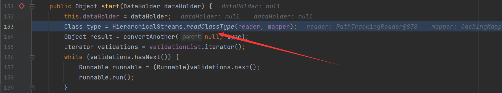

跟进`readClassType`方法

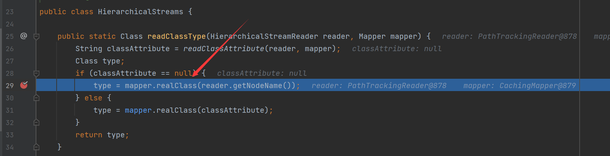

在`mapper.readClass`调用中获取了`sortedSet`跟进

通过一系列适合mapper的寻找，找到了`ClassAliasingMapper`这个，调用它的`readClass`方法

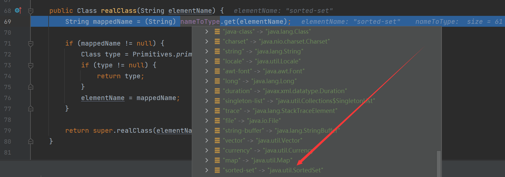

成功获取到`java.util.SortedSet`

之后就是调用`TreeUnmarshaller#convertAnother`方法，跟进

首先就是调用`mapper.defaultImplementationOf`寻找对应type的默认实现类

之后经过一系列mapper的寻找，成功找到了DefaultImplementationsMapper，获取到了实现类`java.util.TreeSet`

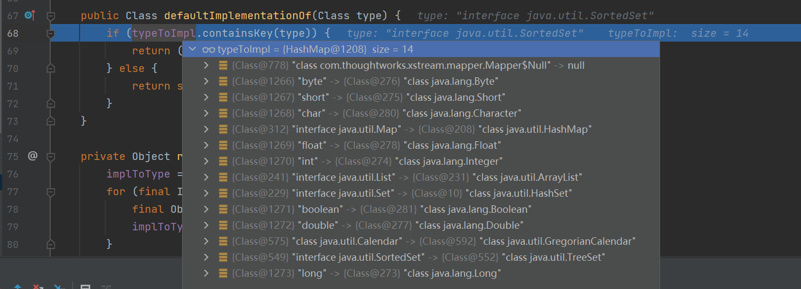

之后通过`converterLookup.lookupConverterForType`的调用获取对应类的转换器

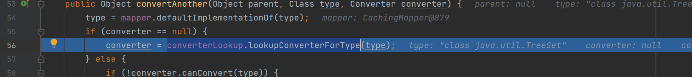

跟进，在其中的逻辑中是通过迭代`converters`(这个是一个PrioritizedList类型)，直到找到了可以转换`java.util.TreeSet`的转化器

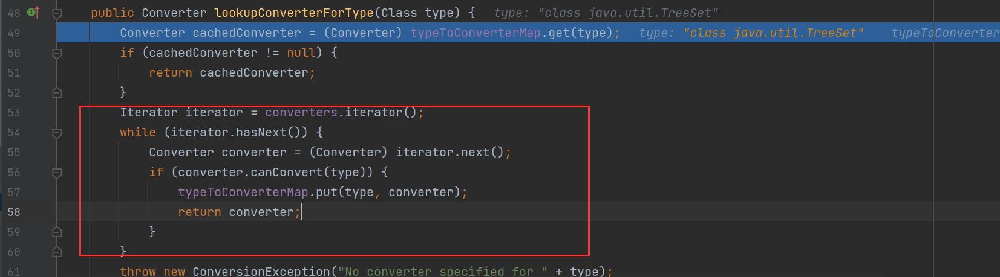

找到了`TreeSetConverter`

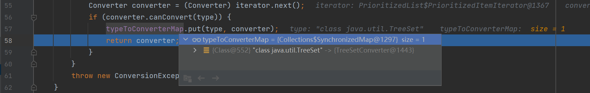

之后在`TreeUnmarshaller#convertAnother`中将type类型和获取的converter返回给`AbstractReferenceUnmarshaller#convert`方法，跟进，在其中调用了`getCurrentReferenceKey`方法获取当前的`Reference`键，即对应的标签名，之后将其压入栈中

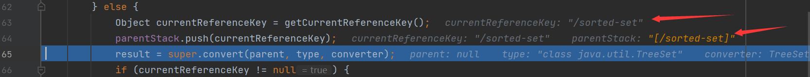

之后调用父类的`convert`方法即是`TreeUnmarshaller#convert`方法，首先将type类型压入`FastStack`栈中，之后调用转换器的`unmarshal`方法

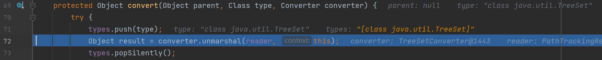

跟进，之后调用了`treeMapConverter.populateTreeMap`方法，跟进，首先判断是否是第一个元素，如果是就会调用`putCurrentEntryIntoMap`方法将当前内容填充到map中去

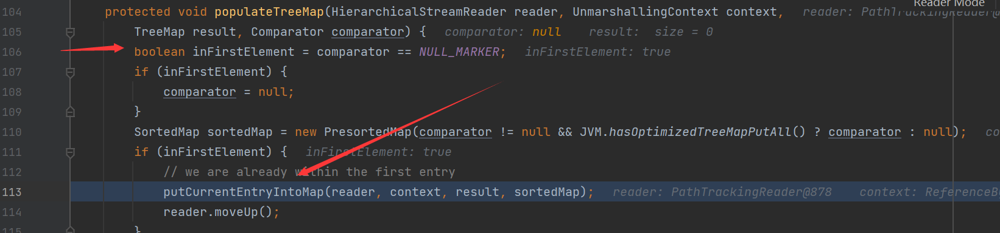

跟进，这里调用`readItem`方法读取标签内的内容，然后将内容放入target这个map中

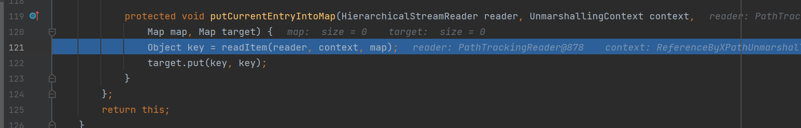

跟进，通过`HierarchicalStreams.readClassType`来寻找标签的类

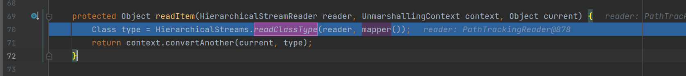

跟进，之后就会开始寻找`dynamic-proxy`标签的类，通过和之前类似的方法，在`DynamicProxyMapper#readClass`方法中寻找到了`DynamicProxy`类

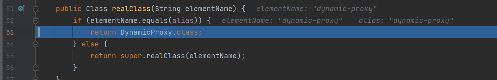

之后在`com.thoughtworks.xstream.core.TreeUnmarshaller#convertAnother`方法中找到这个动态代理类的转换器`DynamicProxyConverter`

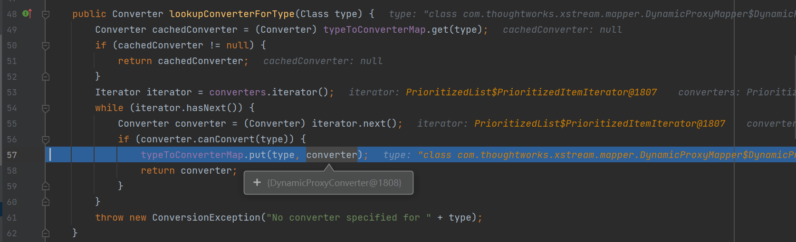

之后调用了`AbstractReferenceUnmarshaller#convert`方法，首先将根标签放入`values`属性中之后同样调用getCurrentReferenceKey()来获取当前的Reference键即标签名，接着将当前标签名压入parentStack栈中

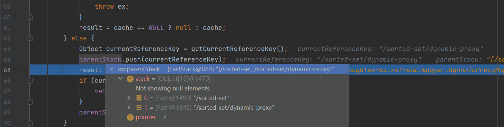

之后调用父类的`convert`方法，同样将type压入了FastStack栈中之后，调用了`converter.unmarshal`方法，即来到了`DynamicProxyConverter#unmarshal`方法中，首先循环它的子标签，如果是`interface`标签，就会调用`mapper.realClass(reader.getValue())`找到对应的类，并添加进入`interfaces`变量中，如果下一个是`handler`标签，就会通过`mapper.realClass(reader.getAttribute(attributeName))`获取`handler`的类型是`java.beans.EventHandler`，之后跳出循环

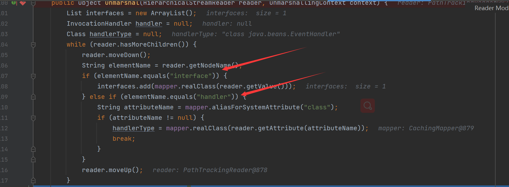

之后有一个判断，如果没有handtype值，就会抛出异常，之后，将会根据标签里面的内容生成对应接口的动态代理

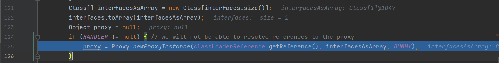

接下来调用了`context.convertAnother`方法，接下来转换器转换最终得到EventHandler，之后通过`Fields.write(HANDLER, proxy, handler);`将之前生成的动态代理替换，之后返回代理对象

接下来在`com.thoughtworks.xstream.converters.collections.TreeMapConverter#populateTreeMap`中，这里会把结果放入result中去

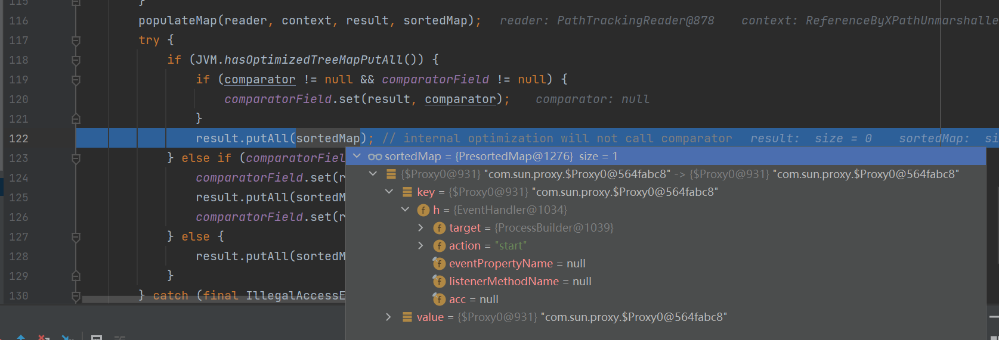

之后会调用`TreeMap`的putAll方法，进而调用了父类的`putAll`方法

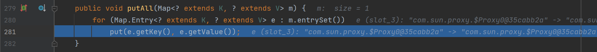

调用了put方法，key value都是之前的代理，之后调用了`TreeMap`的compare方法，进而调用了compareTo方法，这里的k1是代理类，所以会触发对应的invoke方法

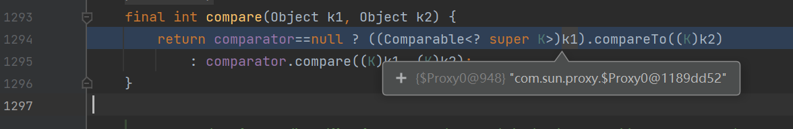

之后调用了run方法，进而调用了`invokeInternal`方法，成功调用了`ProcessBuilder.start`方法执行命令

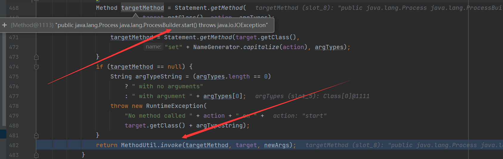